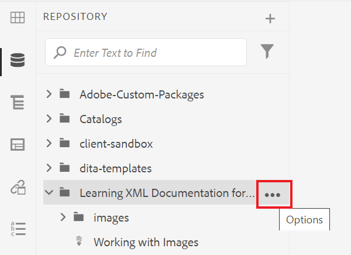
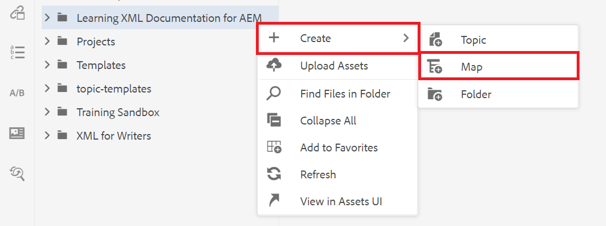
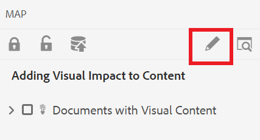
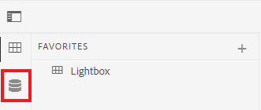

# 建立地圖

地圖是一種組織工具，可讓您以階層結構新增及組織資訊。 此工作會示範如何建立地圖及組織地圖中的內容。

您可以從這裡下載範例DITA檔案：

* [Documents-with-Visual-Content.dita](assets/working-with-maps/Documents-with-Visual-Content.dita)
* [Working-with-Tables.dita](assets/working-with-maps/Working-with-Tables.dita)

>[!VIDEO](https://video.tv.adobe.com/v/336725?quality=12&learn=on)

## 上傳地圖元件

如有需要，您可以將本機範例檔案上傳到AEM，以獲得更完整的材料集。

1. 將任何本機檔案拖放到AEM中以上傳它們。
1. 視需要重複處理任何檔案，包括影像和主題。

## 建立地圖

1. 若要開啟 [!UICONTROL 選項] 功能表中，選取主要資料夾上的省略符號圖示。

   

1. 選取 **[!UICONTROL 建立]** > **[!UICONTROL 地圖]**.

   

   此 [!UICONTROL 建立新地圖] 對話方塊隨即顯示。

1. 在 [!UICONTROL 範本] 欄位，選取 **[!UICONTROL Bookmap]** 從下拉式功能表，為您的地圖指定標題。
1. 選擇 **[!UICONTROL 建立]**。

   您的地圖隨即建立，而左側邊欄會自動從「存放庫」檢視變更為「地圖」檢視。

## 插入地圖元件

1. 選取左側邊欄中的鉛筆圖示。

   

   這是「編輯」圖示，可讓您在編輯器中開啟對應。

1. 選取「存放庫」圖示，切換回「存放庫」檢視。

   

1. 將主題從存放庫拖放至編輯器中的對映，以對映中新增主題。

   行指示器會顯示主題的位置。

1. 繼續視需要新增主題。

## 檢視地圖預覽

「預覽」可讓您使用預設格式快速檢視內容。 它會顯示標題、段落、清單，以及主題中的任何其他內容。

1. 選取 **[!UICONTROL 預覽]** 從上方的黑色功能表列。

   

您的內容開啟於 [!UICONTROL 預覽].

1. 若要返回「作者」檢視並繼續編輯對映，請選取 **作者。**

   

## 設定地圖結構

您可以編輯地圖中主題的階層。

1. 按一下主題的圖示以選取它。
1. 使用箭頭可分別降級和升級元素。

   

## 將地圖另存為新版本

現在地圖已完成，您可以將您的工作儲存為新版本，並記錄您的變更。

1. 選取 **[!UICONTROL 另存為新版本]** 圖示。

   

1. 在「新版本的註解」欄位中，輸入簡短但清楚的變更摘要。

1. 在「版本標籤」欄位中，輸入任何相關標籤。

   標籤可讓您指定發佈時要包含的版本。

   >[!NOTE]
   > 
   > 如果您的程式設定了預先定義的標籤，您可以從中選取以確保一致的標籤。

1. 選取&#x200B;**儲存**。

   您已建立新版地圖，且版本號碼已更新。
