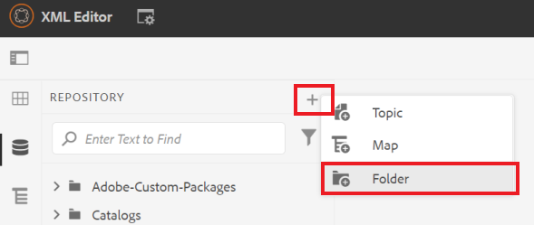
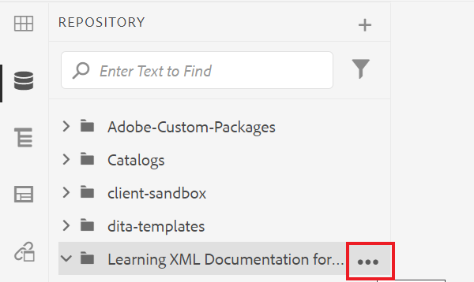
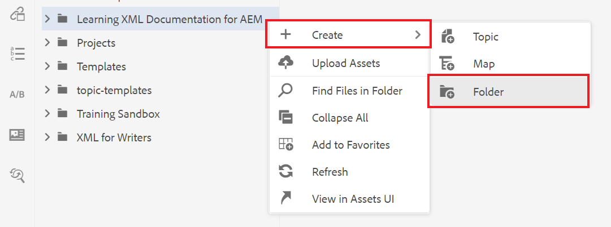
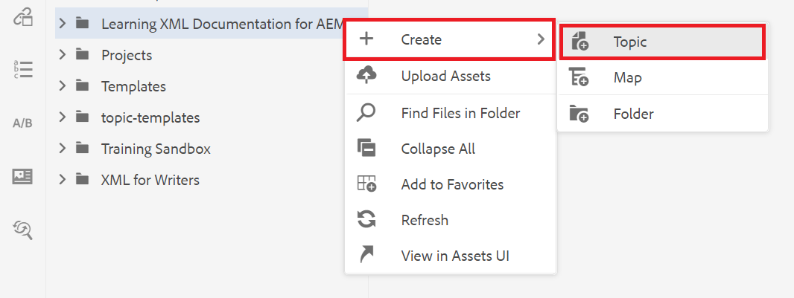
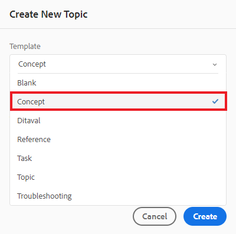
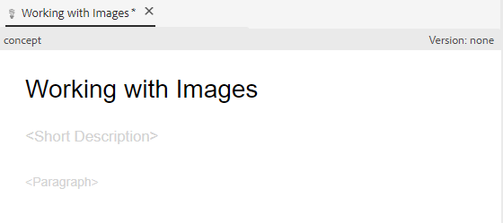

# 建立和結構化內容

一旦您熟悉了用戶介面，就可以開始建立和構建您自己的內容。

>[!VIDEO](https://video.tv.adobe.com/v/336657?quality=12&learn=on)

## 建立資料夾

1. 選擇 **儲存庫** 表徵圖，查看資料夾和檔案。

   

1. 選擇 **+** 表徵圖 **資料夾**。

   
1. 給資料夾一個標題。
1. 選擇 **建立**。您已建立了新資料夾，該資料夾現在顯示在儲存庫中。 此資料夾將是所有課程內容的首頁。

## 建立子資料夾

現在，我們可以在新資料夾內建立一個資料夾，以包含影像或其他內容。

1. 將滑鼠懸停在儲存庫中的新資料夾上，然後選擇顯示的省略號表徵圖。

   

   將顯示「選項」菜單。
1. 選擇 **建立\>資料夾**。
   

1. 為子資料夾指定標題（例如，「images」）並選擇 **建立**。

## 建立和填充新概念

1. 將滑鼠懸停在儲存庫中的父資料夾上，然後選擇省略號表徵圖。

   

   此時將顯示「選項」菜單。
1. 選擇 **建立\>主題**。

   

   將顯示「建立新主題」對話框。

1. 從對話框的「模板」下拉菜單中，選擇 **概念**。

   

1. 給您的概念一個標題並選擇 **建立**。

   新概念將顯示在編輯器中，並填充了其標題。

   

1. 通過按一下簡短說明或段落並鍵入內容來填充概念。

## 另存為新版本

您可以隨時使用「保存」或「另存為新版本」保存您的工作。 使用「保存」保留您所做的更改，使用「另存為新版本」建立具有當前更改的主題的新版本。

### 保存您的工作而不進行版本控制

1. 選擇 **保存** 表徵圖

   

### 另存為新版本

1. 選擇 **另存為新版本** 表徵圖。

   

   將顯示「另存為新版本」對話框。

1. 在「新版本的注釋」欄位中，輸入簡短但清晰的更改摘要。
1. 在「版本標籤」欄位中，輸入任何相關標籤。

   標籤允許您指定發佈時要包括的版本。

   >[!NOTE]
   > 
   > 如果程式配置了預定義的標籤，則可以從這些標籤中進行選擇以確保標籤的一致性。
1. 選擇 **保存**。

   您已建立了主題的新版本，並且版本號已更新。
