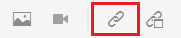

# 連結到網站

Web連結可將讀者直接連結到網站以獲取更多資訊，允許他們與外部內容交互，或授予對可下載檔案的訪問權。 以下步驟介紹如何將Web連結添加到現有概念。

>[!VIDEO](https://video.tv.adobe.com/v/336656?quality=12&learn=on)

## 插入連結

1. 從「儲存庫」(Repository)中選擇您的概念，然後在編輯器中將其開啟。
1. 將一串文本添加到概念中並突出顯示它，或突出顯示現有選擇的文本。

   此突出顯示的文本將插入連結。
1. 選擇 **插入交叉引用** 按鈕。

   

   將顯示「參照」(Reference)對話框。

1. 選擇 **Web連結** 的下界。
1. 貼上所需的URL，然後按一下 **選擇**。

   該連結功能正常，按一下後將在新瀏覽器頁籤中開啟一個網頁。

## 使用預覽test連結

「預覽」(Preview)按鈕允許您查看主題的預覽。 在此，您可以test連結，並像您的觀眾那樣查看它們。

1. 選擇 **預覽** 按鈕。

   

   您的概念將在預覽中開啟。

1. 選擇連結。
連結目標將在另一個頁籤中開啟。
1. 通過選擇「返回到作者」視圖 **作者** 按鈕。

   

## 另存為新版本

現在，您已將更多內容添加到您的概念中，您可以將您的工作另存為新版本並記錄您所做的更改。

1. 選擇 **另存為新版本** 表徵圖

   

1. 在「新版本的注釋」欄位中，輸入簡短但清晰的更改摘要。
1. 在「版本標籤」欄位中，輸入任何相關標籤。

   標籤允許您指定發佈時要包括的版本。

   >[!NOTE]
   > 
   > 如果程式配置了預定義的標籤，則可以從這些標籤中進行選擇以確保標籤的一致性。

1. 選取&#x200B;**儲存**。

   您已建立了主題的新版本，並且版本號已更新。
