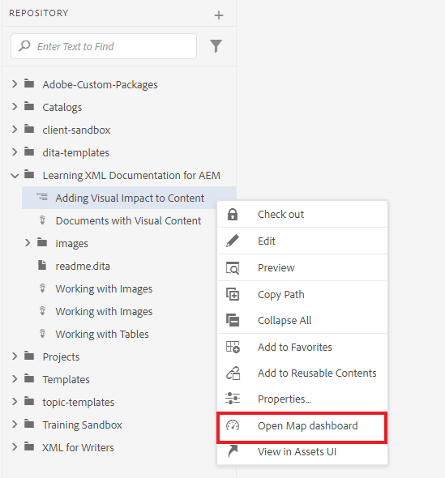
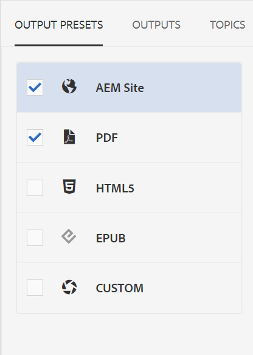
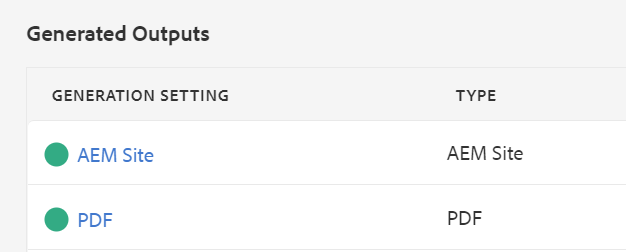

# 發佈預設輸出

完成地圖後，您就可以使用多種輸出格式發佈內容。

>[!VIDEO](https://video.tv.adobe.com/v/336662?quality=12&learn=on)

## 將地圖發佈為AEM網站和PDF

有許多輸出預設集可供您選擇。 本指南重點說明AEM網站和PDF輸出。

1. 在存放庫中，選取地圖上的省略符號圖示以開啟「選項」功能表，然後 **在地圖儀表板中開啟。**

   

   「對映圖示板」會在另一個標籤中開啟。

1. 在「輸出預設集」索引標籤中，選取「AEM網站」和「PDF」。

   

1. 選取 **產生。**

1. 導覽至「輸出」頁面，檢視所產生輸出的狀態。

   綠色圓圈表示產生已完成。

   

## AEM網站輸出

在AEM網站輸出中，主題、清單、影像、標題、表格和使用XML編輯器建立的其他內容都會由AEM自動發佈為網頁易記內容。

您可以在目錄以及相關資訊區段中檢視從屬主題。 這些連結都可用來導覽。

## PDF輸出

完成的PDF檔案包含地圖的預設標題作為封面頁上的主要標題。 章節封面頁面會使用章節編號來設定樣式，並包含內含主題的連結。
