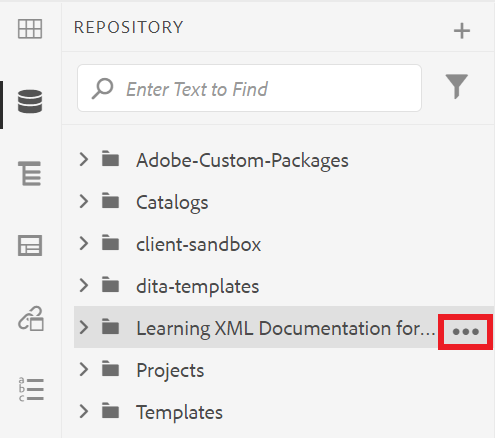
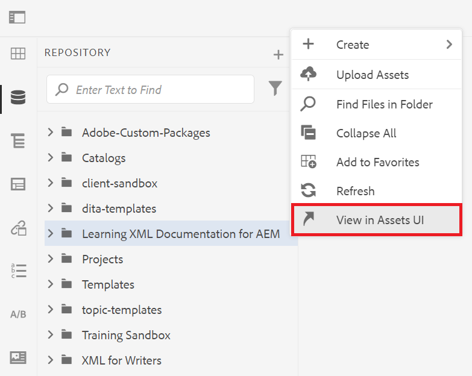
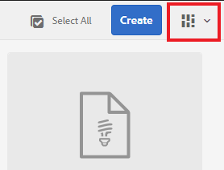
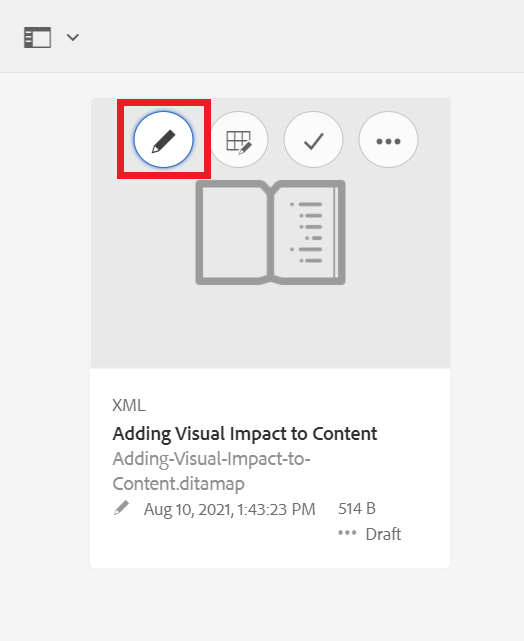

# 瞭解用AEM戶介面

瞭解如何在XML編輯器中管理資產、檔案和資料夾以進行Experience Manager。

>[!VIDEO](https://video.tv.adobe.com/v/336659?quality=12&learn=on)

## 訪問XML編輯器

1. 在登錄螢幕中，輸入用戶名和密碼，然後選擇 **[!UICONTROL 登錄]**。
2. 選擇 **[!UICONTROL XML編輯器]** 的子AEM菜單。

## XML編輯器視圖

在提要欄中，您可以從XML編輯器的多個視圖中進行選擇，以最好地滿足您的組織需要。 這些包括預設視圖和 [!UICONTROL 儲存庫視圖]。

預設視圖顯示 [!UICONTROL 收藏夾]。 您可以根據需要使用快捷方式進一步自定義它。 相反， [!UICONTROL 儲存庫視圖] 顯示更傳統的資料夾結構。

### 切換到 [!UICONTROL 儲存庫視圖] 從預設視圖

1. 在左滑軌中，選擇 **[!UICONTROL 儲存庫視圖]**。

   

   的 [!UICONTROL 儲存庫視圖] 顯示。

## 資產UI

在 [!UICONTROL 資產] 介面，您可以查看

### 在資產UI中查看內容

您可以對內容執行其他操作。 其中一個選項是在「資產」UI中查看您的檔案。

1. 將滑鼠懸停在儲存庫中的資料夾或主題上，然後選擇顯示的省略號表徵圖。

   

   將顯示「選項」菜單。

1. 從菜單中，選擇 **在資產UI中查看。**

   

### 選擇視圖

您可以從多個視圖中為「資產」UI進行選擇，以最好地滿足您的組織需要。

1. 選擇 **視圖切換器** 表徵圖。

   

   將顯示下拉菜單。

1. 選擇要使用的視圖。

### 資產UI視圖

| 名稱 | 說明 |
| --- | --- |
| 卡片檢視 | 將每個資產顯示為表徵圖 |
| 欄檢視 | 以壓縮、可擴展的資料夾結構顯示資產 |
| 清單檢視 | 在清單中顯示資產及其詳細資訊 |

## 返回到XML編輯器

可以從資產UI的任何視圖返回到XML編輯器。

### 從清單和列視圖返回

1. 從清單中選擇要編輯的主題。
該主題顯示在「資產」UI中。
2. 選擇 **編輯** 的上界。
您將返回到XML編輯器。

### 從卡視圖返回

1. 選擇中某個主題的鉛筆表徵圖 [!UICONTROL 資產] UI。

   

   您將返回到XML編輯器。
