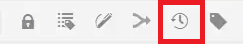

# 版本控制內容

對文檔進行版本控制會建立其當前狀態的快照。 建立主題或映射的多個版本允許您跟蹤更改並恢復較舊的工作。

>[!VIDEO](https://video.tv.adobe.com/v/336724?quality=12&learn=on)

## 建立新版本

1. 選擇「另存為新版本」表徵圖。

   

   將顯示「另存為新版本」對話框。

1. 在「新版本的注釋」欄位中，輸入簡短但清晰的更改摘要。
1. 在「版本標籤」欄位中，輸入任何相關標籤。

   標籤允許您指定發佈時要包括的版本。

   >[!NOTE]
   >
   >如果程式配置了預定義的標籤，則可以從這些標籤中進行選擇以確保標籤的一致性。

1. 選取&#x200B;**儲存**。

   您已建立了主題的新版本，並且版本號已更新。 文檔的第一個版本為1.0版。

## 查看版本歷史記錄

一旦您擁有了多個版本的內容，您可能希望瞭解它們之間的差異。

1. 從工具欄中選擇「版本歷史記錄」表徵圖。

   

   將顯示「版本歷史記錄」對話框。

1. 從下拉清單中選擇一個版本，以比較當前版本。

   系統會指示您的版本到版本的更改。

## 還原為選定版本

如果需要，可以選擇一個版本並恢復到該版本。 這允許您放棄當前版本並返回使用早期版本。

1. 在「版本歷史記錄」對話框中，從下拉清單中選擇要還原到的版本。
1. 選擇 **還原到所選版本**。

將顯示「還原版本」對話框。

1. 添加描述性注釋，說明您還原為以前版本的原因。
1. 選擇 **確認**。

   您的主題已還原為特定版本。

## 使用篩選器比較版本

也可以使用右滑軌中的「跟蹤」和「顯示差異」過濾器查看「預覽」中的版本差異。

1. 選擇 **預覽** 的上界。

   

   您的主題將在預覽中開啟。

1. 在右欄的「跟蹤」下拉清單中，選擇 **顯示標籤**。
1. 在「顯示比較」下拉清單中，選擇要比較的版本。

   您的更改顯示為格式化內容。
