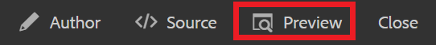

# 版本設定內容

版本化檔案會建立其目前狀態的快照。 建立多個版本的主題或地圖可讓您追蹤變更並復原舊的工作。

>[!VIDEO](https://video.tv.adobe.com/v/336724?quality=12&learn=on)

## 建立新版本

1. 選取「另存為新版本」圖示。

   

   「另存為新版本」對話方塊隨即顯示。

1. 在「新版本的註解」欄位中，輸入簡短但清楚的變更摘要。
1. 在「版本標籤」欄位中，輸入任何相關標籤。

   標籤可讓您指定發佈時要包含的版本。

   >[!NOTE]
   >
   >如果您的程式設定了預先定義的標籤，您可以從中選取以確保一致的標籤。

1. 選取&#x200B;**儲存**。

   您已建立主題的新版本，且版本編號已更新。 檔案的第一個版本將是1.0版。

## 檢視版本記錄

擁有多個內容版本後，您可能會想要探索版本之間的差異。

1. 從工具列選取「版本記錄」圖示。

   

   版本記錄對話方塊隨即顯示。

1. 從下拉式清單中選取一個版本，以比較您目前的版本與哪個版本。

   將會指出您的版本對版本變更。

## 回覆至選取的版本

如有需要，您可以選取版本並還原成該版本。 這可讓您捨棄目前的版本，並返回使用先前的版本。

1. 在「版本記錄」對話方塊中，從下拉式選單中選取您要回復到的版本。
1. 選取 **還原至選取的版本**.

回覆版本對話方塊隨即顯示。

1. 新增說明性註解，說明您回覆至舊版的原因。
1. 選取 **確認**.

   您的主題已恢復為特定版本。

## 使用篩選器來比較版本

您也可以使用右側邊欄中的追蹤和顯示差異篩選器，在預覽中檢視版本差異。

1. 選取 **預覽** 從上方功能表列。

   

   您的主題會在「預覽」中開啟。

1. 在右側欄的「追蹤」下拉式清單中，選取 **顯示標籤**.
1. 在顯示差異下拉式清單中，選取您要比較的版本。

   您的變更會顯示為格式化內容。
