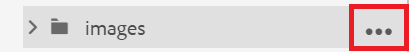
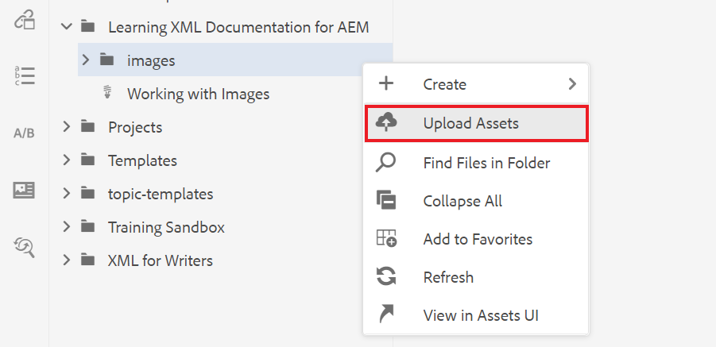
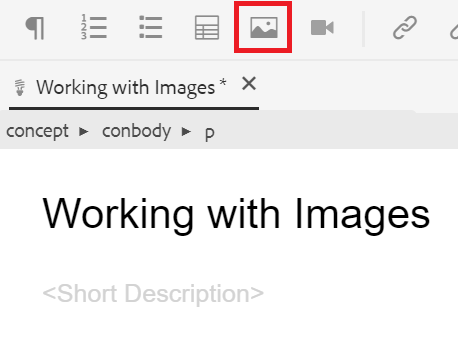
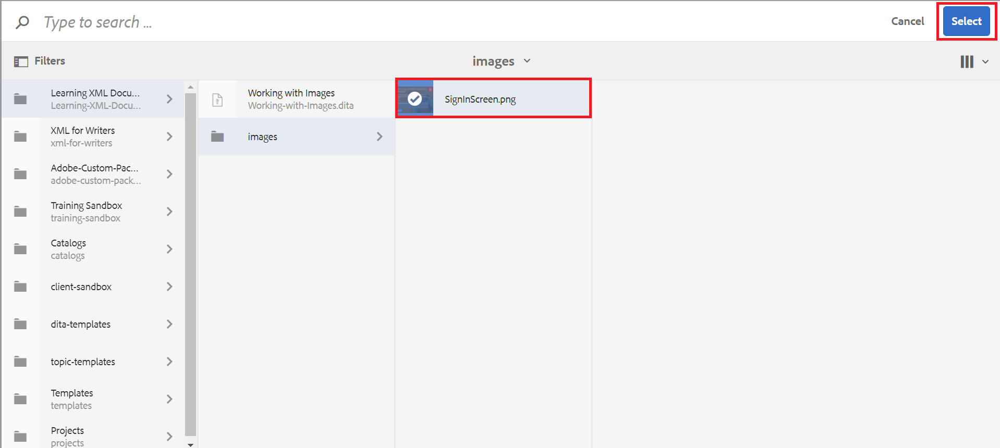

# 使用影像

下面將介紹如何上載和插入影像以及如何保存新版本的主題。

可以從下載示例映像檔案 [給。](assets/working-with-images/SignInScreen.png)

>[!VIDEO](https://video.tv.adobe.com/v/336661?quality=12&learn=on)

## 上載映像

1. 將滑鼠懸停在子資料夾上，然後選擇省略號表徵圖以開啟「選項」菜單。

   

1. 選擇 **[!UICONTROL 上載資產]**。

   

1. 選擇要從本地系統上傳的映像，然後選擇 **開啟**。

   的 [!UICONTROL 上載資產] 對話框。
1. 選擇 **上載**。

## 將影像插入主題

將影像插入主題有多種方法。

您可以將影像從本地系統拖放到主題中。 如果影像已上載，您還可以從左滑軌將其直接拖放到主題中。 或者，可以使用「插入影像」按鈕在左滑軌中插入當前不可見的影像，並在插入影像之前進一步配置影像。

對於以下內容，請確保在文檔編輯器中開啟了您的主題。

### 插入帶拖放功能的影像

1. 從本地系統或左滑軌中選擇影像檔案，然後將其拖放到主題中。

   您的影像顯示在編輯器中。

### 使用「插入影像」按鈕插入影像

1. 選擇 **插入影像** 表徵圖

   

   出現「插入影像」對話框。

1. 選擇「選擇檔案」欄位旁邊的資料夾表徵圖以搜索影像或導航至其在儲存庫中的位置。
1. 選擇影像的表徵圖，然後 **選擇**。

   

   此時將出現「插入影像」對話框，其中包含所選影像的資訊。

1. 根據需要在「表徵圖題」和「替代文本」欄位中輸入文本。
1. 選擇 **插入**。

   您的影像會顯示在編輯器中，並顯示其表徵圖。

## 從主題中刪除影像

1. 在文檔編輯器中選擇影像，然後按 **刪除** 按鈕

## 保存主題的新版本

版本控制允許您查看和比較不同的版本。 您甚至可以回滾到以前的版本。

由於您對主題進行了重大更改，現在您可能會發現將當前工作另存為新版本非常有用。

1. 選擇 **另存為新版本** 表徵圖

   

   的 **另存為新版本** 對話框。

1. 在「新版本的注釋」欄位中，輸入簡短但清晰的更改摘要。
1. 在「版本標籤」欄位中，輸入任何相關標籤。

   標籤允許您指定發佈時要包括的版本。
   >[!NOTE]
   > 
   > 如果程式配置了預定義的標籤，則可以從這些標籤中進行選擇以確保標籤的一致性。
1. 選擇 **保存**。

   您已建立了主題的新版本，並且版本號已更新。
