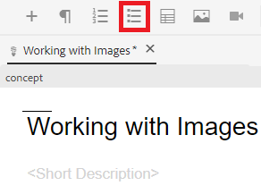
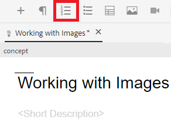

# 使用清單

您可能需要項目符號清單和編號清單來組織資訊。 下面將指導您如何在現有概念內插入和使用清單。

>[!VIDEO](https://video.tv.adobe.com/v/336658?quality=12&learn=on)

## 項目符號清單

當清單元件不需要按特定順序排列時，應使用項目符號清單或無序清單。

### 插入項目符號清單

1. 選擇 **插入項目符號清單** 的子菜單。

   

   顯示項目符號點。 這是你名單的開頭。

1. 鍵入第一個清單項。
1. 按Enter鍵建立第二個條目並鍵入內容。
1. 根據需要繼續添加清單項。

## 編號清單

當清單元件需要按某種方式排序或結構化時，應使用編號清單。

### 插入有序清單

1. 選擇 **插入編號清單** 的子菜單。

   

   將顯示一個數字。 這是你名單的開頭。

1. 鍵入第一個清單項。
1. 按Enter鍵建立第二個條目並鍵入內容。
1. 根據需要繼續添加清單項。

## 另存為新版本

現在，您已將更多內容添加到您的概念中，您可以將您的工作另存為新版本並記錄您所做的更改。

1. 選擇 **另存為新版本** 表徵圖

   

1. 在「新版本的注釋」欄位中，輸入簡短但清晰的更改摘要。
1. 在「版本標籤」欄位中，輸入任何相關標籤。

   標籤允許您指定發佈時要包括的版本。

   >[!NOTE]
   > 
   > 如果程式配置了預定義的標籤，則可以從這些標籤中進行選擇以確保標籤的一致性。

1. 選取&#x200B;**儲存**。

   您已建立了主題的新版本，並且版本號已更新。
