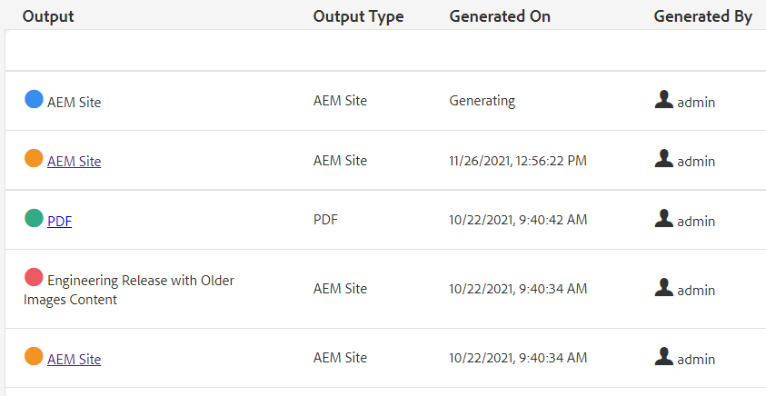

# 大量發佈

發佈時，通常需要多種類型的檔案。 使用「地圖集合」，您可以控制要組合及產生的輸出數量和類型，並啟動大量發佈。 「發佈控制面板」可讓您檢視作用中的發佈作業。 「大量發佈控制面板」提供大量啟用集合的方式。

>[!VIDEO](https://video.tv.adobe.com/v/338985?quality=12&learn=on)

## 使用地圖集合

使用「地圖集合」，您可以控制將為一個或多個地圖產生的輸出類型。

### 建立對應集合

1. 在導覽功能表中，按一下 **資產**.

1. 選擇「映射集合」。

1. 按一下&#x200B;**建立**。

1. 輸入系列標題。

   

1. 按一下&#x200B;**建立**。
1. 關閉成功訊息。

1. 開啟地圖集合（按一下圖磚下方的灰色區段）

1. 按一下 **編輯**.

1. 視需要新增地圖。

1. 選擇或取消選擇 **輸出預設集** 對應。
1. 按一下 **完成**.

### 篩選映射預設集

1. 開啟地圖預設集。

1. 在 **篩選** 視需要展開並選取選項。

### 在地圖集合中產生內容

1. 開啟地圖預設集。

1. 如果需要，請按一下 **全部產生**.

1. 或者，選擇要生成的映射和輸出類型，然後按一下 **生成選定項**.

1. 如果需要，請切換到「輸出」頁簽。

1. 查看輸出。

## 在發佈控制面板中檢視作用中的發佈作業

「發佈控制面板」可讓您檢視作用中的發佈作業。 它會顯示地圖及其目前狀態的動態清單。 您可以追蹤、管理或取消發佈工作流程。

1. 在導覽檢視中，按一下 **工具** 表徵圖。

1. 按一下 **[!DNL Guides]**.

1. 選取 **發佈控制面板** 方塊。

       如果控制面板空白，則沒有執行任何發佈作業。
       
   
1. 視需要篩選控制面板，以檢視所有發佈作業。

### 使用大量發佈控制面板

「大量發佈控制面板」可讓您使用「大量啟動集合」，並控制多種類型的輸出。

### 建立大量啟動集合

1. 在導覽檢視中，按一下 **工具** 表徵圖。

1. 按一下 **[!DNL Guides]**.

1. 選取 **大量發佈控制面板** 方塊。

1. 輸入系列標題。

1. 按一下&#x200B;**建立**。

1. 按一下 **開啟**.

1. 開啟地圖集合（按一下圖磚下方的灰色區段）

1. 按一下 **編輯**.

1. 視需要新增地圖。

1. 選擇或取消選擇 **輸出預設集** 對應。
1. 按一下 **完成**.
1. 完成時關閉地圖集合。

### 快速發佈大量啟動集合

1. 選取「大量啟動收集」方塊。
1. 按一下 **開啟**.
1. 選擇一個或多個地圖。
1. 按一下 **快速發佈**.
