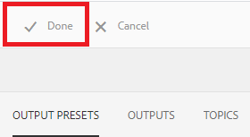

# 使用基線建立和發佈

使用基線可建立映射主題和相關參考內容的版本。 這可以基於特定日期或時間或標籤。

>[!VIDEO](https://video.tv.adobe.com/v/338993?quality=12&learn=on)

## 訪問「映射」面板中的「基線」頁籤

可以在「映射面板」中訪問基線。

1. 儲存庫視圖，選擇映射上的省略號表徵圖以開啟「選項」菜單，然後 **開啟映射儀表板。**

   
「映射儀表板」(Map Dashboard)將在另一個頁籤中開啟。

1. 選擇 **基線**。

   

此時將顯示「基線」頁籤。

## 基於標籤建立基線

1. 在「基線」(Baselines)頁籤中，選擇 **建立**。

   

   顯示新基線的資訊。 其預設名稱基於其建立日期。

1. 如果需要，請為基線指定新名稱。

1. 在「基於設定版本」標題下，為「標籤」選擇圓。
   

   >[!NOTE]
   >
   >注：的 *如果標籤不存在，則使用最新版本* 複選框。 如果未選擇此選項，且映射中存在主題或媒體檔案（未選擇標籤），則基線建立過程將失敗。

1. 輸入要使用的標籤。

1. 選取&#x200B;**儲存**。

基線已建立。 將顯示所有主題及其關聯資訊的表。

### 使用「瀏覽所有主題」功能

「瀏覽所有主題」功能允許您查看主題的資訊，包括版本和標籤，並指定使用的版本。 通過選擇 **瀏覽所有主題** 建立或編輯基線時。

## 根據日期和時間建立基線

您還可以及時建立作為快照的基線。

1. 確保「基線」頁籤已開啟，然後選擇「建立」。

   

1. 在「基於版本設定」標題下，為「版本開」選擇圓。

   

1. 選擇日曆表徵圖並指定所需的日期和時間。

   

1. 如果需要，請為基線指定新名稱。

1. 選取&#x200B;**儲存**。

基線已建立。 將顯示所有主題及其關聯資訊的表。

### 將標籤添加到基線

您可能希望將新標籤批量分配給所有映射內容。

1. 選擇要為其添加標籤的基線。

1. 選擇 **添加標籤**。

   

   將顯示「添加標籤」對話框。

1. 輸入要分配的標籤，然後選擇 **添加**。

標籤已添加到所有主題。

## 使用基AEM線生成站點輸出

1. 導航到「映射儀表板」中的「輸出預設」頁籤。

1. 選中「站AEM點」複選框。

   

1. 選取&#x200B;**編輯**。

   

   將顯示新頁面。

1. 選中「使用基線」(Use Baseline)複選框，然後從下拉清單中選擇要使用的基線。

   

1. 選擇 **完成**。

   

1. 選擇 **生成**。

   

   已使用基線生成輸出。

## 查看生成的輸出

1. 導航到「映射面板」中的「輸出」頁籤。

1. 在「層代設定」列中選擇文本以開啟輸出。
   

## 刪除基線

1. 在「基線」(Baselines)頁籤中，選擇要刪除的基線。

1. 選擇 **刪除**。

   

   將顯示「刪除基線」(Remove Baseline)對話框。

1. 選擇 **刪除**。

基線被刪除。

## 複製基線

1. 在「基線」(Baselines)頁籤中，選擇要複製的基線。

1. 選擇 **重複**。

   

1. 選取&#x200B;**儲存**。

   

建立重複的基線。

## 修改基線

您可以直接指定基線中使用的主題的版本。

1. 在「基線」(Baselines)頁籤中，選擇要修改的基線。
1. 選取&#x200B;**編輯**。

   

1. 選擇 **瀏覽所有主題**。

   

   將顯示主題及其關聯資訊的表。

1. 對於要修改的主題，請從「版本」列下的下拉清單中選擇所需的版本。

   

1. 選取&#x200B;**儲存**。

您所做的更改已保存。 您的基線現在將使用您指定的主題版本。

## 建立自定AEM義站點輸出預設

很難在「輸出」(Outputs)頁籤中區分同一類型的預設輸出。 使用具有唯一且用戶友好名稱的自定義輸出預設可解決此問題。

在這種情況下，我們將基於基線建立輸出預設。

1. 導航到「映射儀表板」中的「輸出預設」頁籤。

1. 選擇 **建立**。

   

   將顯示一個名為「新輸出」的新輸出預設頁。
1. 在「設定名稱」欄位中，輸入用戶友好名稱。

1. 選中「使用基線」(Use Baseline)複選框，然後從下拉菜單中選擇所需的基線。

   

1. 選擇 **完成**。

您的新輸出預設已建立，並顯示在輸出預設頁面上。
