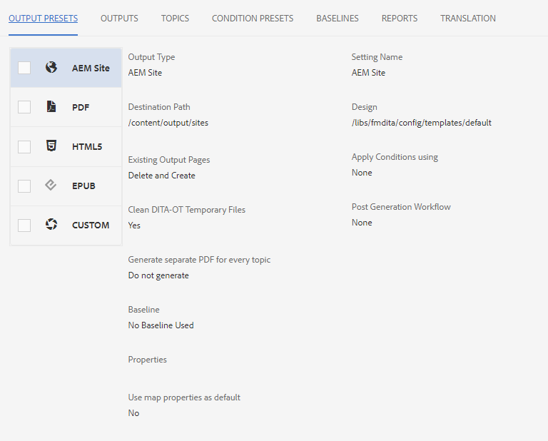
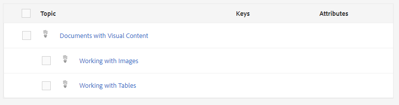
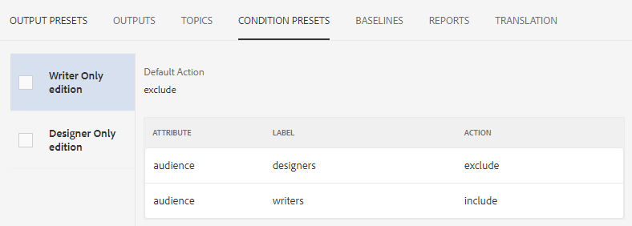
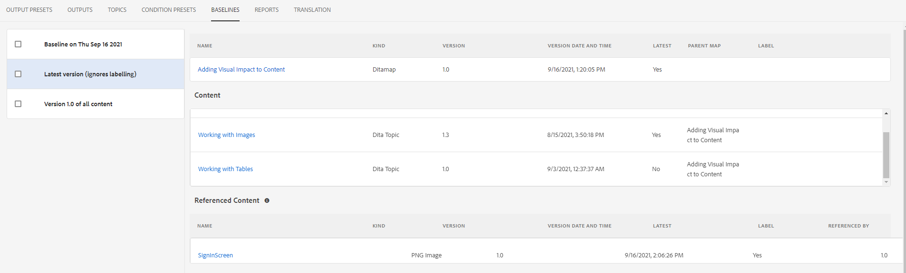

# 地圖控制面板簡介

以下項目將提供地圖控制面板主要功能的概觀。

>[!VIDEO](https://video.tv.adobe.com/v/339040?quality=12&learn=on)

## 在地圖控制面板中開啟地圖

1. 在儲存庫檢視中，選取地圖上的刪節號圖示，開啟「選項」選單，然後開啟地圖控制面板。
   

   「對應控制面板」會在另一個索引標籤中開啟。

## 地圖控制面板的元件

「映射控制面板」包含許多標籤，包括輸出預設集、輸出結果、使用的主題、基線等。

### 輸出預設集

「輸出預設集」(Output Presets)頁簽顯示不同輸出類型的預設預設集：AEM網站、PDF、HTML5、ePub和自訂。

您可以選取輸出預設集以檢視其設定的詳細資訊，包括轉換名稱、目的地路徑、基線和套用的條件。

### 輸出

「輸出」(Outputs)頁簽顯示所有先前生成和當前生成的輸出。

「層代設定」欄下方的綠色圓圈表示已成功產生輸出。 此列中的文本充當活動超連結，您可以選擇它們以開啟生成的輸出。 「類型」(Type)列下的條目指示輸出類型。
此處還顯示其他輸出生成資訊，包括生成輸出的用戶的名稱、生成的日期和時間，以及生成所花費的時間。 如果在生成過程中出錯，則可以在「生成日期」列下選擇生成日期和時間，以開啟並查看錯誤日誌。

### 主題

「主題」索引標籤會在地圖中顯示所有主題的清單。

選取主題的核取方塊可讓您執行其他動作。 您可以編輯、重新產生，以及顯示、套用或隱藏其標籤。

### 條件預設集

「條件預設集」索引標籤會顯示要納入或排除的特定條件內容的設定。

在此，選中「僅編寫器版本」的複選框將產生輸出，該輸出將排除所有具有「對象」屬性（具有「設計者」標籤）的內容，並包括所有具有「編寫者」標籤的內容。

### 基線

「基線」(Baselines)頁簽允許您查看基線。

基線可及時作為快照，並可讓您建立要發佈的主題和資產版本。 例如，擷取特定日期和時間內容的基線，可以根據某個主題的個別版本，使用某個主題的1.3版和另一個主題的1.0版。
如果未指定基線，則會使用所有內容的最新版本生成輸出。

### 報表

「報表」頁簽顯示主題資訊的摘要，包括使用中的主題總數、這些主題中缺少的元素以及文檔狀態。

如果主題缺少元素，您可以選取列中最右側的箭頭，以展開項目並檢視有關錯誤的詳細資訊。
