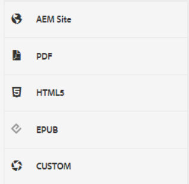
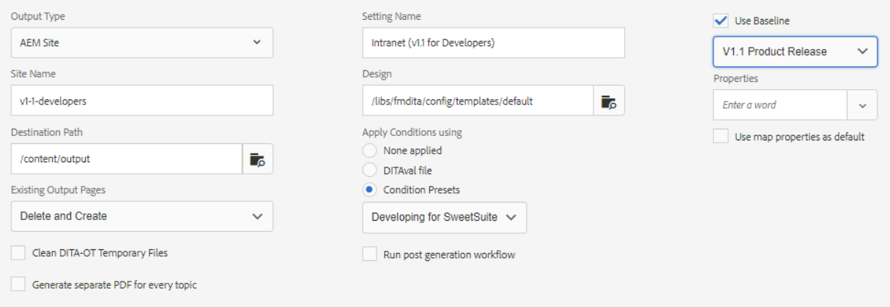

# 輸出預設

「輸出預設」是已分配給映射的發佈屬性的集合。 如果需要，可以建立或修改這些檔案。

>[!VIDEO](https://video.tv.adobe.com/v/338989)

## 訪問輸出預設

在「映射儀表板」中開啟XML編輯器中的映射時，將顯示輸出預設。 預設可包括有關特定輸出類型、目標路徑、有關如何管理現有輸出頁的說明以及可以應用於映射以生成輸出的其他設定的資訊。

## 建立輸出預設

>[!NOTE]
>
>注：輸出預設使用的某些特徵可取決於第一開發基線或條件預設。 如果需要這些選項，必須使用相應的頁籤配置它們。

1. 選擇基線輸出預設。 例如，如果要AEM建立的新預設是針對站點或提供Adobe PDF內容，則可以選擇「」。

2. 按一下&#x200B;**建立**。

3. 如果需要，請選擇「輸出類型」。

4. 根據輸出類型進一步配置選項。

5. 按一下 **完成**。

## 編輯輸出預設

輸出預設是預定義的，但可以根據需要定制。

1. 開啟「映射儀表板」。

2. 選擇 **輸出預設** 頁籤。

3. 選擇輸出預設。

4. 按一下 **編輯**。

5. 根據需要修改設定。

   

6. 按一下 **完成**。
