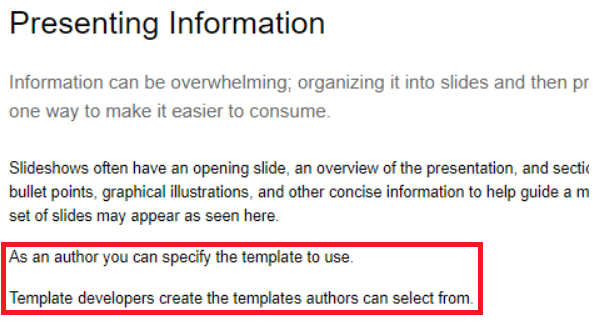
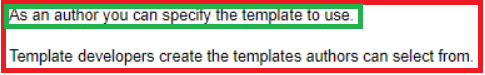
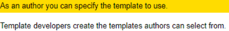
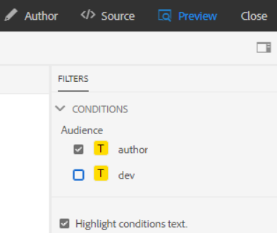
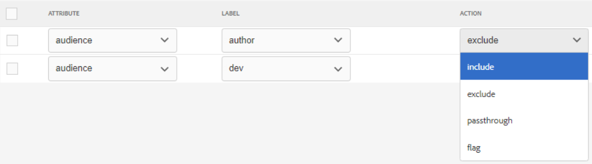
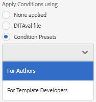
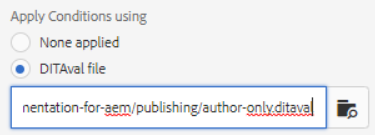

# 發佈條件

條件發佈允許為一個或多個受眾、產品或平台編寫一個內容源。 然後，可以動態發佈此資訊，並且僅包括在輸出中的特定所需內容。

>[!VIDEO](https://video.tv.adobe.com/v/339041?quality=12&learn=on)

## 準備練習

您可以在此處下載示例檔案以供練習。

[練習 — 下載](assets/exercises/publishing-with-conditions.zip)

## 使用條件屬性標籤內容

1. 開啟要修改的主題。

1. 輸入要成為條件的文本。 例如，一個或多個段落、整個表、圖或其他內容。

   

1. 選擇要為其分配條件屬性的特定內容。 例如，源中的單個段落。

   

1. 在右滑軌中確保顯示「Properties（屬性）」。

1. 為受眾、產品或平台添加屬性。

1. 為屬性分配值。 已應用用於顯示條件標籤的內容顯示更新。

   

## 預覽條件內容

1. 按一下 **預覽**。

1. 下 **篩選器**，選擇或取消選擇要顯示或隱藏的條件。

1. 選擇或取消選擇 **突出顯示條件文本**。

   

## 建立條件預設

條件預設是屬性的集合，這些屬性定義了在生成輸出期間要包括或排除或標籤的內容。

1. 從「映射儀表板」中，選擇 **條件預設** 頁籤。

1. 按一下&#x200B;**建立**。

1. 選擇 **添加** 或 **全部添加**)。

1. 命名條件。

1. 選擇屬性、標籤和操作組合。

   

1. 根據需要重複。

1. 按一下「**儲存**」。

## 生成條件輸出

一旦將條件應用於內容，就可以將其作為輸出生成。 這可以使用條件預設或DITAval檔案。

## 使用條件預設生成條件輸出

1. 選擇 **輸出預設** 頁籤。

1. 選擇輸出預設。

1. 按一下 **編輯**。

1. 下 **應用條件使用** 選擇條件預設。

   

1. 按一下 **完成**。

1. 生成輸出預設並查看內容。

## 使用DITAval檔案生成條件輸出

DITAval檔案可用於發佈條件內容。 這要求建立或上載檔案，然後在發佈時引用。

1. 選擇 **輸出預設** 頁籤。

1. 選擇輸出預設。

1. 按一下 **編輯**。

1. 在「使用應用條件」下選擇DITAval檔案。

   

1. 按一下 **完成**。

1. 生成輸出預設並查看內容。
