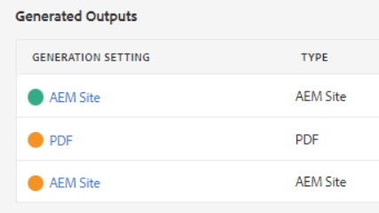
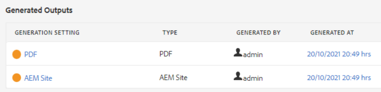

# 疑難排解發佈錯誤

發佈地圖通常很簡單。 開啟地圖，選取輸出預設集，然後產生輸出！ 但是，如果地圖或其主題中有錯誤，則輸出產生可能會失敗。 發生此情況時，請務必瞭解如何進行疑難排解。

>[!VIDEO](https://video.tv.adobe.com/v/338990?quality=12&learn=on)

## 準備練習

您可以在此處下載練習的範例檔案。

[練習 — 下載](assets/exercises/publishing-basic-to-advanced.zip)

## 發佈錯誤的常見原因

來源內容中可能會引入錯誤。 例如：

* 未正確命名的檔案路徑參考

* 名稱不正確的資料夾

* 遺失圖形或檔案

* 不正確設定的內容參考

* 中斷的互動參照

* 屬性的值中有錯誤（例如字串而不是數字）

* 使用的元件設定不正確 [!DNL AEM Guides]

## 錯誤的影響

錯誤可能是輕微的，並會導致一個簡單的附註，讓您知道檔案未成功封裝，或嚴重到足以導致無法產生輸出。 「輸出」索引標籤會顯示以顏色標示的圖示，以顯示與輸出產生相關的成功、錯誤或失敗。

## 開啟和檢閱錯誤記錄檔

可開啟產生的記錄檔以供檢閱。

1. 在 **輸出** 索引標籤，按一下 **產生日期/時間下的日期/時間。**

   

1. 捲動錯誤記錄。

## 顯示和隱藏錯誤型別

錯誤記錄會以獨特的顏色顯示每個錯誤型別。

1. **選取** 或 **取消選取** 顯示或隱藏醒目提示的任何錯誤型別。

1. 使用來瀏覽錯誤 **下一個** 或 **上一個** 按鈕（箭頭）。

## 解決錯誤

根據錯誤型別，解決方法可能簡單或複雜。 可由作者以XML編輯器完成，或需要管理員使用 [!DNL AEM Guides]. 具體更正取決於錯誤、影響及您的組織工作流程。

* 未正確命名的檔案路徑參考

       作者可以更新來原始檔中的路徑參照。
       
   
* 名稱不正確的資料夾

       作者可視需要更新資料夾名稱或移動檔案。
       
   
* 遺失圖形或檔案

       作者可以上傳遺失的圖形/檔案、重新命名圖形/檔案，或移動圖形/檔案
       
   
* 不正確設定的內容參考

       作者可以修正參考內容的位置，或變更內容參考的路徑。
       
   
* 中斷的互動參照

       作者可以修正互動參照點所在的位置，或變更目的地檔案名稱或屬性
       
   
* 屬性的值中有錯誤（例如字串而不是數字）

       作者可以將屬性更新為正確的值，或者管理員可以更新系統以支援新值。
       
   
* 使用的元件設定不正確 [!DNL AEM Guides]

       管理員可以更新系統、其元件或許可權的安裝。
       
   