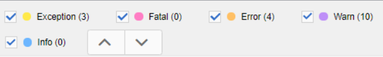

# 疑難排解發佈錯誤

發佈地圖通常很簡單。 開啟地圖，選取「輸出預設集」，然後產生輸出！ 不過，如果地圖或其主題中有錯誤，則輸出產生可能會失敗。 發生此情況時，請務必了解疑難排解方法。

>[!VIDEO](https://video.tv.adobe.com/v/338990?quality=12&learn=on)

## 為練習做準備

您可以在此處下載練習的範例檔案。

[練習 — 下載](assets/exercises/publishing-basic-to-advanced.zip)

## 發佈錯誤的常見原因

可能會在來源內容中造成錯誤。 例如：

* 檔案路徑引用名稱不正確

* 資料夾名稱不正確

* 缺少圖形或檔案

* 未正確配置的內容引用

* 斷開交叉引用

* 屬性值（例如字串而非數字）中的錯誤

* 使用的元件設定不正確 [!DNL AEM Guides]

## 錯誤的影響

錯誤可能很小，並導致簡單的注釋，以便您知道檔案未成功打包，或者嚴重到導致無法生成輸出。 「輸出」索引標籤會顯示彩色編碼圖示，以顯示與輸出產生相關的成功、錯誤或失敗。

## 開啟和檢閱錯誤記錄

可以開啟生成的日誌檔案以供查看。

1. 在 **輸出** ，按一下 **日期/時間（在「產生日期」下）。**

   

2. 滾動查看錯誤日誌。

## 顯示和隱藏錯誤類型

錯誤日誌以唯一的顏色顯示每種錯誤類型。

1. **選擇** 或 **取消選取** 顯示或隱藏突出顯示的任何錯誤類型。

2. 使用 **next** 或 **上一個** 按鈕（箭頭）。

## 解決錯誤

根據錯誤類型，解析度可能是簡單或複雜的。 作者可在XML編輯器中完成此作業，或要求管理員使用 [!DNL AEM Guides]. 具體更正取決於錯誤、影響和您的組織工作流程。

* 檔案路徑引用名稱不正確

       作者可以更新源文檔中的路徑引用。
       
   
* 資料夾名稱不正確

       作者可以更新資料夾名稱，或視需要移動檔案。
       
   
* 缺少圖形或檔案

       作者可以上傳遺失的圖形/檔案、更名圖形/檔案或移動圖形/檔案
       
   
* 未正確配置的內容引用

       作者可以修正所參考內容的位置，或變更內容參考的路徑。
       
   
* 斷開交叉引用

       作者可以修正交叉參照指向的位置，或變更目標檔案名稱或屬性
       
   
* 屬性值（例如字串而非數字）中的錯誤

       作者可將屬性更新為正確值，或管理員可更新系統以支援新值。
       
   
* 使用的元件設定不正確 [!DNL AEM Guides]

       管理員可以更新系統、其元件或權限的安裝。
       
   