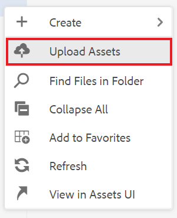
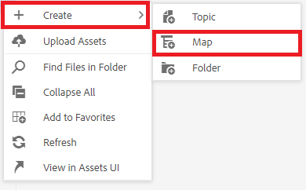
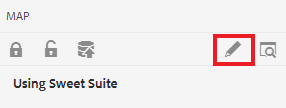
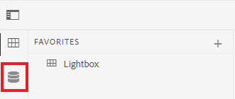
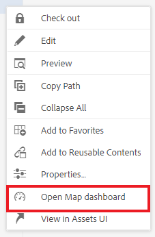
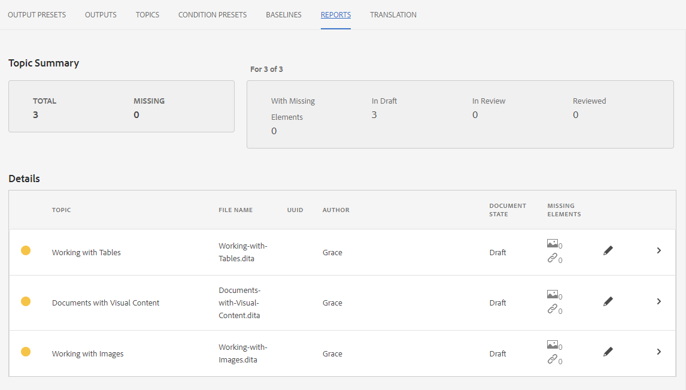
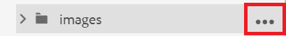
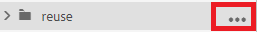
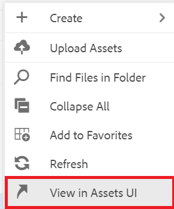

# 使用報表

「映射面板」中的「報告」(Reports)頁籤允許您識別和解決斷開的連結、被引用和重用的內容（參照）、交叉引用或其他缺少的資訊。

>[!VIDEO](https://video.tv.adobe.com/v/339039)

## 準備練習

您可以在此處下載示例檔案以供練習。

[練習 — 下載](assets/exercises/working-with-reports.zip)

## 上傳資產

1. 在儲存庫視圖中，選擇主資料夾上的省略號表徵圖以開啟「選項」菜單。

   

2. 選擇 **[!UICONTROL 上載資產]**。

   

3. 選擇要上載到資料夾的檔案，然後選擇 **上載**。

DITA檔案開啟，您應查看它們，以瞭解缺少內容、引用或交叉引用的問題。

## 建立映射

1. 選擇主資料夾上的省略號表徵圖以開啟「選項」菜單。

   

2. 選擇 **建立>映射**。

   

   將顯示「建立新映射」對話框。

3. 在「模板」欄位中，選擇 **布克馬普** 或 **地圖** 根據您正在建立的內容類型)，並為您的地圖指定一個標題。

4. 選擇 **建立**。

您的映射已建立，左滑軌將自動從「儲存庫」視圖更改為「映射」視圖。

## 插入映射元件

1. 選擇左滑軌中的鉛筆表徵圖。
這是「編輯」表徵圖，允許您在編輯器中開啟映射。

   

2. 通過選擇「儲存庫」表徵圖切換回「儲存庫」視圖。

   

3. 通過將主題從儲存庫拖放到編輯器的映射中，將主題添加到映射中。
行指示器將顯示主題的位置。

4. 繼續根據需要添加主題。

5. 完成後，選擇 **另存為新版本。**

   

6. 在 *新版本的注釋* 欄位，輸入說明性注釋。

7. 選擇 **保存**。

## 生成站AEM點輸出

1. 在儲存庫中，選擇映射上的省略號表徵圖以開啟「選項」菜單，然後 **開啟映射儀表板。**

   

   「映射儀表板」(Map Dashboard)將在另一個頁籤中開啟。
2. 在「輸出預設」頁籤中，選擇 **站AEM點**。

   

3. 選擇 **生成**。

4. 定位至「輸出」頁以查看生成的輸出的狀態。
如果存在錯誤，「輸出」(Outputs)頁籤在「層代設定」(Generation Setting)列下可顯示一個橙色圓，而不是綠色，表示層代已完成。

5. 選擇「層代設定」列下的連結以開啟生成的輸出。
查看輸出中缺少的內容。

## 「報告」頁籤

「報告」頁籤顯示主題摘要和包含主題資訊和映射內問題的表。

理想情況下，在導入內容後始終檢查「報告」中的映射。

「缺少元素」列指示缺少的影像數和損壞的參照數。 可以選擇 **鉛筆** 表徵圖以在編輯器中開啟主題。

## 解析丟失的影像

如果檔案中缺少影像，一個常見原因可能是內容已上載，但影像未上載。 如果是，請通過將影像上載到與檔案所需的路徑和檔案名匹配的特定資料夾中，解決缺少的影像問題。

1. 在 *儲存庫視圖*，選擇影像資料夾中的省略號表徵圖以開啟「選項」菜單。

   

2. 選擇 **[!UICONTROL 上載資產]**，然後選擇缺少的影像。

3. 選擇 **上載**。

丟失的映像已上載。 現在，新生成的AEM站點輸出將顯示這些影像，並且「報告」頁籤將不再顯示任何丟失的影像錯誤。

## 解決斷開的容器

如果在其他位置引用的內容(conref)連結到另一個資料夾內的檔案（例如，一個名為「reuse」的檔案）。 內容未上載，必須解決錯誤。 例如，必須建立名為「reuse」的子資料夾，然後將缺少的檔案上載到「reuse」。

### 正在將資產與 [!UICONTROL 資產] UI

除 [!UICONTROL 上載資產] 選項，可通過拖放到「資產」UI中來上載資產。

1. 在「儲存庫視圖」中，選擇重用資料夾中的省略號表徵圖以開啟「選項」菜單。

   

2. 選擇 **在資產UI中查看**。

   

3. 將檔案拖放到資料夾中。
檔案已上載，並且解決了conref錯誤。

所有錯誤現已解決。 「報告」頁將指示不再有錯誤，並且生成站點AEM將導致完整輸出，且沒有缺少元件。
