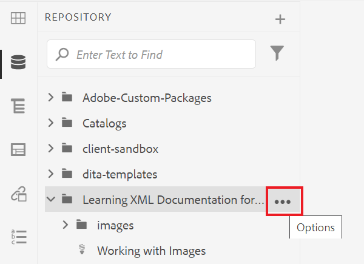

# 使用報表

「地圖控制面板」中的「報表」索引標籤可讓您識別並解決中斷的連結、參照並重複使用的內容(conref)、交叉參照或其他遺失的資訊。

>[!VIDEO](https://video.tv.adobe.com/v/339039?quality=12&learn=on)

## 為練習做準備

您可以在此處下載練習的範例檔案。

[練習 — 下載](assets/exercises/working-with-reports.zip)

## 上傳資產

1. 在「儲存庫視圖」中，選擇主資料夾上的刪節號表徵圖以開啟「選項」菜單。

   

2. 選擇 **[!UICONTROL 上傳資產]**.

   

3. 選擇要上載到資料夾的檔案，然後選擇 **上傳**.

DITA檔案會開啟，您應該檢閱這些檔案，以找出缺少內容、conref或交叉參照的問題。

## 建立地圖

1. 選取主資料夾上的刪節號圖示，開啟「選項」選單。

   

2. 選擇 **建立>對應**.

   

   隨即顯示「建立新地圖」對話方塊。

3. 在「模板」欄位中，選擇 **書籤圖** (或 **地圖** 根據您正在建立的內容類型)，並為地圖指定標題。

4. 選擇 **建立**。

您的地圖會建立，而左側邊欄會自動從存放庫檢視變更為地圖檢視。

## 插入映射元件

1. 選取左側邊欄中的鉛筆圖示。
這是「編輯」圖示，可讓您在編輯器中開啟地圖。

   

2. 通過選擇儲存庫表徵圖切換回儲存庫視圖。

   

3. 將主題從存放庫拖曳至編輯器的對映中，即可將主題新增至對映。
行指示器將顯示主題的放置位置。

4. 視需要繼續新增主題。

5. 完成後，請選取 **另存為新版本。**

   

6. 在 *新版本的注釋* 欄位中輸入描述性備注。

7. 選取&#x200B;**儲存**。

## 產生AEM網站輸出

1. 在存放庫中，選取地圖上的刪節號圖示以開啟「選項」選單，然後 **開啟「地圖控制面板」。**

   

   「對應控制面板」會在另一個索引標籤中開啟。
2. 在「輸出預設集」頁簽中，選擇 **AEM網站**.

   

3. 選擇 **產生**.

4. 導覽至「輸出」頁面，以檢視您所產生輸出的狀態。
如果出現錯誤，「輸出」索引標籤可能會在「層代設定」欄下顯示橘色圓圈，而非綠色，表示層代已完成。

5. 選擇「層代設定」列下的連結以開啟生成的輸出。
檢閱輸出中是否有遺漏內容。

## 報表標籤

「報表」索引標籤會顯示主題摘要，以及包含主題資訊和對映內問題的表格。

最好在匯入內容後，一律檢查「報表」中的對應。

「缺少元素」欄指出缺少影像的數量和損壞的conref。 您可以選取 **鉛筆** 圖示以在編輯器中開啟主題。

## 解決缺少的影像

如果檔案中缺少影像，常見原因可能是內容已上傳，但影像尚未上傳。 若有，請將影像上傳至符合檔案所需路徑和檔案名稱的特定資料夾，以解決遺失的影像問題。

1. 在 *儲存庫視圖*，請選取影像資料夾上的刪節號圖示，開啟「選項」選單。

   

2. 選擇 **[!UICONTROL 上傳資產]**，並選取遺失的影像。

3. 選擇 **上傳**.

已上載丟失的影像。 現在，新產生的AEM Site輸出將會顯示這些影像，而「報表」標籤將不再顯示任何遺失的影像錯誤。

## 解決斷開的conref

如果在其他位置參照的內容(conref)連結至另一個資料夾內的檔案（例如，名為「reuse」的檔案）。 且內容未上傳，則必須解決錯誤。 例如，您必須建立名為「reuse」的子資料夾，並將遺失的檔案上傳至「reuse」。

### 上傳資產，並搭配 [!UICONTROL 資產] UI

除了 [!UICONTROL 上傳資產] 選項，您可以拖放至「資產」UI，以上傳資產。

1. 在「儲存庫視圖」中，選擇重用資料夾上的刪節號表徵圖，以開啟「選項」菜單。

   

2. 選擇 **在資產UI中檢視**.

   

3. 將檔案拖放至資料夾。
檔案已上傳，且conref錯誤已解決。

所有錯誤現已解決。 「報表」頁面會指出沒有其他錯誤，而產生AEM Site會導致完整輸出，且沒有遺失元件。
