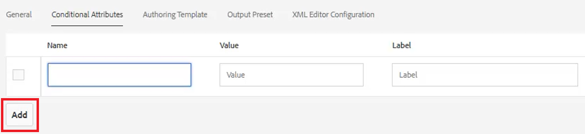
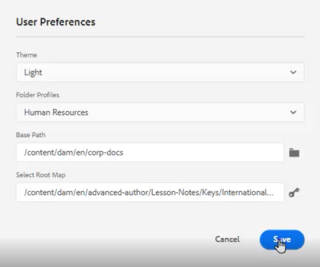
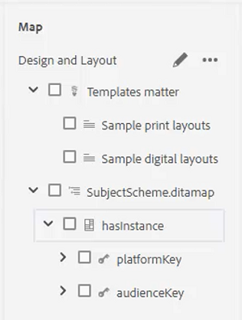
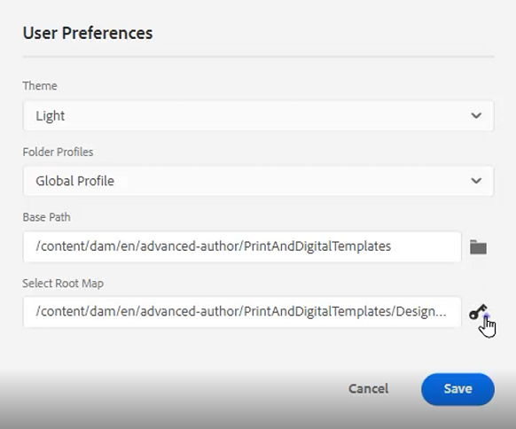

# 條件

在DITA中，條件通常是透過產品、平台和對象等屬性來驅動。 也可以為這些值指派特定值。 使用者可以透過資料夾設定檔控制所有這些。

檔案中提供您可選擇用於本課程的範例檔案 [conditions.zip](assets/conditions.zip).

>[!VIDEO](https://video.tv.adobe.com/v/342755?quality=12&learn=on)

## 將條件指派給資料夾設定檔

1. 選取 **資料夾描述檔** 方塊。

1. 按一下 [!UICONTROL **條件屬性**].

1. 按一下 [!UICONTROL **編輯**] 在設定檔的左上角。

1. 按一下 [!UICONTROL **新增**].

   

1. 填妥必填欄位。

   - 名稱應對應於用於分析的屬性。

   - 值是要在DITA代碼源中使用的確切條目。

   - 「標籤」是輸入屬性的使用者將看到的字詞。

1. 按一下「[!UICONTROL **儲存**]」。

>[!NOTE]
>
>注意：設定全域設定檔可能是控制屬性和值使用方式的早期和有效方式，以遵循一致的樣式指南。

## 將屬性指派給元素

如果未將自定義資料夾配置檔案分配給某個概念，則您可能希望將屬性分配給特定元素，如段落。

1. 從 **儲存庫視圖**，按一下您要使用的元素以選取它。

1. 在 **內容屬性** 面板，按一下 [!UICONTROL **屬性**] 下拉式清單。

1. 選擇要分配的屬性。

1. 新增 **值**.

屬性和值配對現在會指派給選取的元素。

## 使用條件指派屬性和值配對

「條件」面板可以控制「屬性」和「值」配對的分配。

1. 修改 **使用者偏好設定**.

   a.按一下「用戶首選項」表徵圖。

   

   b.填妥 **使用者偏好設定** 對話框。 例如：

   

   c.按一下 [!UICONTROL **儲存**].

1. 從「條件」面板，展開「對象」和「平台」的下拉式清單。 請注意，可用條件是「資料夾描述檔」專屬的。

1. 將條件拖放至所需元素上以指派。

## 指派主旨方案

主題方案圖是地圖的專用形式，並由地圖引用。 主體方案用於定義分類。 它們可控制可用的值。

1. 導覽至 **儲存庫視圖**.

1. 選擇引用「主題方案」對話框的映射。 此範例使用的地圖稱為 _設計與佈局_.

   

1. 配置用戶首選項。

   a.按一下 [!UICONTROL **使用者偏好設定**] 表徵圖。

   

   b.填入 **使用者偏好設定** 對話框。

   c.按一下「基本路徑」欄位旁的資料夾符號，以選擇所需檔案的路徑。

   d.按一下 [!UICONTROL **選擇**].

   e.按一下 **根圖** 欄位以輸入路徑。

   >[!IMPORTANT]
   >
   >重要：所選的根映射必須是包含「主體配置」的映射。

   

   f.選取您要使用的資料夾，以限制顯示的資產。

   g.按一下 [!UICONTROL **選擇**].

   h.按一下 [!UICONTROL **儲存**].

「主體方案」現已指派。

## 從「條件」面板檢視「主旨配置」

1. 導覽至 **編輯器設定**.

1. 選取 **條件** 標籤。

1. 核取方塊 **在「條件」面板中顯示主體配置**
