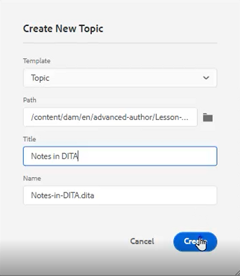

# 內容重用

DITA的主要功能之一是能夠重用內容。 它允許從小短語到整個主題或地圖的內容重用。  但是，要有效地重用內容，必須對其進行妥善管理。 使用可重複使用的資訊時，確保您有一個有效的內容策略。

>[!VIDEO](https://video.tv.adobe.com/v/342757?quality=12&learn=on)

## 建立可重用主題

當對可重用源主題進行更改時，資訊將在使用內容的任何地方進行更新。

1. 導航到 **儲存庫**。

1. 按一下 **上下文菜單** 資料夾旁邊。

1. 選擇 **建立> Dita主題**。

1. 填充「建立新主題」對話框中的欄位。 例如：

   

1. 按一下&#x200B;[!UICONTROL **建立**]。

1. 根據需要將內容添加到主題。

## 向主題添加新的可重用元素

添加可重用元素有幾種方法。 在此，只添加一個元件時，第一個工作流最好。 第二個工作流更適合添加多個可重用元件。

### 工作流1

1. 在有效位置按一下主題。

1. 選擇 **插入可重用內容** 表徵圖

   

1. 在「重用內容」對話框中，按一下 [!UICONTROL **資料夾**] 表徵圖

1. 導航到所需的資料夾。

1. 選擇具有可重用元件的主題。
例如：

   

1. 按一下 [!UICONTROL **選擇**]。

1. 選擇要重用的特定元件。

1. 按一下 [!UICONTROL **選擇**]。

可重用元素現在已插入到主題中。

### 工作流2

1. 導航到 **可重用內容** 的下界。

1. 按一下 [!UICONTROL **添加**] 表徵圖。

   

1. 導航到資料夾。

1. 選擇特定主題。

1. 按一下 [!UICONTROL **添加**]。

1. 從「可重用內容」面板展開 **元素概述**。

1. 將元素拖放到主題的有效位置。

可重用元素現在已插入到主題中。

## 為元素分配ID和值

您剛建立的長度是可重用的元素。 因此，它需要ID和值。

1. 在窗口內按一下。

1. 在「內容屬性」面板中，按一下「屬性」下的下拉清單。

1. 選擇 **ID**。

1. 鍵入值的邏輯名稱。

1. 保存或版本主題，以便更改反映在儲存庫中。

ID和值已分配給元素。
