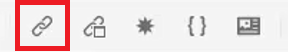
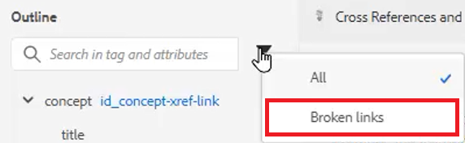

# 交叉參考和連結

XML編輯器和DITA提供強大的方式，可連結主題之間。 請務必有效管理您的內容參考，包括使用唯一ID值。

檔案中提供您可選擇用於本課程的範例檔案
[crossreferencesandlinks.zip](assets/crossreferencesandlinks.zip)

>[!VIDEO](https://video.tv.adobe.com/v/342764?quality=12&learn=on)

## 建立外部主題的交叉參考

將存放庫中的主題拖放至開啟的檔案中，即可建立外部交叉參照。 不過，為避免交叉參照損毀，必須先將ID定義為與父元素相關的值。 這是建立交叉參照的簡單方式，同時確保正確指派ID。

1. 開啟要插入外部交叉引用的檔案。

2. 將ID指派給要參考的元素。

   a.在元素內按一下。

   b.在「內容屬性」面板上，選擇 **ID** 從「屬性」下拉式清單中。

   c.在值欄位中鍵入邏輯名稱。

   d.在中檢視元素及其值 **大綱視圖** 如果需要。

3. **儲存** 確保儲存庫具有更新的ID的主題。

4. 按一下 [!UICONTROL **參考**] 圖示。

   

5. 從 **內容參考** 頁簽，選擇要作為交叉引用插入的ID和元素配對。

6. 按一下 [!UICONTROL **選擇**].

交叉參考已新增至主題。

## 連結至網站

您可以在任何主題中插入網站的連結。 如需詳細資訊，請參閱連結至網站的AEM指南第1課程影片。

## 檢視中斷的連結

某些修改可能會導致交叉參照損毀。 這包括刪除主題、重新組織包含交叉引用的節，或在插入交叉引用後更改ID。 請注意，範例主題 _crossreferencesandlinks.zip_ 本課程提供，其中會造成內部內容的數個項目符號交叉參照中斷。

1. 導覽至 **大綱視圖** 在左側面板上。

2. 按一下 [!UICONTROL **篩選**] 表徵圖。

3. 選擇 **失效連結**.

   

中斷的連結會顯示為可點按的物件。 您可以在主題中以紅色文字識別。
