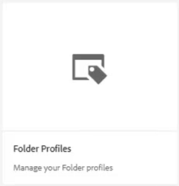

# XML編輯器配置

如果在限制性環境中工作，則可以通過在特定資料夾配置檔案中自定義編輯器配置來選擇作者能夠查看的功能。 應用此資料夾配置檔案可以更改編輯器本身、CSS模板、可用的代碼段和內容版本標籤的外觀。

檔案中提供了您可能選擇用於本課的示例檔案 [xmleditorconfiguration.zip](assets/xmleditorconfiguration.zip)。

>[!VIDEO](https://video.tv.adobe.com/v/342762?quality=12&learn=on)

## 自定義預設編輯器UI配置

您始終可以將預設的UI配置下載到本地系統，在您選擇的文本編輯器中對其進行更改，然後重新上載。

1. 在導航螢幕中，按一下 [!UICONTROL **工具**] 表徵圖

   

1. 選擇 **參考線** 的下界。

1. 按一下 [!UICONTROL **資料夾配置檔案**] 平鋪。

   

1. 選擇資料夾配置檔案。

1. 按一下 [!UICONTROL **XML編輯器配置**] 頁籤。

1. 按一下 [!UICONTROL **下載**] 預設。

   

現在，您可以在文本編輯器中開啟和修改內容。 的 _指AEM南安裝和配置_ 指南包含如何刪除、自定義或向UI配置添加函式的示例。

## 上載修改的XML編輯器UI配置

自定義UI配置後，可以上載它。 請注意，示例配置檔案 _ui-config-restricted-editor.json_ 提供了本課的一組支援主題。

1. 在資料夾配置檔案中，按一下 [!UICONTROL **XML編輯器配置**] 頁籤。

1. 在XML編輯器UI配置下，按一下 [!UICONTROL **上載**]。

   

1. 按兩下修改的UI配置檔案，或如此處所示，按一下提供的示例檔案。

   

1. 按一下 [!UICONTROL **保存**] 的下界。

您已成功上載已修改的UI配置。

## 自定義CSS模板佈局

與UI配置一樣，您可以下載CSS模板佈局。 您可以在文本編輯器中開啟它，並在上載前進行修改以自定義主題的外觀。

1. 在導航螢幕中，按一下 [!UICONTROL **工具**] 表徵圖

   

1. 選擇 **參考線** 的下界。

1. 按一下 [!UICONTROL **資料夾配置檔案**] 平鋪。

   

1. 選擇資料夾配置檔案。

1. 按一下 [!UICONTROL **XML編輯器配置**] 頁籤。

1. 在「CSS模板佈局」下，按一下 [!UICONTROL **下載**]。

   

現在，您可以修改CSS內容並將其保存在文本編輯器中。

## 上載修改的CSS模板佈局

自定義CSS模板佈局後，可以上載它。 請注意示例檔案 _css-layout-only-draft-comment-change.css_ 提供了本課的一組支援主題。 此檔案僅包含「草稿注釋更改」，而 _css-layout-draft-comment-change-css_ 是整個檔案，僅供您測試或查看。

1. 在資料夾配置檔案中，按一下 [!UICONTROL **XML編輯器配置**] 頁籤。

1. 在「CSS模板佈局」下，按一下 [!UICONTROL **上載**]。

   

1. 按兩下您自己的自定義CSS佈局或此處顯示的提供的示例檔案。

   

1. 按一下 [!UICONTROL **保存**] 的下界。
您已成功上載自定義的CSS模板佈局。

## 編輯XML編輯器代碼段

片段是可重複使用的內容片段，可特定於產品或組。 請注意，本課的支援檔案中提供了示例代碼段。

1. 在導航螢幕中，按一下 [!UICONTROL **工具**] 表徵圖

   

1. 選擇 **參考線** 的下界。

1. 按一下 [!UICONTROL **資料夾配置檔案**] 平鋪。

   

1. 選擇資料夾配置檔案。

1. 按一下 [!UICONTROL **XML編輯器配置**] 頁籤。

1. 在XML編輯器代碼段下，按一下 **上載**。

   

1. 選擇您自己的代碼段或使用提供的示例。

   

1. 按一下 [!UICONTROL **保存**] 的下界。

您已成功將新代碼段添加到編輯器中。

## 自定義XML內容版本標籤

預設情況下，允許作者建立其選擇的標籤，並將其與主題檔案關聯。 這可能導致同一標籤上出現不同的變化。 為避免標注不一致，您還可以從預定義標籤清單中進行選擇。

1. 在導航螢幕中，按一下 [!UICONTROL **工具**] 表徵圖

   

1. 選擇 **參考線** 的下界。

1. 按一下 [!UICONTROL **資料夾配置檔案**] 平鋪。

   

1. 選擇資料夾配置檔案。

1. 按一下 [!UICONTROL **XML編輯器配置**] 頁籤。

1. 在「XML內容版本標籤」下，按一下 [!UICONTROL **下載**]。

   

您現在可以根據需要自定義標籤。

## 上載XML內容版本標籤

下載和修改標籤後，可以上載XML內容版本標籤主題。 您可以選擇使用示例檔案 _標籤.json_，提供了本課的一組支援主題。

1. 在資料夾配置檔案中，按一下 [!UICONTROL **XML編輯器配置**] 頁籤。

1. 在「XML內容版本標籤」下，按一下 [!UICONTROL **上載**]。

   

1. 按兩下您自己的自定義標籤或此處顯示的示例檔案的檔案。

   

1. 按一下 [!UICONTROL **保存**] 的下界。

您已成功上載自定義XML內容版本標籤。
