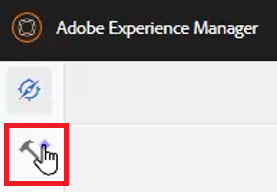

# XML編輯器配置

如果您在限制性環境中工作，則可以透過在特定資料夾設定檔中自訂編輯器設定，來選擇作者可檢視的功能。 套用此資料夾設定檔可以變更編輯器本身、CSS範本、可用的片段和內容版本標籤的外觀和風格。

檔案中提供您可選擇用於本課程的範例檔案 [xmleditorconfiguration.zip](assets/xmleditorconfiguration.zip).

>[!VIDEO](https://video.tv.adobe.com/v/342762?quality=12&learn=on)

## 自訂預設編輯器UI設定

您隨時可以將預設的UI設定下載至本機系統、在您選擇的文字編輯器中對其進行變更，然後再次上傳。

1. 在導覽畫面中，按一下 [!UICONTROL **工具**] 表徵圖。

   

1. 選擇 **指南** 在左側面板上。

1. 按一下 [!UICONTROL **資料夾描述檔**] 方塊。

   

1. 選擇資料夾配置檔案。

1. 按一下 [!UICONTROL **XML編輯器配置**] 標籤。

1. 按一下 [!UICONTROL **下載**] 預設。

   

您現在可以在文字編輯器中開啟和修改內容。 此 _AEM指南安裝與設定_ 本指南包含如何移除、自訂或新增函式至UI設定的範例。

## 上傳修改的XML編輯器UI配置

自訂UI設定後，即可上傳它。 請注意，範例設定檔 _ui-config-restricted-editor.json_ 提供本課程的一組支援主題。

1. 在「資料夾描述檔」中，按一下 [!UICONTROL **XML編輯器配置**] 標籤。

1. 在XML編輯器UI配置下，按一下 [!UICONTROL **上傳**].

   

1. 連按兩下已修改UI設定的檔案，或如此處所示，提供的範例檔案。

   

1. 按一下 [!UICONTROL **儲存**] 在畫面左上角。

您已成功上傳已修改的UI設定。

## 自訂CSS範本版面

和UI設定一樣，您可以下載CSS範本版面。 您可以在文字編輯器中開啟主題，並進行修改以自訂主題的外觀和風格，然後再上傳。

1. 在導覽畫面中，按一下 [!UICONTROL **工具**] 表徵圖。

   

1. 選擇 **指南** 在左側面板上。

1. 按一下 [!UICONTROL **資料夾描述檔**] 方塊。

   

1. 選擇資料夾配置檔案。

1. 按一下 [!UICONTROL **XML編輯器配置**] 標籤。

1. 在「CSS範本配置」下，按一下 [!UICONTROL **下載**].

   

您現在可以在文字編輯器中修改及儲存CSS內容。

## 上傳修改的CSS範本版面

自訂CSS範本版面後，您可以上傳它。 請注意，範例檔案 _css-layout-ONLY-draft-comment-change.css_ 提供本課程的一組支援主題。 此檔案僅包含「草稿注釋變更」，但 _css-layout-draft-comment-change.css_ 是整個檔案，僅供您測試或檢閱之用。

1. 在「資料夾描述檔」中，按一下 [!UICONTROL **XML編輯器配置**] 標籤。

1. 在「CSS範本配置」下，按一下 [!UICONTROL **上傳**].

   

1. 連按兩下您自訂CSS版面的檔案，或此處顯示的範例檔案。

   

1. 按一下 [!UICONTROL **儲存**] 在畫面左上角。
您已成功上傳自訂的CSS範本版面。

## 編輯XML編輯器代碼段

片段是可重複使用的內容片段，可供產品或群組專用。 請注意，本課程的支援檔案提供了示例代碼片段。

1. 在導覽畫面中，按一下 [!UICONTROL **工具**] 表徵圖。

   

1. 選擇 **指南** 在左側面板上。

1. 按一下 [!UICONTROL **資料夾描述檔**] 方塊。

   

1. 選擇資料夾配置檔案。

1. 按一下 [!UICONTROL **XML編輯器配置**] 標籤。

1. 在「XML編輯器代碼段」下，按一下 **上傳**.

   

1. 選擇您自己的代碼片段或使用提供的示例。

   

1. 按一下 [!UICONTROL **儲存**] 在畫面左上角。

您已成功將新的代碼片段添加到編輯器中。

## 自定義XML內容版本標籤

依預設，作者可建立其所選標籤，並與主題檔案建立關聯。 這可能會導致相同標籤上出現不同的變化。 為避免標籤不一致，您也可以從預先定義的標籤清單中選擇。

1. 在導覽畫面中，按一下 [!UICONTROL **工具**] 表徵圖。

   

1. 選擇 **指南** 在左側面板上。

1. 按一下 [!UICONTROL **資料夾描述檔**] 方塊。

   

1. 選擇資料夾配置檔案。

1. 按一下 [!UICONTROL **XML編輯器配置**] 標籤。

1. 在「 XML內容版本標籤」下，按一下 [!UICONTROL **下載**].

   

您現在可以視需要自訂標籤。

## 上傳XML內容版本標籤

下載並修改標籤後，可以上載「XML內容版本標籤」主題。 您可以選擇使用範例檔案 _labels.json_，提供本課程的一組支援主題。

1. 在「資料夾描述檔」中，按一下 [!UICONTROL **XML編輯器配置**] 標籤。

1. 在「 XML內容版本標籤」下，按一下 [!UICONTROL **上傳**].

   

1. 連按兩下您自訂標籤的檔案，或此處顯示的範例檔案。

   

1. 按一下 [!UICONTROL **儲存**] 在畫面左上角。

您已成功上傳自訂XML內容版本標籤。
