# 資料夾描述檔

AEM可讓您快速存取設定工具。 通過自定義資料夾配置檔案，不同的部門或產品可以具有獨特的模板、創作環境、條件屬性配置檔案、片段，甚至Web編輯器配置。

檔案中提供您可選擇用於本課程的範例檔案 [folderprofiles.zip](assets/folderprofiles.zip).

>[!VIDEO](https://video.tv.adobe.com/v/342758?quality=12&learn=on)

## 存取資料夾設定檔

設定是透過「資料夾設定檔」圖示來管理。

1. 在導覽畫面中，按一下 [!UICONTROL **工具**] 表徵圖。

   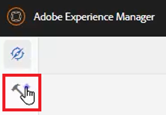

2. 選擇 **指南** 在左側面板上。

3. 按一下 [!UICONTROL **資料夾描述檔**] 方塊。

   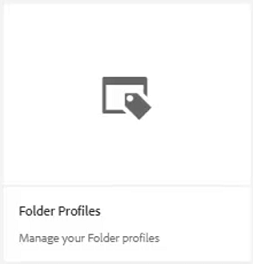

4. 選取所需的設定檔。 例如，選擇 **全域設定檔**，此為預設設定檔。

   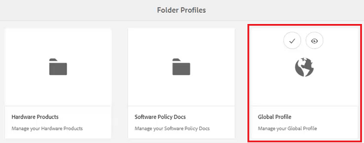

## 在全局配置檔案中編輯條件屬性

存取全域設定檔後，即可編輯其設定。 除非另有指定，否則全域設定檔設定會套用至所有使用者。

1. 在全域設定檔中，選取 **條件屬性** 標籤。

2. 按一下 [!UICONTROL **編輯**] 在畫面左上角。

   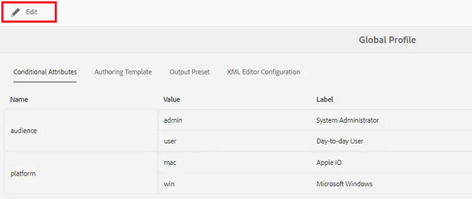

3. 按一下&#x200B;[!UICONTROL **「新增」**]。

4. 填入 **名稱**, **值**，和 **標籤** 欄位。

   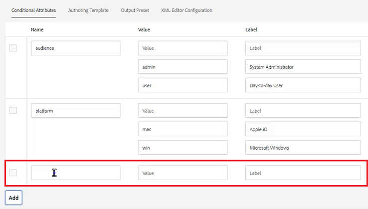

5. 按一下 [!UICONTROL **儲存**] 在畫面左上角。
新條件現在可供所有使用者使用。 您可以在「內容屬性」面板中選取它，並視需要將其套用至內容。

## 建立新的資料夾配置檔案

除了預設的全域設定檔，您還可以建立自己的自訂設定檔。

1. 在導覽畫面中，按一下 [!UICONTROL **工具**] 表徵圖。

   

2. 選擇 **指南** 在左側面板上。

3. 按一下 [!UICONTROL **資料夾描述檔**] 方塊。

   

4. 按一下&#x200B;[!UICONTROL **建立**]。

5. 在「建立資料夾配置檔案」對話框中。

   a.為設定檔命名。

   b.指定路徑。

   c.按一下 [!UICONTROL **建立**].

   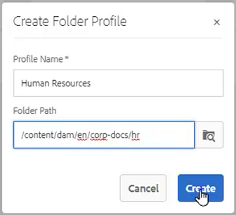

「資料夾配置檔案」(Folder Profiles)頁面上將顯示一個具有新配置檔案名稱的磁貼。

## 從「常規」頁簽添加管理用戶

管理使用者有權更新資料夾設定檔的條件屬性、製作範本和輸出預設集。

1. 按一下圖磚，開啟所需的「資料夾描述檔」。

   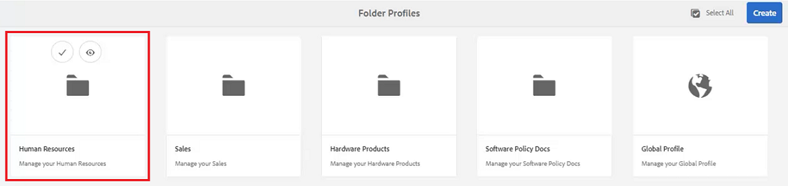

2. 選取 **一般** 標籤。

3. 按一下 [!UICONTROL **編輯**] 在畫面左上角。

4. 在管理員使用者下方，從下拉式清單中選取使用者或輸入使用者名稱。

5. 按一下&#x200B;[!UICONTROL **「新增」**]。

   您可以視需要新增多個管理員使用者。

   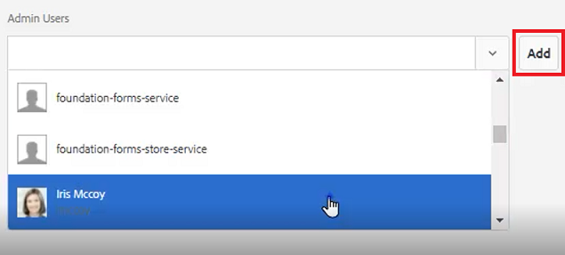

6. 按一下 [!UICONTROL **儲存**] 在新增所有使用者時顯示於畫面的右上角。

管理使用者現在已指派給此設定檔。

## 從「條件屬性」索引標籤新增對象

存取全域設定檔後，即可編輯其設定。 除非另有指定，否則全域設定檔設定會套用至所有使用者。

1. 從所需的資料夾描述檔中，選取 **條件屬性** 標籤。

2. 按一下 [!UICONTROL **編輯**] 在畫面左上角。

   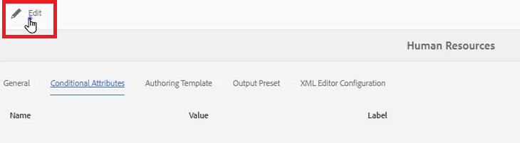

3. 按一下&#x200B;[!UICONTROL **「新增」**]。

4. 填入 **名稱**, **值**，和 **標籤** 欄位。

   按一下 [!UICONTROL **加號**] sign可讓您為已命名屬性新增其他值和標籤配對。

   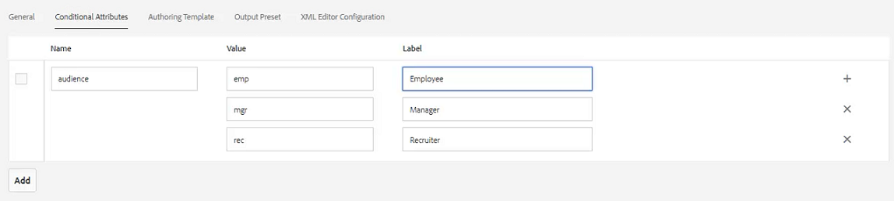

5. 按一下 [!UICONTROL **儲存**] 在畫面左上角。

此設定檔已新增新的條件屬性。

## 從「創作模板」頁簽中選擇模板和映射

AEM指南隨附現成可用的製作範本和地圖。 您可以將其限制在特定作者。 預設情況下，範本會儲存在DITA範本資料夾內的資產位置。

1. 從所需的「資料夾配置檔案」中，選擇「創作模板」頁簽。

2. 按一下畫面左上角的「編輯」 。

3. 新增地圖範本。

   a.從 **對應範本** 下拉式清單中，從可用地圖中選取選項。

   b.按一下 [!UICONTROL **新增**].

   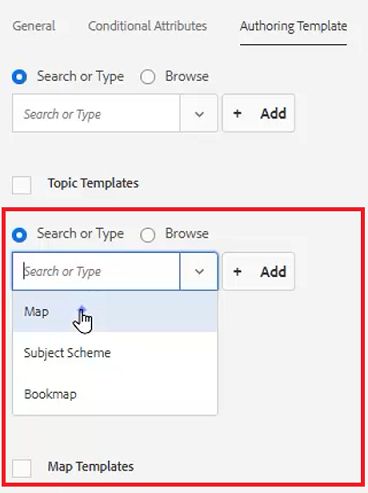

4. 新增主題範本。

   a.從 **主題範本** 下拉式清單中，從可用的範本中選取選項。

   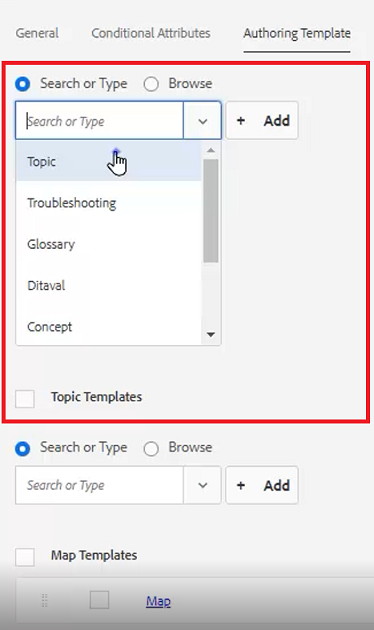

5. 按一下&#x200B;[!UICONTROL **「新增」**]。

6. 視需要新增其他主題範本。

7. 完成後，按一下 [!UICONTROL **儲存**] 在畫面左上角。

此設定檔已新增新的製作範本。

## 從「輸出預設集」頁簽中刪除非必需的預設集

您可以根據資料夾設定檔設定每個輸出預設集。 不需要的輸出預設集應移除。

1. 從所需的資料夾描述檔中，選取 **輸出預設集** 標籤。

2. 在左側面板上，選取任何非必要預設集的核取方塊。

   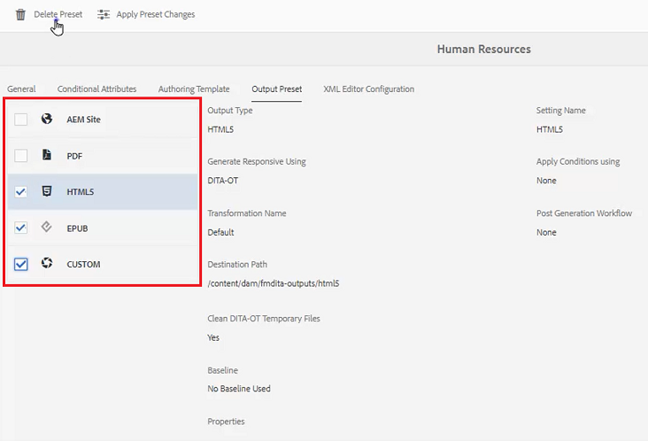

3. 按一下 [!UICONTROL **刪除預設集**] 在畫面左上角。

4. 在「刪除預設集」對話方塊中，按一下 [!UICONTROL **刪除**].

   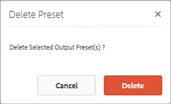

現在唯一顯示的輸出預設集是將使用的預設集。

## 從XML編輯器配置頁簽上載代碼段

1. 從所需的資料夾描述檔中，選取 **XML編輯器配置** 標籤。

2. 在「XML編輯器代碼段」下，按一下 [!UICONTROL **上傳**].

   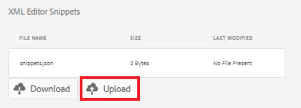

3. 導覽至先前建立的程式碼片段。

4. 按一下 [!UICONTROL **開啟**].

5. 按一下 [!UICONTROL **儲存**] 在畫面左上角。

您已成功修改編輯器配置以包括代碼片段。

## 在儲存庫中指定資料夾配置檔案

在編輯器中，您可以查看您對資料夾設定檔進行修改的結果。

1. 導覽至 **儲存庫視圖**.

2. 按一下您要使用之內容的資料夾。

3. 按一下 [!UICONTROL **使用者偏好設定**] 圖示。

   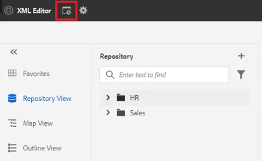

4. 在「用戶首選項」對話框中，從下拉清單中選擇所需的資料夾配置檔案。

   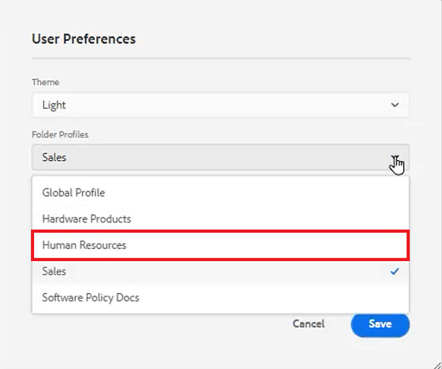

5. 按一下「[!UICONTROL **儲存**]」。

您已將「資料夾描述檔」套用至您的內容。 現在，當您建立新DITA主題時，將會看到根據資料夾配置檔案的主題類型限制清單。 「對象條件」包含全域設定，以及資料夾設定檔專用的設定。 上載的代碼片段檔案建立了一組要選擇的預設代碼片段。 「映射控制面板」顯示受限的輸出預設集。
