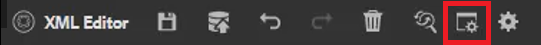
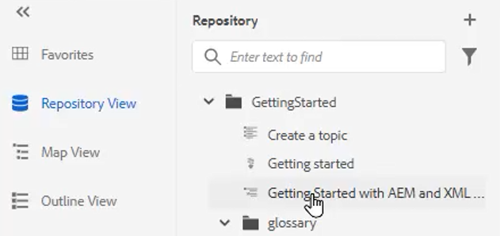

# 字彙表

「辭彙表」面板允許分析映射。 您可以建立辭彙表主題檔案，並將其包含在通用的辭彙表映射中。 然後可以將此映射添加到其他映射中。 使用辭彙表，可以更輕鬆地統一短語資訊，並為讀者提供更清晰的認識。

檔案中提供了您可能選擇用於本課的示例檔案 [術語表.zip](assets/glossary.zip)。

>[!VIDEO](https://video.tv.adobe.com/v/342765)

## 將辭彙表條目添加到主題

1. 導航到 **辭彙表** 的子菜單。

2. 從 **辭彙表** 的子菜單。

如果映射包含辭彙表條目且配置正確，則主題可自動更新為包含縮寫形式。

## 指定根映射

必須選擇正確的根映射才能正確使用辭彙表。 根圖查找辭彙表條目時，它們顯示在「辭彙表」面板中。

1. 開啟主題後，選擇 **辭彙表** 的下界。

2. 按一下 [!UICONTROL **用戶首選項**] 表徵圖

   

3. 按一下鍵表徵圖，指定正確的根圖以使用辭彙表。

4. 按一下 [!UICONTROL **選擇**]。

5. 按一下「[!UICONTROL **儲存**]」。

「辭彙表」面板會自動更新。

## 使用辭彙表

1. 導航到 **儲存庫視圖**。

2. 選擇已預配置以使用辭彙表的映射。

   

3. 選擇 [!UICONTROL **映射視圖**]。

4. 驗證「映射視圖」是否顯示所需主題。

## 預覽Glossentry

因為可以進行批量更改，所以預覽光澤哨兵很重要。

1. 選擇 **辭彙表** 的下界。

2. 按一下「辭彙表」旁邊的上下文菜單並選擇 [!UICONTROL **預覽**]。

顯示縮寫表單和術語定義。

## 查看熱點工具設定

使用熱點工具從單個映射中建立整個辭彙表條目集合。 您甚至可以搜索特定文本術語並將其轉換為連結的辭彙縮寫。

1. 從「辭彙表」面板中，選擇 [!UICONTROL **熱點表徵圖**]。

   

2. 按一下 [!UICONTROL **辭彙表鍵**] 下拉清單，並僅選擇要應用的鍵。

3. 按一下 [!UICONTROL **主題**] 下拉菜單以選擇應受影響的內容。

4. 按一下 [!UICONTROL **按狀態篩選主題**] 下拉清單以查看已配置的選項。

5. 根據需要配置其餘設定。

6. 完成後，按一下 [!UICONTROL **轉換**]。

「辭彙表」面板現在顯示所有更新的主題以及包含錯誤的主題。
