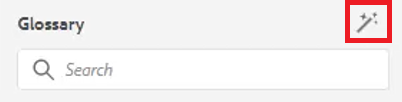

# 字彙表

「辭匯表」面板允許分析映射。 您可以建立字彙表主題檔案，並將其納入通用的字彙表映射中。 然後，可將此地圖新增至其他地圖。 使用字彙表，可更輕鬆一致地提供片語資訊，並為讀者提供更清楚的說明。

檔案中提供您可選擇用於本課程的範例檔案 [glossary.zip](assets/glossary.zip).

>[!VIDEO](https://video.tv.adobe.com/v/342765?quality=12&learn=on)

## 將字彙表項目新增至主題

1. 導覽至 **字彙表** 中。

2. 從 **字彙表** 面板找到主題中所需的位置。

如果地圖包含字彙表項目且已正確設定，則主題可自動更新，以包含縮寫的表單。

## 指定根映射

必須選擇正確的根映射才能正確使用辭匯表。 根圖找到字彙表條目時，這些條目會顯示在「字彙表」面板中。

1. 開啟主題時，請選取 **字彙表** 從左側面板。

2. 按一下 [!UICONTROL **使用者偏好設定**] 圖示。

   

3. 按一下鍵表徵圖可指定使用辭匯表的正確根映射。

4. 按一下 [!UICONTROL **選擇**].

5. 按一下「[!UICONTROL **儲存**]」。

「字彙表」面板會自動更新。

## 使用字彙表

1. 導覽至 **儲存庫視圖**.

2. 選擇已預配置為使用辭匯表的映射。

   

3. 選擇 [!UICONTROL **地圖檢視**].

4. 確認「地圖檢視」顯示必要的主題。

## 預覽Glossentry

因為可以進行大量更改，所以預覽辭匯哨所非常重要。

1. 選擇 **字彙表** 從左側面板。

2. 按一下辭匯表旁邊的上下文菜單，然後選擇 [!UICONTROL **預覽**].

將顯示縮寫的表單和辭匯定義。

## 查看熱點工具設定

使用熱點工具從單個映射中建立辭匯表條目的整個集合。 您甚至可以搜尋特定文字辭彙，並轉換為連結的字彙表縮寫。

1. 從「字彙表」面板中，選取 [!UICONTROL **熱點圖示**].

   

2. 按一下 [!UICONTROL **字彙表索引鍵**] 下拉式清單中，僅選取您要套用的索引鍵。

3. 按一下 [!UICONTROL **主題**] 下拉式清單，選取應該受影響的內容。

4. 按一下 [!UICONTROL **依狀態篩選主題**] 下拉式清單，檢閱已設定的選項。

5. 視需要配置其餘設定。

6. 完成後，按一下 [!UICONTROL **轉換**].

「字彙表」面板現在會顯示所有更新的主題，以及有錯誤的主題。
