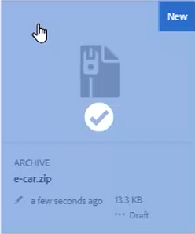
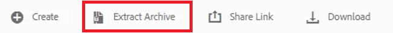
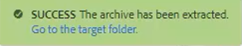
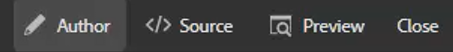
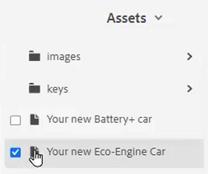
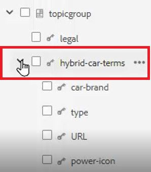
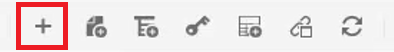
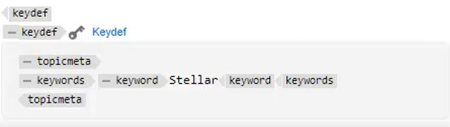

# 鍵

不同的材料集可能包含需要在選定位置定製的類似資訊。 使用鍵可以在使用DITA時包含變數資訊。

檔案中提供了您可能選擇用於本課的示例檔案 [密鑰.zip](assets/keys.zip)。

>[!VIDEO](https://video.tv.adobe.com/v/342756)

## 啟用密鑰

1. 上載提供的示例檔案集。

   a.載入zip檔案。

   b.刷新環AEM境。

   c.選擇要提取的檔案。

   

   d.按一下 [!UICONTROL **提取存檔**] 的子菜單。

   

   e.在對話框中，選擇要提取的檔案的特定位置，如名為Keys的資料夾。

   f按一下 [!UICONTROL **下一個**]。

   g跳過任何衝突，因為以前從未上載過的內容不存在衝突。

   h選擇 [!UICONTROL **提取**] 右上角。

2. 提取完成後，按一下 [!UICONTROL **轉到目標資料夾**]。

   

## 將鍵解析為引用的值

要正確使用鍵，用戶首選項必須將特定映射作為根映射引用。 在此映射內是鍵的集合，在主題組內分組。 開啟映射和主題將鍵解析為此映射引用的值。

1. 指定根映射。

   a.在「鍵」螢幕中，開啟映射。

   b.配置用戶首選項。

   c.按一下 [!UICONTROL **用戶首選項**] 表徵圖

   

   d.按一下鍵表徵圖以指定 **根映射** 用於解析密鑰。

   e.選中任何所需資產的複選框。

   

   f按一下 [!UICONTROL **選擇**]。

   g **保存** 用戶首選項。

2. 導航到 **映射視圖**。

3. 開啟指定的映射。

已解析密鑰。

## 手動添加新密鑰定義

1. 開啟具有指定根映射的映射。

2. 選擇密鑰。

   

3. 插入新鍵定義。

   a.按一下映射中的有效位置。

   b.選擇 **Keydef** 表徵圖

   

   c.在「插入鍵定義」對話框中，為鍵輸入唯一值，該值對您所建立的定義有意義。

   d.按一下 [!UICONTROL **插入**]。

4. 在keydef中添加topicmeta。

   a.按一下 [!UICONTROL **插入元素**] 表徵圖

   

   b.在「插入元素」對話框中，搜索並選擇「topicmeta」。

5. 在topicmeta中添加關鍵字。

   a.按一下 [!UICONTROL **插入元素**] 表徵圖

   

   b.在「插入元素」對話框中，搜索並選擇「關鍵字」。

6. 在topicmeta中添加關鍵字。

   a.按一下 [!UICONTROL **插入元素**] 表徵圖

   

   b.在 **插入元素** 對話框，搜索並選擇「關鍵字」

7. 在關鍵字中鍵入keydef的值。

在地圖中，您的keydef現在應該如下所示：

## 將keydef配置為代碼段

片段是小內容片段，可在文檔項目中的各種主題中重複使用。 您可以將單個keydef配置為代碼段，而不是手動生成每個keydef。

1. 在映射中選擇keydef元素。

2. 在上下文菜單中，按一下 [!UICONTROL **建立代碼段**]。

3. 在「新建代碼段」對話框中，添加標題和說明。
您也可能希望從「內容」中刪除現有的鍵或關鍵字定義。

4. 按一下&#x200B;[!UICONTROL **建立**]。

5. 在左面板上，選擇 **片段**。

6. 將剛從「代碼段」面板建立的代碼段拖放到映射中。

7. 使用「內容屬性」根據需要更新keydef。
保存和刷新後，此組密鑰將可用於已定義包含相同根映射的映射的任何用戶。
