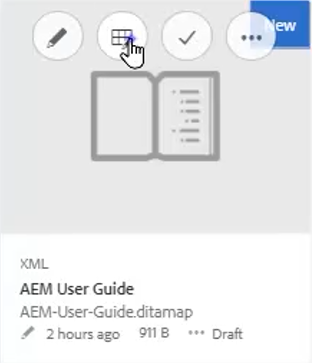
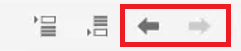
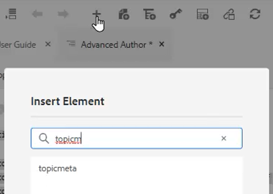
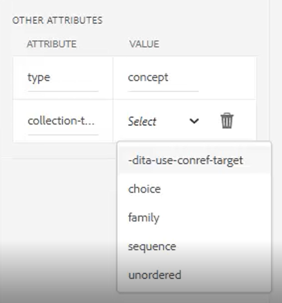

# 地圖和書籍地圖

Adobe Experience Manager參考線的映射編輯器允許您建立和編輯映射檔案。 使用映射編輯器，可以編輯兩種類型的檔案 — DITA映射和書籤映射。 就我們的目的而言，這些概念基本上可以互換。
映射編輯器分為兩種模式：基本映射編輯器和高級映射編輯器。

>[!VIDEO](https://video.tv.adobe.com/v/342766?quality=12&learn=on)

## 建立映射

指AEM南提供了兩個現成映射模板 — DITA映射和書籤映射。 您還可以建立自己的地圖模板，並與作者共用這些模板以建立地圖檔案。

執行以下步驟建立映射檔案。

1. 在「資產」UI中，導航到要建立映射檔案的位置。

1. 按一下 [!UICONTROL **建立> DITA映射**]。

1. 在「藍圖」(Blueprient)頁面上，選擇要使用的映射模板類型，然後按一下 [!UICONTROL **下一個**]。

1. 在「屬性」頁上，輸入 **標題** 和 **名稱** 的下界。

1. 按一下&#x200B;[!UICONTROL **建立**]。

## 使用高級映射編輯器開啟映射

1. 在 **資產UI**，選擇要編輯的映射。

1. 按一下 [!UICONTROL **編輯主題**]。

   

或

1. 將滑鼠懸停在地圖表徵圖上。

1. 選擇 **編輯主題** 從 **操作** 的子菜單。

## 將內容添加到地圖或書籤

1. 導航到 **儲存庫視圖**。

1. 將內容從「儲存庫視圖」拖放到映射或書籤中的有效位置。

或

1. 在映射或書籍映射中的有效位置按一下。

1. 按一下相應的 [!UICONTROL **工具欄表徵圖**] 添加章節、主題或主題引用。

   

1. 選擇要添加的一個或多個資產。

1. 按一下 [!UICONTROL **選擇**]。

### 提升或降級映射中的元素

使用 **工具欄箭頭** 在地圖或書籍圖中升級或降級章節和主題。

1. 在映射中選擇元素。

1. 按一下 [!UICONTROL **左箭頭**] 將主題提升到章節，或 [!UICONTROL **右箭頭**] 將章節降級為topicref。

   

1. 根據需要保存並版本映射。

或

1. 拖放元素以重新組織它們。

## 將元資料添加到映射

1. 從 **映射工具欄**，插入主題組。

   

1. 按一下 [!UICONTROL **加號表徵圖**] 的子菜單。

1. 選擇要插入的元素。

   

1. 按一下&#x200B;[!UICONTROL **關閉**]。

## 向映射添加可信性

在構造映射後可以添加可靠性。

1. 在要插入可靠表的映射中按一下。

1. 使用 **工具欄表徵圖** 的子菜單。

   

1. 配置對話框。

1. 按一下 [!UICONTROL **插入**]。

1. 從 **儲存庫** 放到可靠位置。

1. 使用標準鍵盤快捷鍵將映射中的必需元素複製並貼上到可恢復表中。

## 將屬性分配給映射中的主題引用

1. 在映射中加亮topicref或topicref的嵌套集合。

1. 在「內容屬性」面板的「其它屬性」下，選擇 **屬性** 和 **值。**

   
