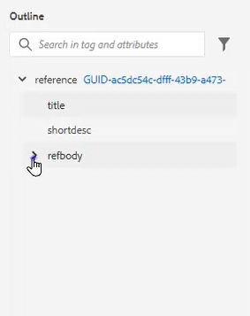
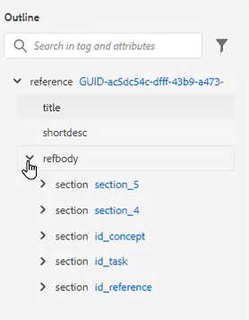
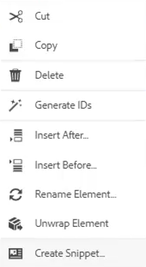
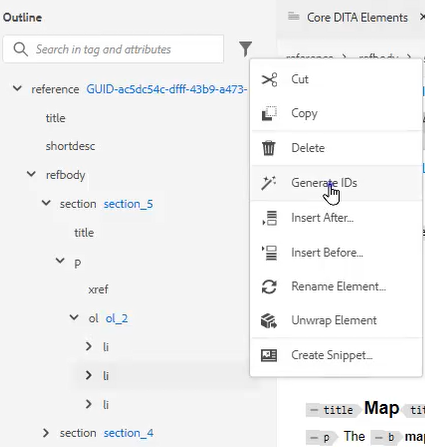
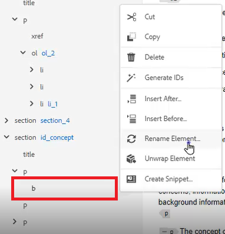
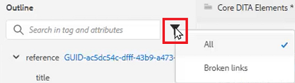
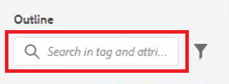

# 大綱檢視

「大綱檢視」在處理結構化檔案時提供廣泛的支援。 展開和收合檢視、導覽結構、使用屬性（例如，建立新ID），以及按一下按鈕時重新組織、取消包裝和重新建構元素。

>[!VIDEO](https://video.tv.adobe.com/v/342767?quality=12&learn=on)

## 展開和收合大綱檢視

您可以展開元素以顯示子元素，或視需要收合元素。

1. 按一下適當的圖示以展開或摺疊「大綱檢視」。

   

   

輪廓檢視會從展開切換到收合。

## 使用大綱檢視進行瀏覽

1. 按一下任何元素以跳至該位置。

1. 按一下 [!UICONTROL **省略符號**] ，以存取捷徑選項。

   

## 使用大綱檢視指派ID

新的ID可以根據系統組態自動產生。 如有需要，也可以使用內容屬性來更新ID及其值。

1. 按一下 [!UICONTROL **省略符號**] 任何元素旁邊。

1. 選擇 **產生ID**.

   

已指派ID。 「內容屬性」會更新，並顯示元素和屬性資訊。

## 使用拖放功能重新組織元素

可在「大綱檢視」中重新排序元素。

1. 按一下並將元素拖曳至「輪廓檢視」中的另一個位置。

1. 將元素拖放到另一個元素上以取代它。 此動作以要取代的元素周圍的方形方塊表示。

   或

   將元素拖放至其他兩個元素之間，以變更其位置。 此動作以元素之間的行表示，其中將捨棄新元素。

## 重新命名元素

1. 選取元素。

1. 按一下 [!UICONTROL **省略符號**].

1. 選取 **重新命名元素**.

   

1. 連按兩下新元素名稱。

元素現在已重新命名。

## 取消元素包裝

1. 選取您要取消繞排的元素。

1. 按一下 [!UICONTROL **省略符號**].

1. 選取 [!UICONTROL **解除元素包裝**].

內容會保留，但結構已移除。

## 使用大綱檢視篩選內容

1. 按一下 [!UICONTROL **篩選**] 圖示加以識別，該圖示位於大綱檢視中的搜尋列旁。

   

1. 選擇 **全部** 顯示所有元素或 **中斷的連結** 以尋找並修正損壞的參照。

## 使用大綱檢視搜尋

可限制搜尋，並根據元素、屬性或值傳回結果。

1. 輸入要在搜尋列中尋找的元素名稱。

   

1. 選擇最符合您需求的結果。
