# 面板

「AEM參考線」Web編輯器分為多個部分，包括主工具欄、輔助工具欄、左面板、內容編輯區域和右面板。

>[!VIDEO](https://video.tv.adobe.com/v/342760)

## 調整左面板的大小

諸如左面板等持久面板的大小可調整。

1. 將游標置於面板邊框上。

2. 出現雙向箭頭時，根據需要按一下並向內或向外拖動。

## 展開或折疊左面板邊欄

展開視圖顯示在折疊視圖中以「工具提示」(Tool Tips)顯示的名稱和表徵圖。

1. 按一下 [!UICONTROL **提要欄**] 表徵圖以展開面板。

   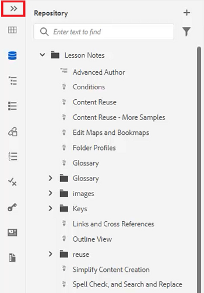

2. 按一下 [!UICONTROL **提要欄**] 表徵圖以折疊面板。

   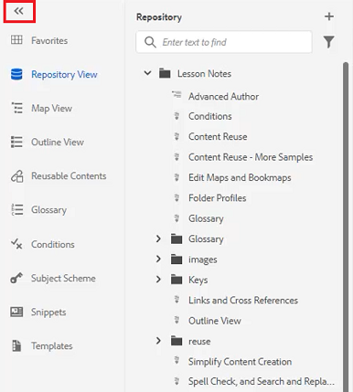

## 建立收藏夾集合

在左側面板上，「收藏夾」允許您建立特定文檔的清單並隨時間添加到其中。 您可以建立和管理收藏夾的廣泛集合。

1. 選擇 **收藏夾** 的下界。

2. 按一下 [!UICONTROL **加**] 表徵圖

   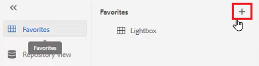

3. 在「新建集合」對話框中，輸入 **標題** 和 **說明**。

   請注意，選擇「公共」意味著其他用戶可以查看此收藏夾。

4. 按一下&#x200B;[!UICONTROL **建立**]。

您現在已建立收藏夾集合。

## 將檔案添加到儲存庫中的收藏夾集合

建立「收藏」後，可開始向其添加收藏夾。

1. 選擇 **儲存庫視圖** 的下界。

2. 按一下 [!UICONTROL **省略號**] 位於主題旁邊，可訪問上下文選項。

3. 選擇 **添加到** > **收藏夾**。

4. 在「添加到收藏夾」對話框中，選擇 **新建集合** 或 **現有集合**。

   在此，我們將選擇添加到現有集合。

   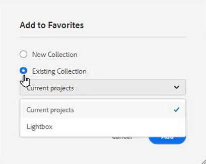

5. 如果需要，請從下拉清單中選擇一個集合。

6. 按一下&#x200B;[!UICONTROL **「新增」**]。

主題將添加到您選擇的收藏夾中。 可以在「收藏夾」菜單中查看。

## 從編輯器將檔案添加到收藏夾集合

將主題添加到收藏夾的另一種方法是從編輯器中的開啟主題添加主題。

1. 導航到 **儲存庫視圖**。

2. 按兩下某個主題以將其開啟。

3. 按一下右鍵檔案 **標題頁籤** 的子菜單。

4. 選擇 **添加到** > **收藏夾**。

   

5. 在「添加到收藏夾」對話框中，選擇 **新建集合** 或 **現有集合**。

   在此，我們將選擇添加到新集合。

6. 在「新建集合」對話框中，輸入 **標題** 和 **說明**。

   請注意，選擇 **公共** 表示其他用戶可以查看此收藏夾。

7. 按一下&#x200B;[!UICONTROL **建立**]。

新收藏夾已建立並分組。 可以在「收藏夾」菜單中查看。

## 查看和管理收藏夾

您可以輕鬆查看已添加到收藏夾的主題。

1. 選擇 [!UICONTROL **收藏夾**] 的下界。

2. 在「收藏夾」(Favorites)下，按一下 [!UICONTROL **箭頭**] 表徵圖，查看其內容。

   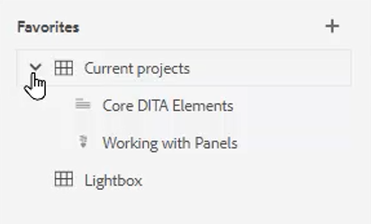

3. 按一下 [!UICONTROL **省略號**] 選項，包括從「收藏夾」清單中刪除該選項。

## 在儲存庫視圖中篩選搜索

儲存庫中的增強篩選器允許您搜索具有多種限制的文本。

1. 導航到 **儲存庫視圖**。

2. 按一下 [!UICONTROL **篩選搜索**] 表徵圖

   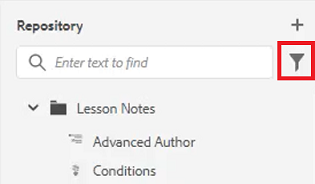

3. 在所選路徑中鍵入文本，或根據需要選擇新路徑。

   在篩選器中鍵入文本時，檔案清單會更新。

4. 如果需要，按一下搜索類別旁邊的箭頭表徵圖以進一步縮小搜索範圍。

   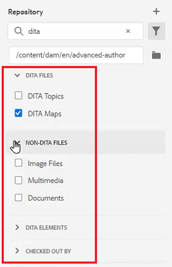

搜索範圍可以縮小到DITA主題或DITA映射。 您可以在所選路徑中搜索非DITA影像檔案、多媒體或其他文檔。 您甚至可以通過檔案簽出將搜索限制為DITA元素或篩選器。

## 瀏覽映射視圖

「映射視圖」中提供了一些有用的功能，包括簽出和鎖定檔案、預覽映射檔案、開啟「映射面板」以及在「資產」UI中查看映射。

請參閱標題為 [地圖和書籍地圖](./maps-and-bookmaps.md) 在本課程中，瞭解有關「映射視圖」及其功能的詳細資訊。

## 瀏覽大綱視圖

「大綱視圖」提供大綱中當前文檔的分層視圖。 可以展開「大綱視圖」以顯示多個元素以及任何已分配的ID。

請參閱標題為 [大綱視圖](./outline-view.md) 在本課程中，瞭解有關「大綱視圖」及其功能的詳細資訊。

## 使用可重用內容

核心DITA功能是能夠重用內容，從小短語到整個主題或映射。 編輯器提供了拖放介面，供內容重用。

請參閱標題為 [內容重用](./content-reuse.md) 在本課程中，瞭解有關可重用內容以及如何有效管理內容的詳細資訊。

## 使用辭彙表

使用辭彙表，可以更輕鬆地統一短語資訊，並為讀者提供更清晰的認識。 編輯器提供拖放介面，用於將術語插入主題。

請參閱標題為 [辭彙表](./glossary.md) 有關配置和使用辭彙表的詳細資訊，請參閱本課程。

## 使用條件

在DITA中，條件通常通過使用屬性（如產品、平台和受眾）來驅動，這些屬性可以各自為其分配特定值。 條件通過資料夾配置式進行管理。

請參閱標題為 [條件](./conditions.md) 有關配置和使用條件屬性的詳細資訊，請參閱本課程。

## 建立代碼段

片段是小內容片段，可作為內容或結構的起點重新使用。 使用Snippets可減少建立內容所需的時間，並改善材料的結構質量和一致性。

1. 在編輯器中開啟主題。

2. 選擇主題中的元素。

3. 按一下元素中的輔助滑鼠按鈕。

4. 在結果菜單中，選擇「建立」 [!UICONTROL **代碼段**]。

   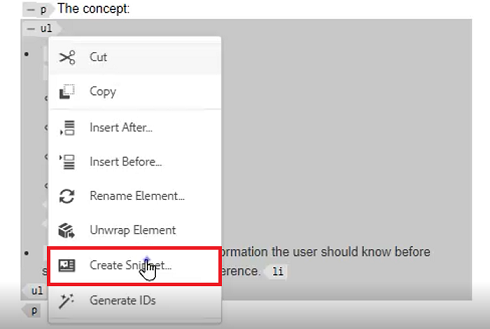

5. 在「新建代碼段」對話框中，添加 **標題** 和 **說明**。

6. 根據需要編輯代碼段。

   請注意，如果在內容中引入錯誤，上下文檢查將以可視方式通知您。

7. 按一下&#x200B;[!UICONTROL **建立**]。

Snippet將添加到可用的Snippets清單中。 它已準備好被拖放到主題中的有效位置。

## 使用模板

使用「模板」面板，管理員可以輕鬆建立和管理供作者使用的模板。 預設情況下，模板分為「映射」和「主題類型」。

請參閱標題為 [資料夾配置檔案](./folder-profiles.md) 和 [簡單內容建立工作流](simple-content-creation-workflows.md) 有關配置和應用模板的詳細資訊，請參閱本課程。

## 使用查找和替換搜索檔案

編輯器中有兩個「查找」和「替換」選項。 第一個允許在特定的開放主題內查找和替換功能，與傳統的字處理器非常相似。 第二個是「查找和替換」面板，用於搜索儲存庫中多個檔案中的文本。

請參閱標題為 [拼寫檢查和查找並替換](./spell-check.md)  有關「查找和替換」功能的詳細資訊，請參閱本課程。

## 更新內容屬性

右側面板上的內容屬性包括有關當前選定元素的特定資訊，例如屬性ID和值。

1. 在中開啟主題 **XML編輯器**。

2. 選擇 **元素**。

   內容屬性顯示元素的當前類型和屬性。

3. 鍵入新 **值** 的子菜單。

   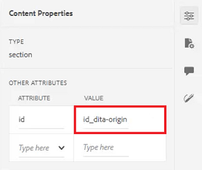

內容屬性在對元素進行更改時動態更新。

## 使用「檔案屬性」將主題添加到映射

檔案屬性顯示有關整個開啟主題的其他資訊。 其中一些資訊由主題屬性控制。 對其他材料（如「文檔狀態」）的修改可能取決於權限。

1. 在編輯器中開啟主題。

2. 按一下 [!UICONTROL  **檔案屬性**] 表徵圖。

   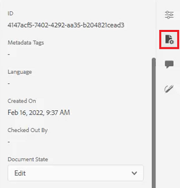

3. 設定 **文檔狀態** 至 **編輯**。 請注意，「參照」(References)清單當前為空。

   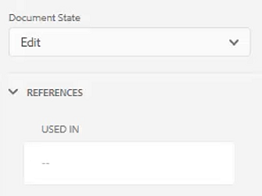

4. 關閉主題。

5. 選擇 [!UICONTROL **儲存庫視圖**] 的下界。

6. 開啟地圖。

   視圖將更改為「映射視圖」。

7. 按一下 [!UICONTROL **編輯**] 表徵圖

   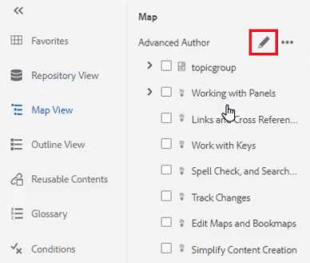

8. 開啟地圖進行編輯後，切換回 **儲存庫視圖**。

9. 將正在處理的主題拖放到映射中。

10. 按一下 [!UICONTROL **保存**] 表徵圖

主題將添加到映射中。 現在，當您開啟主題並檢查「檔案屬性」時，您可以看到「引用」已更新，以反映該主題在指定映射中使用。

## 建立審閱任務

右面板包含啟動審閱工作流的快捷方式。

1. 按一下 [!UICONTROL **審閱**] 表徵圖。

   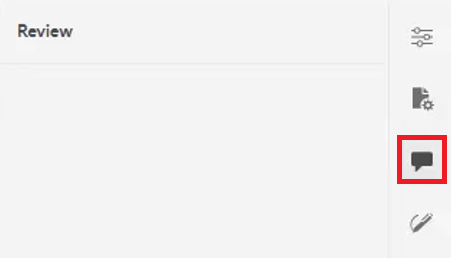

2. 按一下 [!UICONTROL **建立審閱**]。

   

3. 在「建立審閱任務」對話框中，根據需要填充欄位。

4. 按一下&#x200B;[!UICONTROL **下一步**]。

將建立「審閱任務」。

## 跟蹤更改

跟蹤更改的功能讓您能夠對主題的一個版本到下一個版本中保留哪些更改進行大量控制。 可以使用右面板管理跟蹤的更改。

請參閱標題為 [跟蹤更改](./track-changes.md) 有關更改跟蹤功能的詳細資訊，請參閱本課程。
