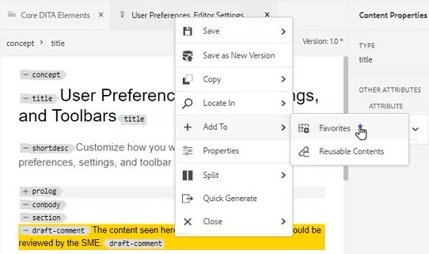

# 面板

AEM Guides Web Editor分為多個區段，包括主工具列、次要工具列、左側面板、內容編輯區域和右側面板。

>[!VIDEO](https://video.tv.adobe.com/v/342760?quality=12&learn=on)

## 調整左側面板的大小

持續面板（例如左側面板）的大小可調整。

1. 將游標置於面板邊框上。

1. 出現雙向箭頭時，視需要按一下並向內或向外拖曳。

## 展開或收合左側面板側欄

展開檢視會顯示名稱與圖示，這些名稱與圖示會在收合檢視中顯示為「工具提示」。

1. 按一下 [!UICONTROL **側欄**] 圖示以展開面板。

   

1. 按一下 [!UICONTROL **側欄**] 圖示以摺疊面板。

   

## 建立我的最愛集合

在左側面板上，「我的最愛」可讓您建立特定檔案的清單，並隨著時間新增到清單中。 您可以建立和管理廣泛的「我的最愛」集合。

1. 選取 **我的最愛** 在左側面板。

1. 按一下 [!UICONTROL **加號**] 圖示。

   

1. 在「新增系列」對話方塊中，輸入 **標題** 和 **說明**.

   請注意，選取「公用」表示其他使用者可以看到此「我的最愛」。

1. 按一下&#x200B;[!UICONTROL **建立**]。

您現在已建立我的最愛集合。

## 從存放庫新增檔案至我的最愛集合

建立「系列」後，您可以開始將「我的最愛」加入其中。

1. 選取 **存放庫檢視** 在左側面板。

1. 按一下 [!UICONTROL **省略符號**] 位於主題旁，可存取內容選項。

1. 選取 **新增至** > **我的最愛**.

1. 在「新增至我的最愛」對話方塊中，選擇 **新增集合** 或 **現有集合**.

   在此，我們將選擇新增至現有集合。

   

1. 如有需要，請從下拉式選單中選取集合。

1. 按一下 [!UICONTROL **新增**].

此主題會新增至您選擇的「我的最愛集合」。 您可以在[我的最愛]功能表中檢視它。

## 從編輯器新增檔案至我的最愛集合

另一種將主題新增至「我的最愛」的方法是從「編輯器」中的開啟主題中新增主題。

1. 導覽至 **存放庫檢視**.

1. 連按兩下主題以開啟它。

1. 以滑鼠右鍵按一下檔案 **標題索引標籤** 在編輯器中存取內容選項。

1. 選擇 **新增至** > **我的最愛**.

   

1. 在「新增至我的最愛」對話方塊中，選擇 **新增集合** 或 **現有集合**.

   在此，我們將選擇新增至新集合。

1. 在「新增系列」對話方塊中，輸入 **標題** 和 **說明**.

   請注意，選取 **公用** 表示其他使用者可以看到此我的最愛。

1. 按一下&#x200B;[!UICONTROL **建立**]。

已建立新的我的最愛並將其分組。 您可以在[我的最愛]功能表中檢視它。

## 檢視和管理您的最愛

您可輕鬆檢視哪些主題已新增至您的最愛集合。

1. 選取 [!UICONTROL **我的最愛**] 在左側面板。

1. 在我的最愛下，按一下 [!UICONTROL **箭頭**] 圖示來檢視其內容。

   

1. 按一下 [!UICONTROL **省略符號**] 在主題旁邊，可顯示內容選項，包括從「我的最愛」清單中刪除該主題的選項。

## 在「存放庫檢視」中篩選搜尋

存放庫中的增強型篩選器可讓您搜尋具有各種限制的文字。

1. 導覽至 **存放庫檢視**.

1. 按一下 [!UICONTROL **篩選搜尋**] 圖示。

   

1. 在選取的路徑中輸入文字，或視需要選擇新路徑。

   當您在篩選器中輸入文字時，檔案清單會更新。

1. 視需要按一下搜尋類別旁的「箭頭」圖示，進一步縮小搜尋範圍。

   

搜尋範圍可以縮小到DITA主題或DITA Map。 您可以在選取的路徑中搜尋非DITA影像檔案、多媒體或其他檔案。 您甚至可以將搜尋限製為DITA元素或依檔案出庫篩選。

## 探索地圖檢視

「對映檢視」中有幾個實用的功能，包括簽出和鎖定檔案、預覽對映檔案、開啟「對映控制面板」以及在Assets UI中檢視對映的功能。

請參閱標題為的課程 [地圖和書籤](./maps-and-bookmaps.md) 在本課程中，瞭解更多有關地圖檢視及其功能的資訊。

## 探索大綱檢視

「大綱檢視」提供「大綱」中目前檔案的階層檢視。 您可以展開「大綱檢視」以顯示多個元素以及任何指派的ID。

請參閱標題為的課程 [大綱檢視](./outline-view.md) 在本課程中，瞭解大綱檢視及其功能的詳細資訊。

## 使用可重複使用的內容

核心DITA功能是能夠重複使用內容，從小短語到整個主題或地圖。 編輯器提供拖放介面，供內容重複使用。

請參閱標題為的課程 [內容重複使用](./content-reuse.md) 如需可重複使用內容以及如何有效管理內容的詳細資訊，請參閱本課程。

## 使用字彙表

使用字彙表可更輕鬆一致地片語資訊，並讓讀者更容易理解。 編輯器提供拖放介面，用於將字彙表詞語插入主題中。

請參閱標題為的課程 [字彙表](./glossary.md) 在本課程中，瞭解設定及使用字彙表的詳細資訊。

## 使用條件

在DITA中，條件通常透過使用屬性（例如「產品」、「平台」和「對象」）來驅動，這些屬性可以各自指派特定的值。 條件會透過資料夾設定檔來管理。

請參閱標題為的課程 [條件](./conditions.md) 在本課程中，瞭解設定及使用條件屬性的詳細資訊。

## 建立代碼片段

片段是小型內容片段，可重複作為內容或結構的起點。 使用代碼片段可減少建立內容所需的時間，並改善材料的結構品質和一致性。

1. 在編輯器中開啟主題。

1. 在主題中選取元素。

1. 按一下元素中的滑鼠輔助按鈕。

1. 在產生的功能表中，選擇「建立」 [!UICONTROL **代碼片段**].

   

1. 在「新增代碼片段」對話方塊中，新增 **標題** 和 **說明**.

1. 視需要編輯代碼片段。

   請注意，如果您在內容中引進錯誤，內容檢查將會以視覺化方式通知您。

1. 按一下&#x200B;[!UICONTROL **建立**]。

此代碼片段會新增至可用代碼片段的清單中。 已準備好將其拖放至主題中的有效位置。

## 使用範本

使用「範本」面板，管理員可輕鬆建立和管理範本以供作者使用。 根據預設，範本可歸類為「地圖」和「主題型別」。

請參閱標題為的課程 [資料夾設定檔](./folder-profiles.md) 和 [簡單的內容建立工作流程](simple-content-creation-workflows.md) 在本課程中，瞭解設定和套用範本的詳細資訊。

## 使用「尋找和取代」搜尋檔案

編輯器中有兩個可用的「尋找」和「取代」選項。 第一個允許特定開放主題中的「尋找」和「取代」功能，與傳統文書處理器非常類似。 第二個是「尋找和取代」面板，用於搜尋存放庫中多個檔案中的文字。

請參閱標題為的課程 [拼字檢查及尋找和取代](./spell-check.md)  在本課程中，瞭解更多有關尋找和取代功能的資訊。

## 更新內容屬性

右側面板的「內容屬性」包含目前所選元素的特定資訊，例如「屬性ID」和「值」。

1. 在中開啟主題 **XML編輯器**.

1. 選取 **元素**.

   「內容屬性」會顯示元素目前的型別和屬性。

1. 輸入新的 **值** 元素的。

   

當您變更元素時，內容屬性會動態更新。

## 使用檔案屬性新增主題至對應

檔案屬性會顯示有關整個開啟主題的其他資訊。 其中的部分資訊由主題屬性控制。 對其他材料（例如檔案狀態）的修改可能取決於許可權。

1. 在編輯器中開啟主題。

1. 按一下 [!UICONTROL  **檔案屬性**] 圖示進行修改。

   

1. 設定 **檔案狀態** 至 **編輯**. 請注意，「參照」清單目前為空白。

   

1. 關閉主題。

1. 選取 [!UICONTROL **存放庫檢視**] 在左側面板。

1. 開啟地圖。

   該檢視會變更為地圖檢視。

1. 按一下 [!UICONTROL **編輯**] 圖示。

   

1. 在開啟地圖進行編輯後，切換回 **存放庫檢視**.

1. 將您正在使用的主題拖放至對映中。

1. 按一下 [!UICONTROL **儲存**] 圖示加以檢視。

此主題會新增至對映。 現在，當您開啟主題並核取「檔案屬性」時，可以看到「參照」已更新，以反映該主題已用於指定的對映。

## 建立稽核任務

右側面板包含啟動稽核工作流程的捷徑。

1. 按一下 [!UICONTROL **檢閱**] 圖示進行修改。

   

1. 按一下 [!UICONTROL **建立評論**].

   

1. 在建立稽核任務對話方塊中，視需要填入欄位。

1. 按一下&#x200B;[!UICONTROL **下一步**]。

評論任務已建立。

## 追蹤變更

追蹤變更的功能可讓您充分控制保留在主題一個版本到下一個版本中的變更。 您可以使用正確的面板來管理追蹤的變更。

請參閱標題為的課程 [追蹤變更](./track-changes.md) 在本課程中，瞭解變更追蹤功能的詳細資訊。
