# 簡單的內容建立工作流程

AEM參考線編輯器有多個捷徑可簡化內容建立工作流程。 這些捷徑可讓使用者快速新增和修改影像、一次處理多個主題、修正錯誤、下載主題PDF，以及使用版本和標籤。

>[!VIDEO](https://video.tv.adobe.com/v/342770?quality=12&learn=on)

## 新增影像

可直接從本地驅動器添加映像。

1. 將影像直接拖放至主題中。 此 **上傳資產** 對話框。

   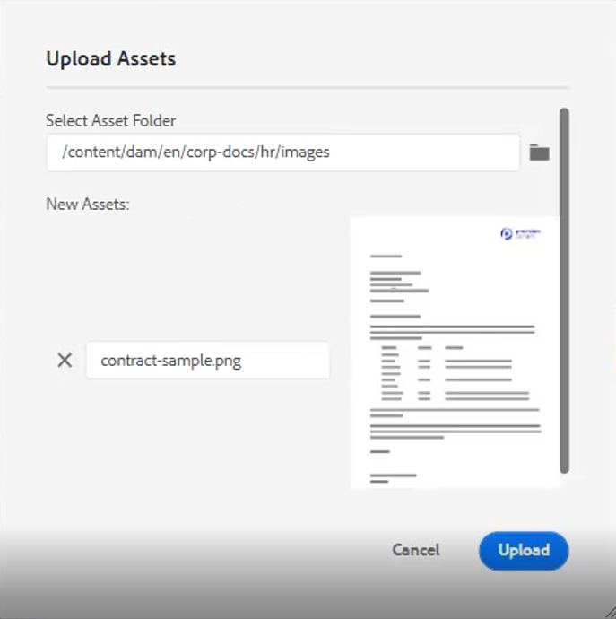

2. 修改資料夾路徑至所需的影像位置。

3. 將影像名稱變更為代表其目的的名稱。

4. 按一下 [!UICONTROL **上傳**].

## 修改影像

1. 拖放角來調整影像大小。

2. 拖放影像，將影像移至主題內的其他位置。

3. 使用 **內容屬性** 在右側面板上，修改影像的

   - 比例

   - position

   - 對齊，或

   - 其他屬性。

   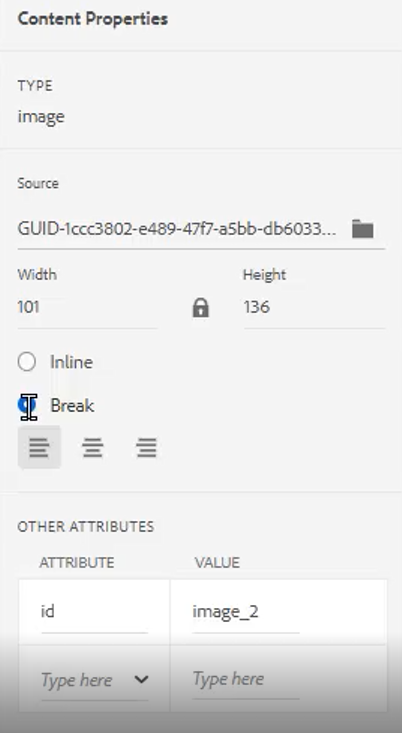

## 處理多個主題

比較主題、在主題之間複製和貼上，或將內容從一個主題拖放到另一個主題時，「分割檢視」很有幫助。

1. 開啟兩個或多個相關主題。

2. 按一下某個檔案的「標題」標籤，開啟內容功能表。

3. 選擇 [!UICONTROL **分割**].

4. 選擇 **右**.

   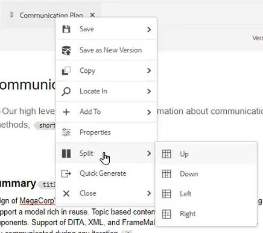

## 更正印刷錯誤

1. 找到包含錯誤的字詞或片語。

2. 按住 [!UICONTROL **Ctrl**].

3. 按一下錯誤上的滑鼠輔助按鈕。

4. 選擇正確的拼寫。

已更正主題文本中的錯誤。

## 下載主題PDF

使用者可能想要下載目前主題的PDF以加以標籤或與他人共用。

1. 按一下 [!UICONTROL **預覽**] 在畫面右上角。

2. 按一下 [!UICONTROL **PDF圖示**] 上方。 對話方塊隨即顯示。

   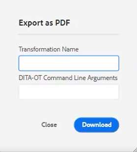

3. 填寫 **轉換名稱** 或 **DITA-OT命令行參數** （如果需要）。 請注意，如果所有欄位皆保留空白，PDF仍會產生。

4. 按一下&#x200B;[!UICONTROL **下載**]。PDF產生。

5. 使用可用的圖示來設定、下載或共用PDF主題。

## 在存放庫或地圖中找出主題

1. 開啟主題。

2. 按一下「Title（標題）」頁簽上的滑鼠輔助按鈕。

3. 選擇 **在中查找**.

4. 選擇 **存放庫** 或 **地圖** 跳到所需的主題位置。

## 版本主題

1. 變更主題。

2. 儲存主題。

3. 按一下 **存放庫** 圖示。

   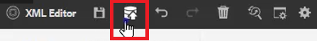

4. 在對話方塊中，新增 **新版本的注釋**.

   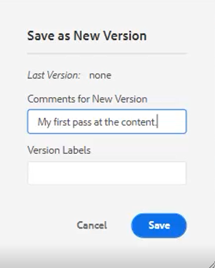

5. 按一下「[!UICONTROL **儲存**]」。

版本編號會更新。

## 載入版本標籤

要僅根據版本編號來追蹤主題的狀態可能會很困難。 標籤可讓您更輕鬆識別已進行多個修訂之主題的確切狀態。

1. 選取 **資料夾配置檔案**.

2. 在資料夾配置檔案中，配置XML編輯器。

   a.在螢幕左上方選取「編輯」 。

   b.在「XML內容版本標籤」下，添加新主題或使用現有主題。

   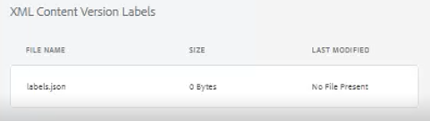

3. 選擇 [!UICONTROL **上傳**].

4. 選擇ReviewLabels.json或類似的檔案。 有關如何建立此類檔案的詳細資訊，請參閱另一部影片。

5. 按一下 [!UICONTROL **開啟**].

6. 按一下 [!UICONTROL **儲存**] 在「資料夾配置檔案」螢幕的左上角。

7. 按一下 [!UICONTROL **關閉**] 在右上角。

版本標籤現在已載入。

## 指派版本標籤

1. 載入版本標籤。

2. 按一下 [!UICONTROL **使用者偏好設定**] 圖示。

   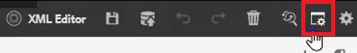

3. 選取先前載入版本標籤的相同資料夾描述檔。

4. 在「用戶首選項」(User Preferences)對話框中，確保「基本路徑」(Base Path)引用的資訊與「資料夾配置檔案」(Folder Profile)已應用的資訊相同。

   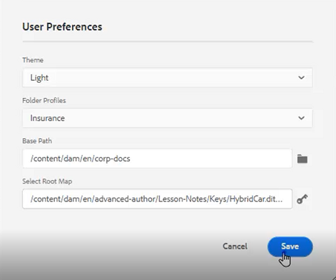

5. 按一下「[!UICONTROL **儲存**]」。

6. 版本主題。

7. 新增註解並從下拉式清單中選取版本標籤。

   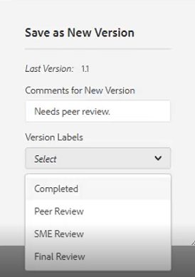

8. 按一下「[!UICONTROL **儲存**]」。

版本編號會更新。

## 檢視版本記錄和標籤

1. 從左側面板中，找出目前的主題標題。

2. 按一下標題以開啟內容功能表。

3. 選擇 [!UICONTROL **在資產UI中檢視**].

   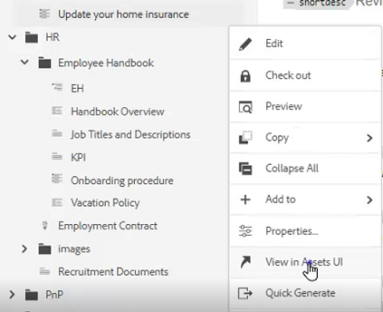

   - 包含標籤的版本歷史記錄會顯示在左側。

   

4. 按一下版本以存取選項，例如 **回復到此版本** 和 **預覽版本**.

## 建立新範本

主題和映射均存在模板。 管理員可存取左側面板的範本。

1. 按一下 [!UICONTROL **範本**] 中。

2. 選取「對應」或「主題」 ，以開啟相關的內容功能表。

3. 按一下以新增範本。

   

4. 填入產生的對話方塊中的欄位。

此時將出現殼模板，其中包含示例內容和示例結構。
