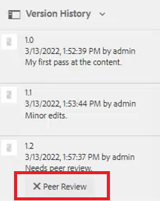

# 簡單的內容建立工作流程

AEM Guides編輯器有多個捷徑，可簡化內容建立工作流程。 這些捷徑可讓使用者快速新增和修改影像、一次處理多個主題、更正錯誤、下載主題PDF，以及使用版本和標籤。

>[!VIDEO](https://video.tv.adobe.com/v/342770?quality=12&learn=on)

## 新增影像

可以直接從本機磁碟機新增影像。

1. 將影像直接拖放至主題中。 此 **上傳資產** 對話方塊隨即顯示。

   

1. 將資料夾路徑修改至所需的影像位置。

1. 將影像名稱變更為能代表其用途的名稱。

1. 按一下 [!UICONTROL **上傳**].

## 修改影像

1. 拖放角落以調整影像大小。

1. 拖放影像至主題中的其他位置。

1. 使用 **內容屬性** 修改影像的

   - 縮放

   - position

   - 對齊方式，或

   - 其他屬性。

   

## 使用多個主題

「分割檢視」在比較主題、複製和貼上主題或在主題之間拖放內容時很有幫助。

1. 開啟兩個或多個相關主題。

1. 按一下某個檔案的「標題」標籤以開啟內容功能表。

1. 選取 [!UICONTROL **Split**].

1. 選擇 **右**.

   

## 更正拼字錯誤

1. 找到包含錯誤的字詞或片語。

1. 按住不放 [!UICONTROL **Ctrl**].

1. 在錯誤上按一下滑鼠輔助按鍵。

1. 選取正確的拼字。

已在主題文字中更正錯誤。

## 下載主題PDF

使用者可能想要下載目前主題的PDF，以標籤或與其他人共用。

1. 按一下 [!UICONTROL **預覽**] 在熒幕右上方。

1. 按一下 [!UICONTROL **PDF圖示**] 在主題上方。 對話方塊隨即顯示。

   

1. 填寫以下任一專案的資訊： **轉換名稱** 或 **DITA-OT命令列引數** 如有需要。 請注意，如果所有欄位都保留空白，仍會產生PDF。

1. 按一下&#x200B;[!UICONTROL **下載**]。會產生PDF。

1. 使用可用的圖示來設定、下載或共用PDF主題。

## 在存放庫或地圖中找出主題

1. 開啟主題。

1. 在「標題」標籤上按一下滑鼠輔助按鍵。

1. 選取 **在「 」中找到**.

1. 選擇 **存放庫** 或 **地圖** 以跳至所需的主題位置。

## 版本主題

1. 變更主題。

1. 儲存主題。

1. 按一下 **存放庫** 圖示加以檢視。

   

1. 在對話方塊中，新增 **新版本的註解**.

   

1. 按一下「[!UICONTROL **儲存**]」。

版本編號會更新。

## 載入版本標籤

嘗試僅根據版本號碼追蹤主題狀態可能會很困難。 標籤可讓您更容易識別經歷了多次修訂之主題的確切狀態。

1. 選取 **資料夾設定檔**.

1. 在資料夾設定檔中，設定XML編輯器。

   a.選取畫面左上方的編輯。

   b.在「XML內容版本標籤」下，新增主題或使用現有主題。

   

1. 選取 [!UICONTROL **上傳**].

1. 選擇ReviewLabels.json等檔案或類似檔案。 另一部影片將說明如何建立這類檔案。

1. 按一下 [!UICONTROL **開啟**].

1. 按一下 [!UICONTROL **儲存**] 在「資料夾描述檔」畫面的左上角。

1. 按一下 [!UICONTROL **關閉**] 右上角。

現在已載入版本標籤。

## 指派版本標籤

1. 載入版本標籤。

1. 按一下 [!UICONTROL **使用者偏好設定**] 圖示填入目前主題的左上角。

   

1. 選取先前已載入版本標籤的相同資料夾設定檔。

1. 在「使用者偏好設定」對話方塊中，確定「基本路徑」參照的資訊與「資料夾設定檔」已套用的資訊相同。

   

1. 按一下「[!UICONTROL **儲存**]」。

1. 版本主題。

1. 新增註解並從下拉式清單中選取版本標籤。

   

1. 按一下「[!UICONTROL **儲存**]」。

版本編號會更新。

## 檢視版本記錄和標籤

1. 從左側面板中，找到目前的主題標題。

1. 按一下標題以開啟內容功能表。

1. 選取 [!UICONTROL **在資產UI中檢視**].

   

   - 含有標籤的版本歷史記錄會顯示在左側。

   

1. 按一下版本以存取選項，例如 **還原為此版本** 和 **預覽版本**.

## 建立新範本

主題和地圖都有範本。 管理員可以存取左側面板中的範本。

1. 按一下 [!UICONTROL **範本**] 在左側面板中。

1. 選取「對應」或「主題」以開啟相關的內容功能表。

1. 按一下以新增範本。

   

1. 填入結果對話方塊中的欄位。

殼層範本隨即出現，其中包含範例內容和範例結構。
