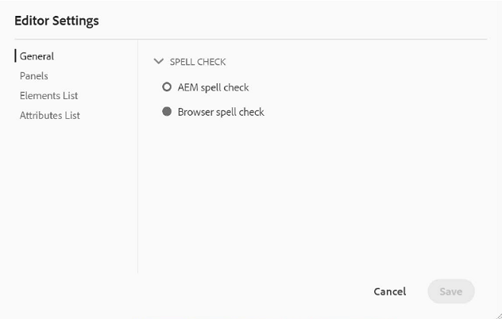
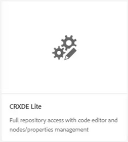
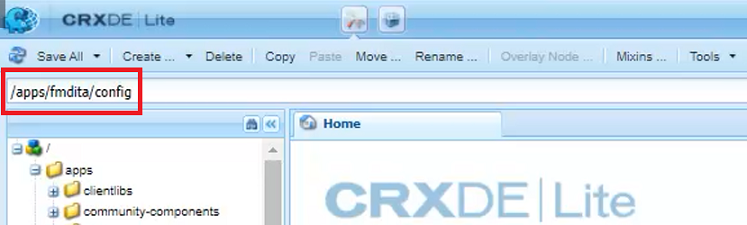
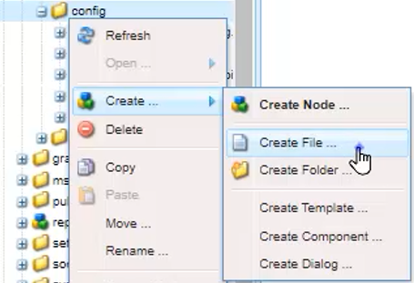
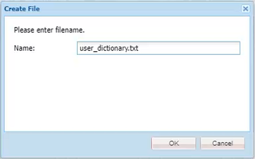
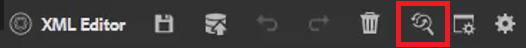
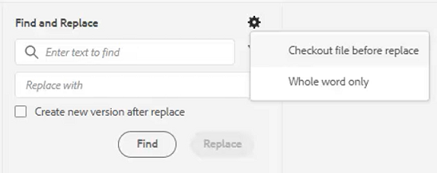
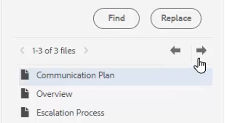

# 拼字檢查與尋找/取代

AEM Guides編輯器擁有強大的拼字檢查及尋找和取代功能。

>[!VIDEO](https://video.tv.adobe.com/v/342768?quality=12&learn=on)

修正拼字錯誤

1. 在開啟的主題中找到錯誤，並以紅色底線顯示。

1. 按住Ctrl鍵並按一下文字中的滑鼠輔助按鈕。

1. 從建議中選擇正確的拼字。

如果不建議使用正確的拼字，您可以隨時手動編輯該字。

## 切換至AEM拼字檢查

您可能想要使用瀏覽器預設字典以外的拼字檢查工具。

1. 導覽至 **編輯器設定**.

1. 選取 **一般** 設定索引標籤。

   

1. 有兩個選項：

   - **瀏覽器拼字檢查**  — 拼字檢查的預設設定使用瀏覽器的內建字典。

   - **AEM拼字檢查**  — 使用此選項來建立使用AEM自訂字典的自訂字詞清單。

1. 選擇 **AEM拼字檢查**.

1. 按一下「[!UICONTROL **儲存**]」。

設定自訂字典

管理員可以變更設定，讓AEM字典辨識自訂單字，例如公司名稱。

1. 導覽至 **工具** 窗格。

1. 登入 **CRXDE Lite**.

   

1. 導覽至 **_/apps/fmdita/config節點_**.

   

1. 建立新檔案。

   a.以滑鼠右鍵按一下設定資料夾。

   b.選擇 **「建立」>「建立檔案」**.

   

   c.為檔案命名 _**user_dictionary.txt**_.

   

   d.按一下 [!UICONTROL **確定**].

1. 開啟檔案。

1. 新增要包含在自訂字典中的單字清單。

1. 按一下 [!UICONTROL **全部儲存**].

1. 關閉檔案。

作者可能需要重新啟動網頁編輯器工作階段，才能在AEM字典中取得更新的自訂字詞清單。

## 在單一檔案中尋找和取代

1. 按一下頂端工具列上的「尋找和取代」圖示。

   

1. 在底部工具列中，輸入單字或片語。

1. 按一下 [!UICONTROL **尋找**].

1. 必要時，鍵入一個單字來取代找到的單字。

1. 按一下 [!UICONTROL **Replace**].

## 在整個存放庫中尋找和取代

1. 導覽至 **存放庫**.

1. 按一下 [!UICONTROL **尋找和取代**] 圖示加以檢視。

1. 按一下 [!UICONTROL **顯示設定**] 圖示。

1. 選擇

   - **取代前簽出檔案**  — 如果由管理員啟用，檔案會在取代搜尋字詞之前自動出庫。

   - **僅限全字**  — 將搜尋限製為只傳回輸入的確切字詞或片語。

   

1. 按一下 [!UICONTROL **套用篩選器**] 圖示來選取您要執行搜尋的存放庫中的路徑。

1. 輸入要尋找和取代的字詞。

1. 如有需要，請選取 **取代後建立新版本**.

1. 按一下 [!UICONTROL **尋找**].

1. 開啟所需的檔案，並使用箭頭來從某個找到的結果瀏覽至下一個結果。

   
