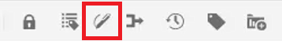
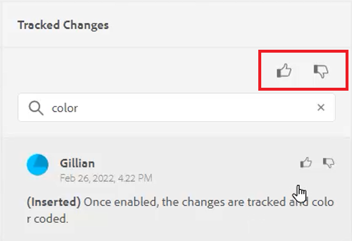
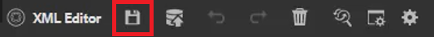
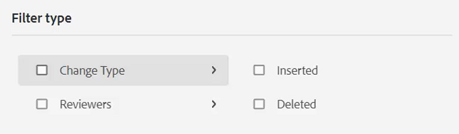
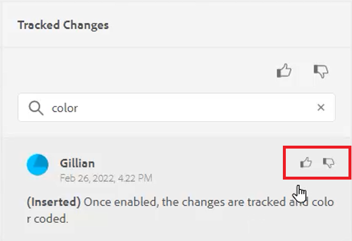

# 跟蹤更改

通過啟用「跟蹤更改」模式，您可以跟蹤文檔上的所有更新。 通過此模式，您和您的團隊可以在文檔審閱過程中捕獲所有插入和刪除內容。

>[!VIDEO](https://video.tv.adobe.com/v/342763)

## 使用「跟蹤更改」功能

1. 切換 **跟蹤更改** 工具欄表徵圖以啟用（或禁用）該功能。

   

2. 更改主題。

   添加的內容現在以綠色顯示，並帶有更改欄。 刪除的內容以紅色顯示，帶有刪除線。

3. 選擇 **跟蹤的更改** 表徵圖，以訪問「跟蹤的更改」面板。

   

4. 按一下「[!UICONTROL **儲存**]」。

   

5. 關閉主題。

其他用戶現在可以開啟主題並查看現有的跟蹤更改。 他們可以接受或拒絕更改並添加自己的更改。

## 搜索跟蹤的更改

當有許多被跟蹤的更改時，搜索功能會很有幫助，因為滾動這些更改可能會非常耗時。

1. 選擇 **跟蹤的更改** 表徵圖，以訪問「跟蹤的更改」面板。

2. 在「搜索」欄位中鍵入單詞或短語。
搜索返回與搜索詞匹配的任何更改。

## 篩選跟蹤的更改

還可以通過插入、刪除或審閱者篩選多個跟蹤的更改。

1. 按一下 [!UICONTROL **篩選**] 表徵圖。

2. 選中所需濾鏡的複選框。

   

3. 按一下 [!UICONTROL **應用**]。

## 接受或拒絕跟蹤的更改

審閱人和主題專家可以單獨或一次全部接受或拒絕其他用戶的更改。

1. 按一下 [!UICONTROL **跟蹤的更改**] 表徵圖，以訪問「跟蹤的更改」面板。

2. 選擇特定更改。

3. 按一下 [!UICONTROL **竪拇指**] 或 [!UICONTROL **姆指向下**] 與要接受或拒絕的更改關聯的表徵圖。

   

   或

   按一下 [!UICONTROL **竪拇指**] 或 [!UICONTROL **姆指向下**] 表徵圖以接受或拒絕所有更改。

   

4. [!UICONTROL **保存**] 主題。

## 使用「合併」特徵

在多作者環境中工作時，很難跟蹤其他作者在主題或地圖中所做的更改。 「合併」功能不僅允許您查看更改，還允許您在文檔的最新版本中保留哪些更改。

1. 在Web編輯器中開啟主題。

2. 按一下 [!UICONTROL **合併**] 的子菜單。

   

3. 在「合併」對話框中，選擇要與當前版本的檔案進行比較的檔案版本。

4. 從「選項」中選擇：

   · **跟蹤所選版本的更改**:此選項以跟蹤更改的形式顯示所有內容更新。 然後，您可以選擇一次或一次全部接受或拒絕文檔中的更改。

   · **還原為所選版本**:此選項將文檔的當前版本還原為所選版本。 它不會授予您對接受或拒絕的內容的任何控制權。

5. 按一下 [!UICONTROL **完成**]。

如果選擇了 **「跟蹤所選版本的更改」選項**，則選定版本中的所有更改將顯示在右側面板的「更改」頁籤中。
