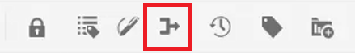

# 追蹤變更

您可以啟用「追蹤變更」模式，以追蹤檔案上所做的所有更新。 此模式可讓您和您的團隊在檔案稽核過程中擷取所有插入和刪除動作。

>[!VIDEO](https://video.tv.adobe.com/v/342763?quality=12&learn=on)

## 使用追蹤變更功能

1. 切換 **追蹤變更** 工具列圖示來啟用（或停用）此功能。

   

1. 變更主題。

   新增的內容現在以綠色顯示，並帶有變更列。 刪除的內容會以紅色顯示，並帶有刪除線。

1. 選取 **追蹤的變更** 圖示來存取「追蹤的變更」面板。

   

1. 按一下「[!UICONTROL **儲存**]」。

   

1. 關閉主題。

其他使用者現在可以開啟主題並檢視現有的追蹤變更。 他們可以接受或拒絕變更，並新增自己的變更。

## 搜尋追蹤的變更

當有許多追蹤變更時，搜尋功能會很有幫助，因為捲動這些變更可能很耗時。

1. 選取 **追蹤的變更** 圖示來存取「追蹤的變更」面板。

1. 在「搜尋」欄位中輸入字詞或片語。
搜尋會傳回符合搜尋字詞的任何變更。

## 篩選追蹤的變更

插入、刪除或檢閱者也可以篩選多個追蹤的變更。

1. 按一下 [!UICONTROL **篩選**] 圖示加以存取（位於追蹤的變更面板底部）。

1. 選取所需篩選器的核取方塊。

   

1. 按一下 [!UICONTROL **套用**].

## 接受或拒絕追蹤的變更

稽核者和主題專家可以一次個別或全部接受或拒絕其他使用者的變更。

1. 按一下 [!UICONTROL **追蹤的變更**] 圖示來存取「追蹤的變更」面板。

1. 選取特定變更。

1. 按一下 [!UICONTROL **豎起大拇指**] 或 [!UICONTROL **向下拇指**] 圖示來接受或拒絕變更。

   

   或

   按一下 [!UICONTROL **豎起大拇指**] 或 [!UICONTROL **向下拇指**] 圖示接受或拒絕所有變更。

   

1. [!UICONTROL **儲存**] 主題。

## 使用合併特徵

當您在多作者環境中工作時，可能很難追蹤其他作者在主題或地圖中所做的變更。 「合併」功能可讓您更進一步控制檢視變更，以及哪些變更會保留在最新版本的檔案中。

1. 在Web編輯器中開啟主題。

1. 按一下 [!UICONTROL **合併**] 圖示加以檢視。

   

1. 在「合併」對話方塊中，選取要與檔案目前版本進行比較的檔案版本。

1. 從「選項」中選擇：

   - **追蹤所選版本的變更**：此選項會以追蹤變更的形式顯示所有內容更新。 然後，您可以選擇一次接受或拒絕一個或全部的檔案變更。

   - **回覆成選取的版本**：此選項會將檔案的目前版本還原為所選版本。 它不會讓您控制接受或拒絕哪些內容。

1. 按一下 [!UICONTROL **完成**].

如果您已選取 **從選取的版本追蹤變更選項**，則所選版本的所有變更都會顯示在右側面板的「變更」標籤中。
