# 用戶首選項、編輯器設定和編輯器工具欄

編輯器具有高度可配置的介面。 「用戶首選項」、「編輯器設定」和「資料夾配置檔案」的混合使用意味著您幾乎可以在特定工作環境的每個方面進行自定義。

>[!VIDEO](https://video.tv.adobe.com/v/342769?quality=12&learn=on)

## 顯示或隱藏元素標籤

標籤是指示元素邊界的視覺提示。 元素邊界標籤元素的開始和結束。 然後，可將這些邊界用作可視提示來放置插入點或在邊界內選取文本。

1. 按一下 [!UICONTROL **切換標籤視圖**] 表徵圖。

   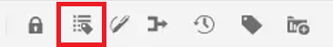

   標籤出現在主題中。 在「標籤視圖」上，您可以：

   - 通過按一下開啟或關閉標籤來選擇元素的內容。

   - 按一下標籤的+或 — ，展開或折疊標籤。

   - 使用上下文菜單剪切、複製或越過選定元素。

   - 通過選擇標籤並將元素拖放到有效位置來拖放元素。

1. 按一下 [!UICONTROL **切換標籤視圖**] 表徵圖以隱藏標籤。

標籤消失，使您能夠專注於文本。

## 使用時鎖定資產

鎖定（或簽出）檔案可讓用戶對檔案具有獨佔的寫訪問權限。 當檔案處於未鎖定狀態（或已簽入）時，更改將保存在檔案的當前版本中。

1. 按一下 [!UICONTROL **鎖**] 表徵圖。

   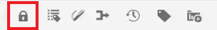

   檔案已簽出，「儲存庫」中檔案名旁顯示「鎖定」表徵圖。

1. 按一下 [!UICONTROL **解鎖**] 表徵圖

   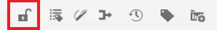

資料庫更新以顯示檔案已簽入。

## 插入特殊字元

1. 按一下 [!UICONTROL **插入特殊字元**] 表徵圖。

   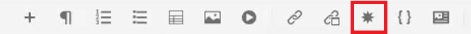

1. 在「插入特殊字元」對話框中，在搜索欄中鍵入字元的名稱。

   或者，使用「選擇類別」下拉清單顯示特定類別中的所有字元。

1. 選擇所需字元。

1. 按一下 [!UICONTROL **插入**]。

特殊字元將插入文本中。

## 在作者、源和預覽模式之間切換

螢幕右上角的工具欄允許您在視圖之間切換。

- 選擇 **作者** 中各屬性的附加資訊。

- 選擇 **源** 顯示組成主題的基礎XML。

- 選擇 **預覽** 顯示當用戶在其瀏覽器中查看主題時如何顯示主題。

## 使用用戶首選項更改主題

可以從編輯器的「亮」或「暗」主題中進行選擇。 使用「光」主題，工具欄和面板使用淺灰色背景。 使用「暗色」主題，工具欄和面板使用黑色背景。 在這兩個主題中，內容編輯區域都以白色背景顯示。

1. 按一下 [!UICONTROL **用戶首選項**] 表徵圖

   

1. 在「用戶首選項」對話框中，按一下 [!UICONTROL **主題**] 下拉清單。

1. 從可用選項中進行選擇。

   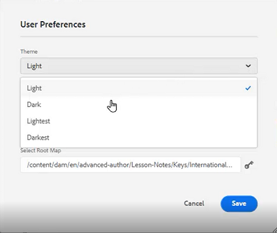

1. 按一下「[!UICONTROL **儲存**]」。

編輯器將更新以顯示您的首選主題。

## 使用用戶首選項更新基本路徑

您可以更新基本路徑，以便在啟動編輯器後，儲存庫視圖即會從特定位置向您顯示內容。 這減少了訪問工作檔案的時間。

1. 按一下 [!UICONTROL **用戶首選項**] 表徵圖

   

1. 在「用戶首選項」對話框中，按一下 [!UICONTROL **資料夾**] 表徵圖。

   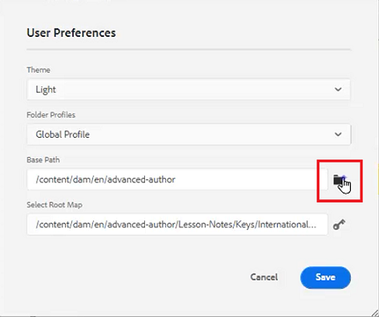

1. 在「選擇路徑」對話框中，按一下特定資料夾旁邊的複選框。

1. 按一下 [!UICONTROL **選擇**]。

下次啟動編輯器時，儲存庫將顯示在基本路徑中指定的檔案。

## 分配新資料夾配置檔案

「全局配置檔案」是系統預設值。 管理員可以建立其他資料夾配置檔案，以供選擇。

1. 按一下 [!UICONTROL **用戶首選項**] 表徵圖

   

1. 在「用戶首選項」對話框中，按一下 [!UICONTROL **資料夾配置檔案**] 下拉清單。

   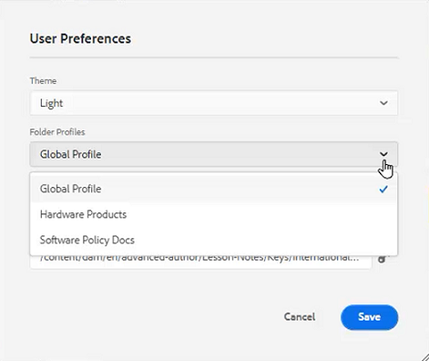

1. 從可用選項中選擇配置檔案。

1. 按一下「[!UICONTROL **儲存**]」。

現在已分配新的資料夾配置檔案。 它更改了左面板中的工具欄選項、查看模式以及條件和代碼段。 它還可能更改編輯器中內容的可視外觀。

## 使用編輯器設定更改字典

編輯器設定可供管理用戶使用。 這些首選項允許您配置一系列設定，其中一個是編輯器用於拼寫檢查的詞典。

1. 按一下 [!UICONTROL **編輯器設定**] 表徵圖

   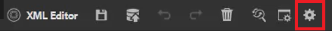

1. 在「編輯器設定」對話框中，按一下 [!UICONTROL **常規**] 頁籤。

1. 選擇要使用的詞典。

1. 按一下「[!UICONTROL **儲存**]」。

字典更新。 請注意，切換到AEM拼寫檢查允許您使用自定義單詞清單。

## 使用編輯器設定顯示和隱藏面板

使用「編輯器設定」可自定義的一個功能是面板。 更具體地說，您可以選擇在編輯器中顯示或隱藏哪些面板。

1. 按一下 [!UICONTROL **編輯器設定**] 表徵圖

   

1. 在「編輯器設定」對話框中，按一下 [!UICONTROL **面板**] 頁籤。

1. 根據需要切換可用的面板以顯示或隱藏。

   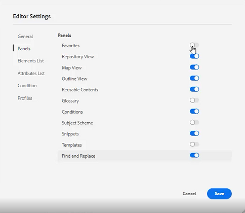

1. 按一下「[!UICONTROL **儲存**]」。

左面板現在配置為僅顯示切換為「顯示」的面板。

## 編輯器設定中的名稱和標籤元素

「元素清單」(Elements List)允許您命名特定元素，並為其指定更人性化的標籤。 元素名稱應為DITA元素之一。 標籤可以是任何字串。

1. 按一下 [!UICONTROL **編輯器設定**] 表徵圖

   

1. 在「編輯器設定」對話框中，按一下 [!UICONTROL **元素清單**] 頁籤。

1. 鍵入 **元素名稱** 和 **標籤** 的上界。

1. 按一下 [!UICONTROL **加**] 表徵圖可向清單中添加更多元素。

   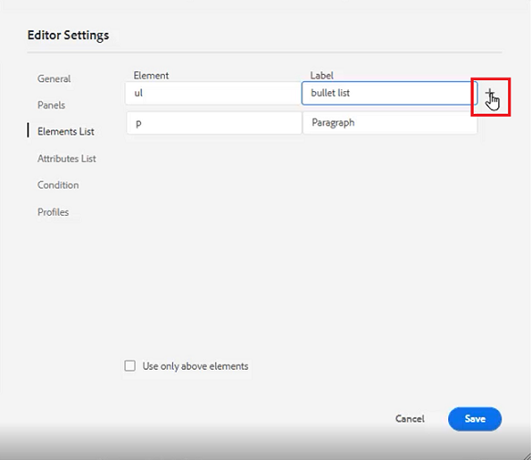

1. 按一下「[!UICONTROL **儲存**]」。

您可以立即在編輯器中的現有標籤中看到對元素清單的更改。 在添加新元素時提供的選項中也可以看到它們。

## 編輯器設定中的名稱和標籤屬性

「屬性清單」與「元素清單」類似。 在編輯器設定中，可以控制屬性清單及其顯示名稱。

1. 按一下 [!UICONTROL **編輯器設定**] 表徵圖

   

1. 在「編輯器設定」對話框中，按一下 [!UICONTROL **屬性清單**] 頁籤。

1. 鍵入 **屬性名稱** 和 **標籤** 的上界。

1. 按一下 [!UICONTROL **加**] 表徵圖可向清單添加更多屬性。

## 在編輯器設定中配置條件

「條件」(Condition)頁籤允許您配置多個屬性。

1. 按一下 [!UICONTROL **編輯器設定**] 表徵圖

   

1. 在「編輯器設定」對話框中，按一下 [!UICONTROL **條件**] 頁籤。

1. 選中要應用的條件的複選框。

   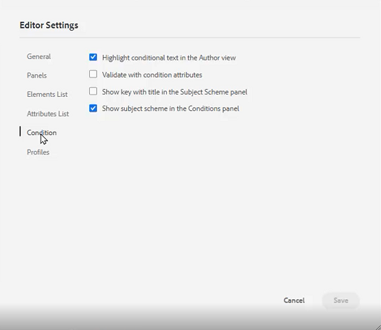

1. 按一下「[!UICONTROL **儲存**]」。

## 在編輯器設定中建立發佈配置檔案

發佈配置檔案可用於發佈知識庫。 例如，Salesforce使用配置的應用，其中包含消費者密鑰和消費者密鑰。 此資訊可用於建立Salesforce發佈配置檔案。

1. 按一下 [!UICONTROL **編輯器設定**] 表徵圖

   

1. 在「編輯器設定」對話框中，按一下 [!UICONTROL **配置檔案**] 頁籤。

1. 按一下 [!UICONTROL **加**] 表徵圖。

1. 根據需要填充欄位。

1. 按一下「[!UICONTROL **儲存**]」。

已建立發佈配置檔案。
