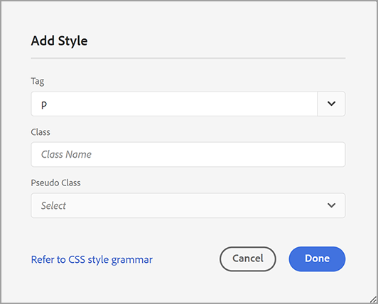
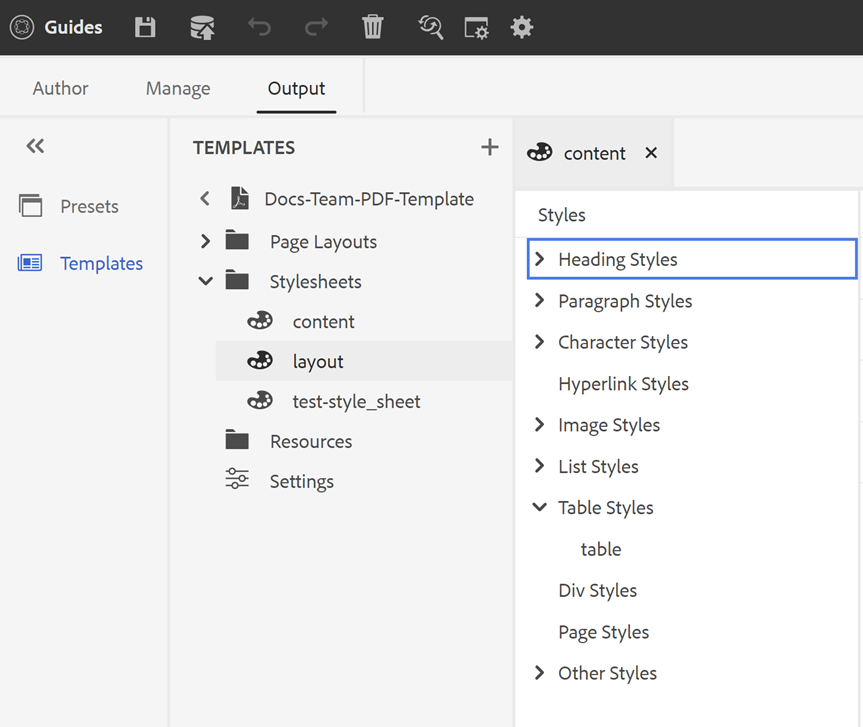

# PDF模板的元件

PDF模板包含四個元件：頁面佈局、樣式表、資源和設定。 您可以通過自定義這些單獨的元件並在生成PDF輸出時將模板與輸出預設相關聯來建立模板。 以下各節詳細介紹了這些元件及其定制過程。

## 建立和自定義頁面佈局

「頁面佈局」元件中的設定允許您通過定義頁面上的頁眉、頁腳和內容區域來設計頁面的結構。 使用WYSIWYG頁面佈局編輯器，可以為PDF中的不同部分建立頁面佈局，如前封面和後封面、章、目錄(TOC)、索引、空白頁、圖表清單(LOF)、表清單(LOT)、辭彙表，或為自定義頁面建立佈局。 在PDF模板設定中，可以為PDF分配具有不同節的頁面佈局，然後使用這些節來生成PDF輸出。

### 建立新頁面佈局

> **注釋**:有些頁面佈局示例是出廠時提供的。 您可以自定義這些頁面佈局或建立新頁面佈局。

1. 在Web編輯器中，轉到 **輸出** 頁籤。
1. 展開左側欄，然後按一下 **模板**。
1. 開啟要使用的模板。
   > **注釋**:可以通過按兩下模板名稱或按一下模板名稱旁邊的>表徵圖來開啟模板。
1. 要建立新頁面佈局，請執行以下操作之一：
   * 懸停於 **頁面佈局** 然後按一下(*選項* 表徵圖) **...** 選擇 **新建頁面佈局**。
   * 在 **模板** 面板，按一下 **+** 表徵圖 **模板** 選擇 **頁面佈局** 的子菜單。

      這將開啟「添加佈局」對話框。

      
1. 指定新頁面佈局的名稱。
   > **注：** 在命名頁面佈局時避免使用任何特殊字元。 名稱中的空格將替換為下划線「_」。
1. 按一下 **完成**。

   新佈局將建立並添加到「頁面佈局」下。

### 複製頁面佈局

1. 在 **模板** 要複製的模板部分，按兩下 **頁面佈局** 或按一下 **>** 表徵圖 **頁面佈局**。

   這將顯示模板中頁面佈局的清單。

1. 將滑鼠懸停在要複製的頁面佈局上，然後按一下(*選項* 表徵圖) **...** 選擇 **重複** 的子菜單。

1. 在 _重複佈局_ 對話框，輸入頁面佈局的名稱。

1. 按一下 **完成**。
在「頁面佈局」(Page Layouts)下建立並添加選定頁面佈局的副本。

### 自定義頁面佈局

1. 在 **模板** 要編輯的模板部分，按兩下 **頁面佈局** 或按一下 **>** 表徵圖 **頁面佈局**。

   這將顯示模板中頁面佈局的清單。
1. 要自定義任何頁面佈局，請執行以下操作之一：
   * 按兩下任何頁面佈局。
   * 將滑鼠懸停在任何頁面佈局上，然後按一下(*選項* 表徵圖) **...** 選擇 **編輯** 的子菜單。

   這將開啟頁面佈局編輯器進行自定義。
1. 完成所需更改後，按一下 *全部保存* 或 `Crl+S`)。

   有關定義單個佈局元素（如頁眉、頁腳、頁碼、標題等）的詳細資訊，請參閱 *使用頁面佈局元素*。

## 使用樣式表自定義PDF

樣式表元件中的設定允許您使用WYSIWYG編輯器對頁面佈局元件和DITA內容進行樣式化，或直接使用CSS檔案。 您可以建立自己的樣式或自定義預設樣式屬性。 WYSIWYG編輯器允許您訪問頁面佈局或DITA內容樣式所需的大多數屬性。 對於高級自定義設定，您可以直接在「源」視圖中工作。

### 建立新樣式表

為內容和佈局提供CSS檔案時，可以建立新樣式表，以將多個自定義項應用到特定樣式類型，然後可以應用到目標元件。 預設情況下，示例CSS檔案捆綁在產品中。 這些CSS檔案旨在幫助您跨內容和佈局組織樣式資訊。 您可以選擇將這些樣式合併到單個CSS檔案或多個檔案中。

預設情況下，無論何時建立新頁面佈局， `layout.css` 檔案包含在新頁面佈局中。 如果希望頁面佈局包含來自其他CSS檔案的樣式，則只需在新頁面佈局的內容編輯區域上拖放所需的CSS檔案即可。 要驗證CSS檔案是否已嵌入頁面佈局中，請切換到「源」視圖，您將在 `<head>` 的子菜單。

要建立樣式表，請執行以下步驟：
1. 在 **模板** 面板，執行下列操作之一：
   * 懸停在 **樣式表** ，然後按一下(*選項* 表徵圖) **...** 選擇 **新建樣式表**。
   * 按一下 **+** 表徵圖 **模板** 選擇 **樣式表** 的子菜單。

   這將開啟「添加樣式表」對話框。

   
1. 指定新樣式表的名稱。
1. 按一下 **完成**。

   在樣式表節下建立並添加新樣式表。

### 建立新樣式

預設情況下，CSS檔案包含標題、段落、字元、超連結、影像、表、div、頁面和其他樣式的樣式。 可覆蓋預設樣式格式或建立新樣式。

通常，當要關聯任何DITA元素的自定義樣式時，將建立新樣式。 要使此類自定義樣式有效，必須確保將樣式的類名與DITA元素的outputclass屬性相關聯。

要建立新樣式，請執行以下步驟：
1. 按一下右鍵任意樣式，然後從上下文菜單中選擇「新建樣式」(New Style)。

   這將開啟「添加樣式」對話框。

   
1. 在 **標籤** 欄位，選擇要為其建立新樣式的標籤。
1. 指定 **類** 名稱。

   此類名必須與源內容中標籤的outputclass屬性關聯。
1. 選擇 **偽類** 來增強元素的樣式。
1. 按一下 **完成**。

   在基本樣式下建立並添加新樣式。

### 自定義預定義或新樣式

建立具有預設樣式的新CSS檔案或要在現有CSS檔案中自定義樣式後，可以使用樣式編輯器來執行此操作。

要自定義樣式，請執行以下步驟：
1. 按兩下 **樣式表** 或按一下 **>** 表徵圖 **樣式表**。

   這將顯示預設（內容和佈局）和自定義CSS檔案。
1. 開啟樣式表進行編輯。

   要開啟樣式表進行編輯，請執行以下操作之一：
   * 按兩下樣式表名稱。
   * 懸停在樣式表名稱上，然後按一下（選項表徵圖）。..，然後選擇「編輯」。

   這將開啟樣式表進行編輯，並在「樣式」面板中顯示樣式清單。

   

1. 要自定義樣式，請按兩下某個樣式，或在樣式前按一下>表徵圖，以使用「樣式」編輯器查看和自定義樣式。

## 使用資源

這是用於設計模板的所有資產的容器。 您可以將其視為資料夾，其中包含背景影像、自定義字型、徽標等資產。 無論何時在模板中添加資產，都會上載或簽入資產資料夾。 然後，您可以使用這些資產來自定義或設計PDF模板。

要將資產檔案添加到「資源」資料夾，請執行以下步驟：
1. 懸停在「資源」資料夾頁籤上，然後按一下（「選項」表徵圖）。..並選擇「導入」。

   這將開啟「上載資產」對話框。

   

   將上載資產檔案的路徑顯示在 **選擇資產資料夾** 的子菜單。
   > **注：** 無法更改上載資產的路徑。 預設情況下，所有資產都儲存在 `/content/dam/dita-templates/pdf/<PDF-template-name>` 的子菜單。

1. 按一下 **選擇檔案** 從本地電腦瀏覽資產檔案
1. 按一下 **上載**。
選定檔案將導入並列在「資源」資料夾下。

## 高級PDF設定

使用「設定」部分可配置PDF頁面佈局的高級設定、從奇數或偶數頁開始PDF、交叉引用的格式以及在使用模板生成的最終PDF中啟用打印標籤。

要配置，請按一下 **設定** 的 **模板** 面板以查看以下選項：

**一般**

設定從奇數或偶數頁開始章節的基本配置設定、目錄結構，並定義目錄條目的引線格式。 您可以定義以下設定：

* **始終從**:允許您定義在最終PDF中發佈每章的方式。 您可以從 **新建頁面**。 **奇數頁**&#x200B;或 **偶數頁** 頁籤 如果選擇從奇數頁開始新章節，則在結束於奇數頁的章節之後插入空白頁。 例如，如果章節在第15頁結束，則發佈過程將插入空白16第 以便新章從17開始第 的子菜單。

* **從新頁面啟動每個主題**:如果希望章中的每個主題都從新頁面開始，請選擇 **從新頁面啟動每個主題** 的雙曲餘切值。 如果要保持主題連續，而不留任何頁面間隙，請取消選擇此選項。

* **TOC結構**:允許您自定義目錄的層次結構。 它使用以下附加設定：

   * **使用最高級別的標題**:它允許您調整要在PDF的目錄結構中顯示的標題級別數。
   * **不顯示目錄中第一級的頁碼**:選擇此選項可隱藏包含嵌套主題或子主題的所有章節的相應頁碼。 請考慮以下示例，其中建立輸出時不選擇此選項。

   

   在上例中，「高級PDF設定」、「附錄」和「法律」是第一級主題標題或章節標題。 所有這些標題都分配了頁碼。

   現在，如果選擇此選項並生成輸出，則將獲得以下目錄：
   

   在此，您可以注意到，第一章「高級PDF」設定沒有提供任何頁碼，因為它包含嵌套主題或子主題。 而頁碼則指定給「附錄」和「法律」，因為它們是獨立主題，沒有任何子主題。

* **引線格式**:使用下拉框選擇「點線」、「實線」或「空格」引線，將標題級別連接到其相應的頁碼。
有關應用目錄結構和樣式標題級別的資訊，請參閱 *定義目錄*。

   > **注釋**:如果您是CSS開發人員，則也可以直接在CSS檔案中定義引線格式。
* **使用表繼續標籤**:選擇此選項可定義跨多頁的長表的標籤。 有關使用表連續標籤的詳細資訊，請參閱使用表連續標籤。

**頁面佈局**

「頁面佈局」設定允許您完全控制指定要用於文檔特定部分的頁面佈局。 例如，要為目錄選擇佈局，請按一下「目錄」(TOC)欄位下的下拉菜單，然後選擇您設計為生成目錄的佈局。

如果您尚未為文檔中的特定部分建立佈局，則只需選擇用作此類部分或主題的預設佈局的佈局即可。 然後，將預設頁面佈局應用於所有沒有專用頁面佈局的此類節。

同樣，如果要建立封面和封底頁面，則必須在設定中建立並應用頁面佈局。 否則，您的PDF將不包含封面和封底。

有關頁面佈局的詳細資訊，請參見 *設定頁面佈局*。

**列印**

配置打印生產設定以分配打印機標籤、選擇顏色模型並指定與打印PDF輸出相關的屬性。

* **打印機標籤**:在準備用於打印生產的文檔時，打印機標籤會添加到頁面邊界，以幫助在打印期間正確對齊、修剪和顏色選擇。 通過選擇打印機標籤，頁面邊界被擴展以容納在打印期間被裁切的標籤。 您可以選擇在PDF輸出中顯示以下打印機標籤：
   * **修剪標籤**:選擇選項以在裁切區域的每個角處放置標籤，以指示打印後需要裁切紙張的位置。
   * **出血標籤**:選擇以在出血框的每個角處放置標籤，以指示擴展影像的修剪區域。
   * **註冊標籤**:選擇以在裁剪區域外放置標籤，以對齊彩色文檔中的不同分色。
   * **色條**:選擇以在修剪區域外添加一條顏色，以保持顏色一致性並在打印時調整墨水密度。

   使用 **線寬**。 **線條顏色**, **出血框寬度** 頁籤

* **介質盒大小**:這是總頁面大小，包括打印機標籤所佔用的擴展區域。 使用下拉選項為PDF輸出選擇頁面大小或建立自己的自定義大小。

* **顏色空間**:您可以選擇RGB或CMYK色彩空間來打印PDF文檔。 選擇RGB以數字顯示生成的PDF和CMYK以進行物理打印。 文檔中定義的顏色將轉換為所選顏色空間。
   > **注釋**:如果使用CMYK顏色空間，則PDF/A建立需要ICC顏色配置檔案。

   有關應用這些打印設定的詳細資訊，請參閱 *打印首選項*。

**交叉引用**

使用「交叉引用」(Cross-reference)頁籤定義交叉引用如何發佈PDF。 可以設定主題標題、表、圖等的交叉引用格式。 有關詳細資訊，請參見 *設定交叉引用格式*。
