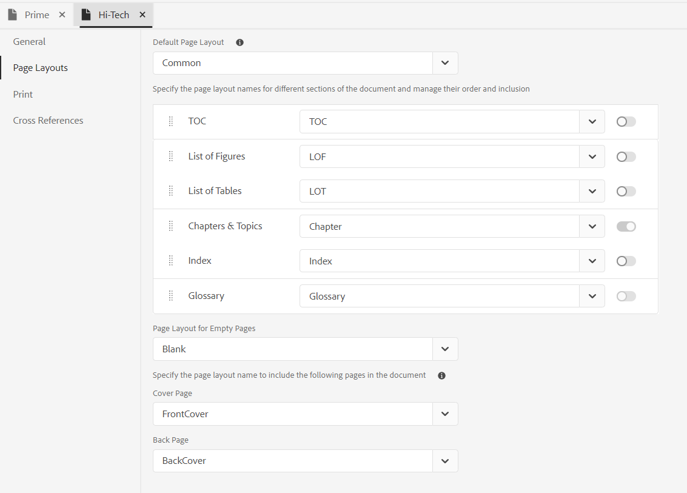
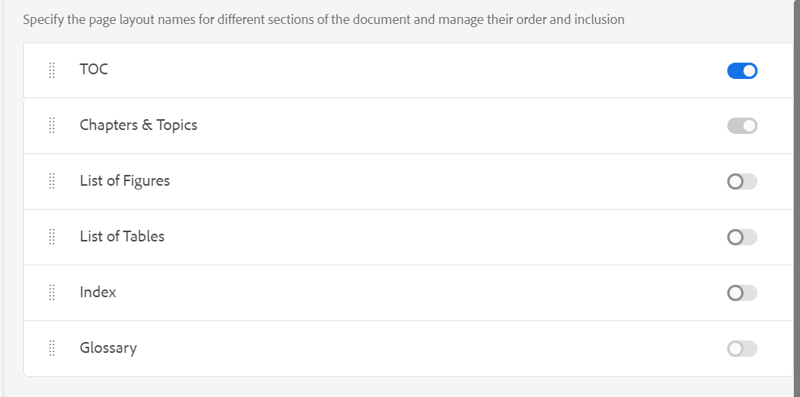

# PDF範本的元件 {#components-pdf-template}

PDF範本有四個元件：頁面配置、樣式表、資源和設定。 您可以自訂這些個別元件，並在產生PDF輸出時將範本與輸出預設集建立關聯，藉此建立範本。 以下各節將詳細介紹這些元件及其自訂程式。

## 建立和自訂頁面配置 {#create-customize-page-layout}

「頁面配置」元件中的設定可讓您定義頁面上的頁首、頁尾和內容區域，以設計頁面的結構。 使用WYSIWYG版面配置編輯器，您可以為PDF中的不同區段建立版面配置，例如正面與背面封面頁、章節、目錄(TOC)、索引、空白頁面、正面重要頁面、背面重要頁面、插圖清單(LOF)、表格清單(LOT)、字彙表，或建立自訂頁面的版面配置。 在「PDF範本設定」中，您可以指派具有PDF內不同區段的頁面配置，然後使用這些區段來產生PDF輸出。

### 建立新的頁面配置 {#create-page-layout}

>[!NOTE]
>
>有現成可用的範例頁面配置。 您可以自訂這些或建立新的頁面配置。

1. 在網頁編輯器中，前往 **輸出** 標籤。
1. 展開左側邊欄並按一下 **範本**.
1. 開啟您要使用的範本。

   >[!NOTE]
   >
   >您可以按兩下範本名稱或按一下範本名稱旁的>圖示來開啟範本。

1. 若要建立新的頁面配置，請執行下列任一項作業：

   * 暫留在 **頁面配置** 並按一下(*選項* 圖示) **...** 並選擇 **新頁面配置**.

   * 在 **範本** 面板，按一下 **+** 圖示旁邊 **範本** 並選擇 **頁面配置** 從內容功能表。

     如此將可開啟 **新增版面** 對話方塊。

     

1. 指定新頁面配置的名稱。
   >[!NOTE]
   >
   >在命名頁面配置時，請避免使用任何特殊字元。 名稱中的空格會以底線「_」取代。

1. 按一下&#x200B;**「完成」**。

   新版面即建立並新增至「頁面版面」下。

### 複製頁面配置 {#duplicate-page-layout}

1. 在 **範本** 要複製的範本區段，按兩下  **頁面配置** 或按一下 **>** 之前圖示 **頁面配置**.

   這會顯示範本中的頁面配置清單。

1. 將滑鼠停留在您要複製的版面配置上，然後按一下(*選項* 圖示) **...** 並選取 **複製** 從內容功能表。

1. 在 _復製版面_ 對話方塊中，輸入頁面配置的名稱。

1. 按一下 **完成**.
所選頁面配置圖的副本隨即建立並新增至「頁面配置」下。

### 自訂頁面配置 {#customize-page-layout}

1. 在 **範本** 要編輯的範本區段，按兩下 **頁面配置** 或按一下 **>** 之前圖示 **頁面配置**.

   這會顯示範本中的頁面配置清單。
1. 若要自訂任何頁面配置，請執行下列任一項作業：
   * 按兩下任何頁面配置。
   * 將滑鼠指標暫留在任何版面配置上，然後按一下(*選項* 圖示) **...** 並選取 **編輯** 從內容功能表。

   這會開啟頁面配置編輯器以進行自訂。
1. 完成所需的變更後，請按一下 *全部儲存* (或 `Crl+S`)。

   如需定義個別版面配置元素（如頁首、頁尾、頁碼、標題等）的詳細資訊，請參閱 [設計頁面配置](design-page-layout.md).

## 使用樣式表來自訂PDF {#stylesheet-customization}

樣式表元件中的設定可讓您使用WYSIWYG編輯器來設定頁面配置元件和DITA內容的樣式，或直接使用CSS檔案。 您可以建立自己的樣式，或是自訂預設的樣式屬性。 所見即所得編輯器可讓您存取設定頁面配置或DITA內容樣式所需的大多數屬性。 對於進階自訂，您可以直接在來源檢視中工作。

### 建立新樣式表 {#create-stylesheet}

雖然CSS檔案是針對內容和版面配置而提供的，但您可以建立新的樣式表以將多個自訂套用至特定樣式型別，然後可套用至目標元件。 依預設，範例CSS檔案是隨產品提供的。 這些CSS檔案的用意是協助您跨內容和版面組織樣式資訊。 您可以選擇將這些樣式合併到單一CSS檔案或多個檔案中。

根據預設，每當您建立新版面配置時， `layout.css` 檔案包含在新的頁面配置中。 如果您希望頁面配置包含不同CSS檔案的樣式，您只需將所需的CSS檔案拖放至新頁面配置的內容編輯區域。 若要驗證CSS檔案是否已內嵌於頁面版面配置中，請切換到來源檢視，您將會在 `<head>` 元素。

若要建立樣式表，請遵循下列步驟：
1. 在 **範本** 面板，執行下列任一項作業：
   * 將游標暫留在 **樣式表** 標籤並按一下(*選項* 圖示) **...** 並選擇 **新增樣式表**.
   * 按一下 **+** 圖示旁邊 **範本** 並選擇 **樣式表** 從內容功能表。

   這會開啟新增樣式表對話方塊。

   
1. 指定新樣式表的名稱。
1. 按一下&#x200B;**「完成」**。

   隨即建立新樣式表並新增至「樣式表」區段下。

### 建立新樣式 {#create-style}

依預設，範本隨附的CSS檔案包含標題、段落、字元、超連結、影像、表格、div、頁面和其他樣式的樣式。 您可以覆寫預設樣式格式或建立新樣式。

您可以建立新樣式以將其用於範本的頁面配置，或為任何DITA元素套用自訂樣式。 若要將這些自訂樣式套用至DITA元素，您必須確定樣式的類別名稱與DITA元素的名稱或屬性相同。 `outputclass` 屬性。  例如， `
` 在DITA中，由 `.div {}` 在CSS或其 `outputclass` 屬性。 如果您套用 `
` 在DITA中，是由下列專案所控管： `.div {}` 或 `.my-div {}` 在CSS中。

若要建立新樣式，請遵循下列步驟：
1. 展開左側邊欄，然後按兩下您要建立樣式的範本。
1. 展開 **樣式表** 區段。 它會開啟 **樣式** 包含所有樣式選項的面板。
1. 選取+圖示以新增樣式。

   **新增樣式** 對話方塊開啟。

   

1. 指定 **類別** 名稱。 若要將樣式套用至DITA元素，請確定樣式的類別名稱與DITA元素的名稱相同，或 `outputclass` 屬性。
1. 在 **標籤** 欄位（選擇性），選擇要建立新樣式的標籤。

1. 選取 **虛擬類別** 來設定元素的樣式。 虛擬類別可協助您定義元素的特殊狀態。 例如，當您將滑鼠停留在元素上或焦點停留在元素上時，可使用偽類別來設定元素的樣式。 您也可以選取多個虛擬類別。 例如，您可以使用虛擬類別 `a::visited {color: blue;}` 來設定造訪連結的樣式。

1. 新增新樣式的選取器。 此 **選擇器** 欄位可協助您在Class、Tag和Pseudo Class組合之外新增自訂選取器。 例如，您可以建立 `table a.link` 表格內所有超連結的樣式。

   如需CSS標籤的詳細資訊，請檢視 [請參閱CSS樣式文法](https://www.w3.org/TR/CSS21/syndata.html#characters).

1. 按一下&#x200B;**「完成」**。

   隨即建立新樣式並新增至樣式清單中。

### 自訂預先定義的樣式或新樣式 {#customize-style}

使用預設樣式建立新的CSS檔案或想要自訂現有CSS檔案中的樣式後，您可使用樣式編輯器執行此操作。

若要自訂樣式，請遵循下列步驟：
1. 按兩下 **樣式表** 或按一下 **>** 之前圖示 **樣式表**.

   這會顯示預設（內容和版面）和自訂CSS檔案。
1. 開啟樣式表以進行編輯。

   若要開啟樣式表進行編輯，請執行下列任一項作業：
   * 按兩下樣式表名稱。
   * 將滑鼠懸停在樣式表名稱上，然後按一下（選項圖示） ...並選擇編輯。

   這會開啟樣式表進行編輯，並在「樣式」面板中顯示樣式清單。

   

1. 若要自訂樣式，請選取要檢視的樣式，並使用樣式編輯器自訂它。

### 樣式的屬性

您可以在中央面板中編輯屬性，但可能很難取得所有值的快照。  此 **屬性** 窗格可讓您快速檢視樣式的所有屬性和值。

在中心面板中，您可以編輯常用的屬性，但無法編輯CSS支援的所有屬性。 在 **屬性** 窗格，您可以編輯CSS支援的所有屬性並加以預覽。 您不需要切換到來源檢視即可編輯任何屬性。

進一步瞭解如何使用樣式編輯器 [使用常見的內容樣式](stylesheet.md).

## 使用資源 {#work-with-resources}

這是用來設計範本之所有資產的容器。 您可以將它視為一個資料夾，其中包含背景影像、自訂字型、標誌等資產。 每當您在範本中新增資產時，該資產都會上傳或存回資產資料夾。 然後，您可以使用這些資產來自訂或設計您的PDF範本。

若要將資產檔案新增至「資源」資料夾，請遵循下列步驟：

1. 將游標暫留在「資源」資料夾標籤上，然後按一下（選項圖示） ...並選擇「匯入」。

   如此將可開啟上傳資產對話方塊。

   

   資產檔案上傳的路徑會顯示在 **選取資產資料夾** 欄位。
   >[!NOTE]
   >
   >您無法變更上傳資產的路徑。 依預設，所有資產都儲存在 `/content/dam/dita-templates/pdf/<PDF-template-name>` 資料夾。

1. 按一下 **選擇檔案** 從本機電腦瀏覽資產檔案

1. 按一下 **上傳**.
選取的檔案會匯入並列在「資源」資料夾下。

## 進階PDF設定 {#advanced-pdf-settings}

使用「設定」段落可設定PDF版面配置的進階設定、從奇數或偶數頁開始PDF、互動參照格式，以及啟用使用範本產生的最終PDF列印標籤。

若要設定，請按一下 **設定** 在 **範本** 面板以檢視下列選項：

### 一般

設定從奇數或偶數頁開始章節的基本組態設定、目錄結構，並定義目錄專案的導線格式。 您可以定義下列設定：

* **開始任何新章節，從**：可讓您定義每個章節在最終PDF中的發佈方式。 您可從 **新頁面**， **奇數頁**， **偶數頁面**，或 **目前頁面**  選項。 如果您選擇從奇數頁開始新章節，則會插入空白頁至結束於奇數頁的章節之後。 例如，如果您的章節結束於第15頁，則發佈程式將插入空白16th 頁面，讓新章節可以從17開始th 頁面。  如果您選擇 **目前頁面** 選項，則所有章節會連續發佈，而不會出現任何分頁符號。 例如，如果章節結束於第15頁的中間，則下一個章節也會從第15頁本身開始。

* **從新頁面開始每個主題**：如果您希望章節中的每個主題都從新頁面開始，請選取 **從新頁面開始每個主題** 選項。 如果您希望主題持續進行，而不留任何頁面間隙，請取消選取此選項。

* **目錄結構**：可讓您自訂目錄的階層。 它會使用以下額外設定：

   * **使用標題至層級**：可讓您調整要在PDF的目錄結構中顯示的標題層級數目。
   * **不要在目錄中顯示第一層的頁碼**：選取此選項可隱藏包含巢狀或子主題之所有章節的對應頁碼。 請考量下列範例，其中在不選取此選項的情況下建立輸出。

  

  在上述範例中，「進階PDF設定」、「附錄」和「法律」是第一層主題標題或章節標題。 頁碼會指定給所有這些標題。

  現在，如果您選取此選項並產生輸出，則會取得以下目錄：

  

  在這裡，您可以注意到第一個章節進階PDF設定未提供任何頁碼，因為它有巢狀或子級主題。 而頁碼（如果指定給「附錄」和「法律」），則是因為它們是獨立主題，沒有任何子主題。

* **不要在目錄中顯示章節編號** ：選取此選項可顯示目錄中沒有章節編號的章節名稱。   依預設，章節編號會顯示在PDF輸出的目錄中。
* **導線格式**：使用下拉式選單選取「點狀」、「實線」或「空格」導線，將標題層級連線至其對應的頁碼。
如需套用目錄結構和樣式標題層級，請參閱 [新增章節目錄](design-page-layout.md#add-chapter-toc).

  >[!NOTE]
  >
  >如果您是CSS開發人員，則也可以直接在CSS檔案中定義導線格式。

* **使用表格繼續標籤**：選取此選項可定義跨多頁之長表格的標籤。
您可以定義要在分頁前後顯示的文字。 例如，表格會在第5頁分隔，而您定義 `<Continued on page %page-num%>` 的 **分隔之前的文字**.  文字在第5頁底部顯示「繼續於第6頁」。

  使用語言變數來定義分行前後連續標籤文字。 系統會根據您選擇的語言，在PDF輸出中自動挑選當地語系化的值。 例如，您可以發佈 `Continued on page %page-num%` 以英文和文字顯示 `Fortsetzung auf Seite %page-num%` 德文版。

  暫留在  接近選項以檢視更多相關詳細資訊。
* **將字彙表術語連結至字彙表頁面**：選取此選項可將字彙表術語顯示為內容中的超連結，並將它們連結至字彙表頁面上的術語。 這可協助讀者快速檢視辭彙表中定義的辭彙定義。

  若要將字彙表辭彙轉換成超連結，您需要：
   * 啟用 **字彙表** 在 **頁面配置順序** DITA map的索引標籤。
   * 在書本地圖的Back Matter Pages中新增字彙表。

  如果您未啟用「字彙表」頁面，內容中的「字彙表」字彙不會轉換為PDF輸出中的超連結。
  <!--For more information on using table continuation markers, see Use table continuation markers.-->

### 頁面配置 {#page-layouts}

「版面配置」設定可讓您完全控制要用於檔案特定區段的版面配置。 例如，若要選取目錄的版面，請按一下目錄欄位下的下拉式功能表，然後選取您設計用來產生目錄的版面。

請務必注意，書籤地圖設定的優先順序高於頁面版面設定。

「頁面配置」區段下提供下列設定：

**預設頁面配置**：選取頁面配置，當作PDF中所有頁面的預設配置。 這是基礎版面配置，會套用到您尚未建立專用版面配置的區段或主題。

**不同區段的頁面配置**：您可以使用PDF輸出的以下區段來對應頁面版面。 如果您已設計相關區段的版面配置，請從下拉式清單中選取它。 如果尚未為特定區段建立頁面配置，則會套用預設頁面配置。

* **章節與主題**：您可以指定章節與主題的頁面配置。 選取的版面配置將套用至所有章節和主題。

* **目錄**：如果您已設計目錄頁面配置，請選取 **目錄** ，檔案中的所有TOC頁面都會有該TOC頁面配置。

* **圖表清單和表格清單**：您也可以指定插圖和表格的頁面配置。 選取的版面配置將套用至所有圖表和表格。

* **索引**：如果您已設計「索引」頁面配置，請將其對應至「索引」選項。 使用樣式表，您可以在PDF輸出中設定不同的索引元素樣式。 使用索引樣式 `.idx-header`， `.idx-footer`， `.idx-body`， `.idx-title`， `.idx-keyword-group`， `.idx-unit`，  `.idx-keyword`， `.idx-name`， `.idx-link` 和 `.idx-child` 以自訂索引元素的樣式。

* **字彙表**：如果您有「字彙表」頁面配置，則將其對應至「字彙表」選項。

  PDF輸出辭彙中的辭彙一律按字母順序排序。

  您也可以新增標籤 `sort-as` 以定義辭彙表的排序索引鍵。 接著，「Experience Manager指南」會使用排序索引鍵來排序字彙術語，以取代字彙術語。 如果您尚未定義排序索引鍵，則會使用字彙術語來排序。 例如，您可以新增標籤 `sort-as` 至 `glossterm` 並將其值設為 `A` 若為「USB」一詞(例如， `<glossterm>USB<sort-as>A</sort-as></glossterm>`)。 同樣地，您可以新增 `sort-as` 標籤並將其值設為 `B` 以「Pen Drive」一詞表示。 當您排序這些辭彙表術語時，排序鍵值 `A` 辭彙的「USB」出現在排序索引鍵之前 `B` （辭彙表「Pen Drive」）。 因此，在PDF輸出中，「USB」在字彙表頁的「Pen Drive」前面。

  使用樣式表，您可以在PDF輸出中設定不同的辭彙表元素的樣式。 使用字彙表樣式 `.glo-header`， `.glo-footer`， `.glo-body`， `.glo-title`， `.glo-unit`， `.glo-link`、和 `.glo-term` 以自訂字彙表元素的樣式。

  進一步瞭解如何使用樣式編輯器 [使用常見的內容樣式](stylesheet.md).

* **正面重要頁面與背面重要頁面**：這些版面配置會定義書冊中重要頁面的前面或背面樣式。 如果您已設計正面佈局，請將它對應至 **重要頁面** 選項。 當您從下拉式清單中選取正文版面時，正文版面會套用至正文出現的所有主題。

  如果您已設計背面材質配置，請將它對應至 **後置重要頁面** 選項。 當您從下拉式清單中選取後置事項版面配置時，後置事項版面配置會套用至後置事項中存在的所有主題。

  **重要頁面** 也會作為的遞補配置 **目錄**， **圖表清單**&#x200B;和表格清單。  同樣地， **後置重要頁面** 也會作為的遞補配置 **索引** 和 **字彙表** 版面。 如果您尚未選取這些專案的版面，則會套用選取的前面或背面重要頁面版面。  如果您尚未選取「正面」或「背面」重要頁面配置，則會套用預設頁面配置。

* **空白頁面的版面配置**：您也可以指定空白頁面的版面配置。 選取的版面配置將套用至所有空白頁面。 例如，如果您已為所有空白頁面設計了空白頁面版面配置，則選取「 」 **空白** ，則檔案中的所有空白頁面都會有「空白頁面」版面配置。

* **封面頁和背頁**：如果您已設計封面版面配置，則將其對應至 **封面** 選項。 同樣地，如果您有後頁版面配置，則將其對應至 **後頁** 選項。 如果尚未建立封面或背面版面配置，則會套用預設版面配置。

如需頁面配置的詳細資訊，請參閱 [設計頁面配置](design-page-layout.md).

### 頁面配置順序 {#page-order}

您可以在PDF中顯示或隱藏以下區段，也可以排列它們在最終PDF輸出中的顯示順序：

* 目錄
* 章節與主題
* 圖表清單
* 表格清單
* 索引
* 字彙表
* 引用

  

  如果不想在PDF輸出中顯示特定截面，可以關閉切換開關來隱藏它。

  您也可以定義在PDF中產生這些不同區段的順序。 若要變更這些區段的預設順序，請選取虛線以將區段拖放到所需位置。

  >[!NOTE]
  >
  > 順序和包含設定僅適用於DITA map。 對於書籤，這些設定不適用。 書籤中的頁面會依書籤區段的順序顯示。

.
**章節與主題** 配置一律預設為啟用。 您無法將其切換。

**合併頁面**

依預設，所有區段都會從新頁面開始。 選取 **上一頁** 或 **下一頁** 選項來自 **合併為** 下拉式清單，將區段與上一頁或下一頁合併。 這會將區段發佈為PDF輸出中所選頁面的延續。 這樣，兩者之間就不會有分頁符號。

>[!NOTE]
>
> 此設定僅適用於區段，不適用於其元件。  例如，如果您選取 **上一頁** 選項 **章節與主題**，則 **章節和主題** 區段會與上一頁合併。 各種章節和主題會依據 **一般** settings。例如，若在 **從設定開始任何新章節**，您選取 **奇數頁**，則會插入空白頁面至結尾為奇數頁面的章節之後。

將區段合併至上一頁或下一頁時，會合併內容，並套用內容合併的目標區段樣式。

例如，如果您啟用 **目錄** 和 **章節與主題** 並選取 **下一頁** 的 **目錄**，則 **目錄** 與下一區段合併，也就是 **章節與主題**. 的樣式 **章節與主題** 區段會套用至兩個區段的合併內容。

合併選項會連續運作，因此如果您已選取 **下一頁** 對於多個連續截面，它們都與沒有此屬性設定的第一個截面（在下一個方向）合併。 例如，您啟用 **目錄**， **章節與主題**， **圖表清單**、和 **索引**. 然後，如果您設定 **下一頁** 的 **目錄**， **章節與主題**， **圖表清單**、和 **無** 的 **索引**，則全部合併為  **索引**.

**靜態頁面**

各種版面配置可協助您設計各種區段的輸出。 這些區段是在您發佈輸出時從DITA map產生的。
您也可以建立自訂頁面配置，並在PDF輸出中發佈為靜態頁面。 這可協助您新增任何靜態內容，例如備註或空白頁面。

執行以下步驟以新增自訂頁面配置：

1. 選取 **新增**  以新增頁面配置。 「新增頁面配置」面板隨即開啟。
2. 從清單中選取版面配置，然後按一下「新增」。 新的版面配置會新增至版面配置清單。

您也可以執行下列動作：

* 選取虛線條，將頁面版面配置拖放至所需位置。

* 選取 **移除版面**   以移除版面。

* 您也可以將靜態頁面與上一頁或下一頁合併。

* 您也可以多次新增自訂版面並加以排序。 這可協助您據以發佈靜態內容。

  例如，您可以使用自訂版面配置，在PDF輸出中多次發佈靜態警告。

### 頁面組織

PDF檔案中的頁面通常會根據DITA map或bookmap檔案中組織的內容發佈。 不過，您也可以變更PDF檔案中的頁面順序。 例如，您可以列印多頁檔案作為小冊子。 當您整理、摺疊、裝訂工作表時，結果會是一本具有正確頁面順序的書。  接著，您就可以像讀書一樣閱讀已出版的小冊子。

下列設定可在 **頁面組織** 區段：

#### 頁面順序

選取決定PDF檔案中頁面順序的頁面順序。 您可以從下拉式清單中選擇下列選項：

* **預設**：頁面的預設順序（根據來源檔案）。
* **奇數頁優先**：所有奇數頁面都會移到所有偶數頁面之前。
* **偶數頁優先**：所有偶數頁面都會移到所有奇數頁面之前。
* **反向**：頁面順序會反轉。
* **手冊**：所有頁面都會以小冊子的形式排序。
* **從右至左的小冊子**：所有頁面的順序都是由右至左的小冊子。
* **自訂**：定義頁面的自訂順序，而非預先定義的順序。
   * &quot;a..b」 — 從a到b的所有連續頁面。
   * &quot;a，b，c&quot; — 新頁面順序a、b、c。
   * &quot;a*b&quot; — 頁面a重複b次。
   * &quot;-a&quot; — 負頁數會從最後一頁開始往後計數，並可與其他自訂訂單結合。
   * 「X」 — 檔案的所有頁面。 與「1..-1」。

例如，您可以提供自訂順序，例如「2,3，5*2,7..10，-1，-2」。
給定的頁面順序會導致PDF具有來自原始檔案的以下頁碼，假設它共有25頁：2、3、5、5、7、8、9、10、25、24。

#### 每張工作表設定一個以上的頁面

選擇此選項可在單張紙上發佈多個頁面。  然後，選取列數和欄數，並像網格一樣將頁面發佈到單一工作表上。 例如，您可以以2列和4欄的網格發佈頁面。

定義目標頁面大小和您要發佈頁面的方向。 您也可以指定頁面的邊界與邊框間距屬性。

### 列印

設定列印成品設定以指派印表機標籤、選取色彩模式，以及指定與列印PDF輸出相關的屬性。

* **印表機標籤**：當您準備檔案以進行列印生產時，印表機標籤會新增至頁面邊界，以協助在列印期間進行適當的對齊、裁剪和顏色選取。 透過選取印表機標籤，頁面邊界會延伸以容納在列印期間裁剪的標籤。 您可以選擇在PDF輸出中顯示下列印表機標籤：
   * **修剪標籤**：選取選項以在裁剪區域的每個角落處放置標籤，以指示列印後需要裁剪紙張的位置。
   * **出血標籤**：選取此選項可在出血方塊的每個角落處放置標籤，以指示延伸影像的裁剪區域。
   * **註冊標籤**：選取此項可將標籤置於裁切區域之外，以對齊彩色檔案中的不同分色。
   * **色條**：選取以在修剪區域外新增顏色帶，以維持顏色一致性並調整列印時的油墨密度。

  使用設定所選印表機標籤的尺寸 **線條寬度**， **線條色彩**、和 **出血方塊寬度** 選項。

* **媒體盒大小**：這是包括印表機標籤所佔用的延伸區域的整體頁面大小。 使用下拉式選項來選取PDF輸出的頁面大小，或建立您自己的自訂大小。

* **色域**：您可以選擇使用RGB或CMYK色域來列印PDF檔案。 選擇「RGB」，以數位方式顯示產生的PDF，以及實體列印的CMYK。 檔案中定義的顏色會轉換成所選的色域。
  >[!NOTE]
  >
  >使用CMYK色域時，建立PDF/A需要ICC色彩設定檔。

  <!--For more information on applying these print settings, see *Printing preferences*.-->

### 交叉引用 {#cross-references}

使用 **互動參照** 標籤定義互動參照在PDF中的發佈方式。 您可以設定主題標題、表格、插圖等專案的互動參照格式。

>[!NOTE]
>
> 如果您已在插入互動參照時定義連結文字，則其優先順序會高於「原生PDF」範本中定義的互動參照。

您也可以使用變數來定義互動參照。  使用變數時，系統會從屬性中挑選變數值。 您可以使用單一變數或變陣列合來定義互動參照。 您也可以使用字串和變數的組合。

例如，您可以使用 `View details on {chapter}`. 如果章節名稱是「一般設定」，則輸出中的互動參照是「檢視一般設定的詳細資料」。

AEM Guides提供下列現成可用的變數：

* {title}：建立主題標題的互動參照。 例如，請參閱第2頁上的實用連結。
* {page} 新增頁碼的互動參照。 例如，請參閱第1頁的。
* {description}：在說明文字中新增互動參照。 例如，請參閱AEM Guides的詳細資料。
* {chapter}：新增章節編號的互動參照。 例如，請參閱第1章的。
* {bookmarkText}：建立書籤化文字的互動參照。 例如，請參閱第5頁的stop_words 。
* {captionText}：建立主題中圖形或表格標題的互動參照。 例如，請參閱第2頁上的氣流。
* {figure}：新增圖數的互動參照。 從您為圖形定義的自動編號樣式中挑選圖形編號。  例如，您可以使用 {figure} 在頁面上 {page}「。 輸出中的互動參照包含自動產生的數字及其頁碼「請參見第5頁的圖1」。
* {table}：新增表格編號的互動參照。 從您為註解定義的自動編號樣式中挑選表格編號。 例如，您可以使用 {table} 在頁面上 {page}「。 輸出中的互動參照包含自動產生的表格編號及其頁碼「請參閱第5頁的表1」。

  >[!NOTE]
  >
  >您可以為註解和圖形標籤建立自動編號樣式。

#### 預設互動參照格式

如果您將文字欄位保留為空白，而且您在插入互動參照時尚未定義連結文字，則「Experience Manager參考線」會為個別互動參照新增下列變數：

* **標題**： `{title}`
* **說明**： `{description}`
* **段落**： `{bookmarkText}`
* **書籤**： `{bookmarkText}`
* **圖**： `{captionText}`
* **表格**： `{captionText}`

互動參照的優先順序為：
* 交叉引用中新增的連結文字
* 在原生PDF範本中定義的互動參照格式
* 預設互動參照格式

#### 交叉引用中的語言變數

您也可以使用語言變數來定義當地語系化的互動參照。 系統會根據您選擇的語言，在PDF輸出中自動挑選當地語系化的值。

例如，您可以新增語言變數「reference-label」，並以英文和德文定義值。

* 英文 — 「在頁面上檢視」 {page}&quot;
* 德文 — 「Einzelheiten finden Sie auf der Seite {page}&quot;

當您新增時 `${lng:<variable name>}` 對於「段落」區段，輸出段落中的互動參照包含本地化文字和頁碼。\
例如，下列熒幕擷取畫面以英文顯示「View on page 1」互動參照，以德文顯示「Einzelheiten finden Sie auf der Seite 1」。

*以英文發佈之段落中的互動參照。*

*以德文發佈之段落中的對照參照。*

<!--For more information, see *Format cross-references*.-->
