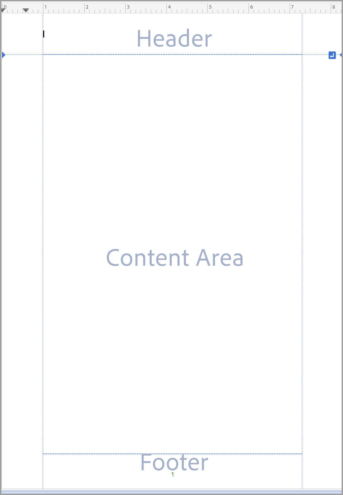
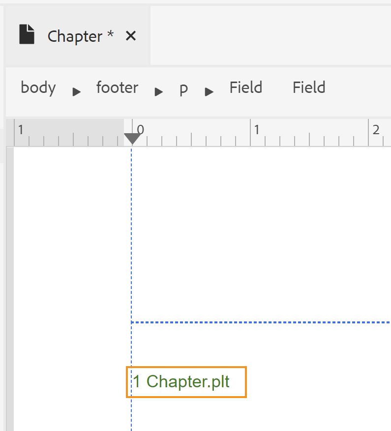
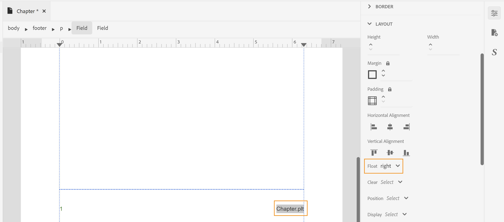

# 設計頁面佈局 {#design-page-layout}

在建立PDF文檔時，您會有不同的部分來顯示不同類型的資訊。 例如，PDF文檔將從頭頁或封面開始，該頁面將包含您公司的徽標、書籍標題或版本資訊。 然後會有章節、附錄或辭彙表頁。 PDF文檔中的每個部分看起來都不同，這是通過建立和自定義頁面佈局來實現的。

設計頁面佈局時，可以定義組成頁面的各種元素。 例如，可以定義頁面大小、邊距、頁眉和頁腳、方向和頁面上的其他頁面規範。 本機PDF發佈功能允許您根據 [頁面媒體標準](https://www.w3.org/TR/css-page-3/)。 「分頁媒體」標準涵蓋的大多數設定都可以使用「本機PDF發佈」功能的用戶介面輕鬆自定義。 對於某些其他高級格式設定，可以使用「源」視圖來編寫您自己的CSS代碼。

設計完頁面佈局後，需要將這些佈局與「PDF頁面佈局」設定中各自的部分相關聯。 查看 [建立和自定義頁面佈局](components-pdf-template.md#create-customize-page-layout) 的子菜單。

## 頁面佈局類型 {#types-of-page-layout}

PDF文檔通常包含以下部分：

* 封面
* 目錄
* 數字的提升
* 桌子升降
* 章或主題頁
* 字彙表
* 索引
* 後頁

這些部分需要相應的頁面佈局以特定格式顯示資訊。 此外，還可以有一個空白頁，該空白頁用作填充，從奇數或偶數頁開始新章節。 在這種情況下，您可以使用預設頁面佈局或為空白頁面建立頁面佈局。 請參閱 [建立新頁面佈局](components-pdf-template.md#create-page-layout) 的子菜單。

位於 **模板>設定** 部分，用於定義要用於PDF不同部分的頁面佈局。 每個頁面佈局還可以具有不同的首頁、右頁或左頁變體。

### 建立第一個、右頁或左頁佈局變型 {#page-layout-variants}

您的PDF模板中的不同頁面佈局可以通過具有不同的首頁、右頁或左頁面佈局變體進行進一步定制。 可以使用頁面佈局設計器以不同方式設計這些頁面。

>[!NOTE]
>
>如果要在書籍中為某個部分建立單個頁面佈局，則不需要建立「第一個」、「右」或「左」頁面佈局。

建立頁面佈局時請考慮以下幾點：

>[!NOTE]
>
>以下幾點以Chapter頁面佈局為例。 但是，這些點也適用於其他頁面佈局。

* 如果要對章節中的所有頁面使用單個頁面佈局，則只建立單個章節頁面佈局而不使用任何變體。

* 如果您希望對書籍中各章的第一頁有不同的外觀和感覺，則需要為各章建立第一頁佈局變型。

* 如果您希望對書籍的每個左側和右側頁面有不同的外觀和感覺，則需要為章節頁面佈局建立「左側」和「右側」變體。

* 如果希望章節從奇數或偶數頁開始，則可以選擇為空白頁建立頁面佈局。 此頁面佈局用於填補兩個章節之間的空白，以確保章節從所需的奇數或偶數頁開始。

   >[!NOTE]
   >
   >如果不建立單獨的空白頁面佈局，則使用預設頁面佈局。 有關建立頁面佈局的資訊，請參閱 [建立新頁面佈局](components-pdf-template.md#create-page-layout)。

下面的示例將引導您完成建立頁面佈局變型的過程：

1. 使用「建立新頁面佈局」過程中提供的步驟建立「Chapter」頁面佈局。

   將在「頁面佈局」下建立並添加空白的章節頁面佈局。

   預設情況下，建立頁面佈局時，也會開啟該佈局進行編輯。 以下螢幕快照顯示一個空白（預設）頁面佈局：

   

   預設情況下，模板中的頁眉、頁腳和內容區域會建立。 您可以使用用戶介面中提供的頁面屬性、內容屬性和各種工具（如插入影像、欄位等）輕鬆自定義這些區域。

   >[!NOTE]
   >
   >對於高級配置，可以使用「源」視圖並添加自定義HTML和CSS代碼。

1. 滑鼠懸停在 **章** 佈局，然後按一下 **選項** 按鈕。

1. 按一下或將滑鼠懸停在 **添加佈局變數** 並選擇要建立的所需頁面佈局（「第一」、「左」或「右」）。

所選頁面佈局是使用基本章節佈局的副本建立的。 這意味著，如果在預設的章節頁面佈局中進行了任何更改，則在建立頁面佈局時，變型頁面佈局中會複製相同的更改。

## 使用頁面佈局的「頁面屬性」 {#page-props-page-layout}

在設計頁面佈局時，控制各種頁面屬性是必不可少的。 「本機PDF發佈」功能封裝了「頁面屬性」面板下的所有首頁屬性。 「頁面屬性」面板提供了對以下各節下各種屬性的訪問：

>[!NOTE]
>
>「頁面屬性」面板封裝屬性，並遵循在 [頁面媒體標準](https://www.w3.org/TR/css-page-3/)。

* **頁面大小** :指定要用於頁面佈局的頁面大小。 「頁面大小」下拉清單允許您從15個以上的頁面大小中進行選擇。 您還可以使用自定義頁面大小建立頁面佈局，請參見 [設定頁面大小](#set-page-size) 的子菜單。

* **方向** :指定要用於頁面佈局的頁面方向。 可以從「縱向」或「橫向」頁面方向中進行選擇。 請注意，您可以選擇將不同的方向應用於頁面佈局中的不同頁面變體。 例如，如果內容包含寬表格或大影像，則可以建立橫向頁面佈局並將該佈局應用於寬表格或影像。

* **視圖旋轉** :指定旋轉後原始頂側所表示的側或方向。 可以從順時針90、逆時針90或逆時針180度中進行選擇。 在您希望在輸出中使用縱向和橫向佈局組合的情況下，此功能非常有用。 例如，可以將縱向用作一般頁面佈局，並可以設定用於呈現寬表格的橫向頁面佈局。 在這種情況下，可以設定以順時針90度顯示表格內容。 這樣，頁面將呈橫向定向，內容將旋轉90度以保持視圖的連續性。 我們將在本節的後半部分作為示例來瞭解如何實現這一點。

* **重新開始編號** :指定頁碼，此頁面佈局的編號將從其開始。 例如，您可以為每個章節設定要重新啟動的頁碼。 在這種情況下，您需要將章節頁面佈局的「第一個頁面佈局」變型上的「從中重新啟動編號」屬性設定為1。

* **佈局** :指定頁邊距以及上、下、左和右邊的填充。 下圖說明了如何圍繞內容呈現邊距、填充和邊框。 請注意，頁面頂部和底部的邊距包含頁眉和頁腳。

   

* **背景** :將影像或顏色作為頁面佈局的背景。 對於影像，可以指定影像的高度和寬度以及重複和位置屬性。

* **腳注** :指定要在輸出中顯示腳注的屬性。 您可以選擇指定邊距和填充屬性以及邊框樣式。

### 設定頁面大小 {#set-page-size}

在頁面佈局中，首先需要定義的是頁面大小。 在「頁面屬性」中，您可以為頁面佈局選擇超過15頁大小。 還可以通過執行以下步驟來建立自定義頁面大小：

1. 開啟所需的頁面佈局進行編輯。

   >[!NOTE]
   >
   >請參閱 [自定義頁面佈局](components-pdf-template.md#customize-page-layout) 的子菜單。

1. 在右面板中，按一下 **頁面屬性**。
1. 在 **頁面大小** 下拉清單，選擇 **自定義**。

   將顯示「頁寬」和「頁高」欄位。

1. 在 **頁寬** 和 **頁面高度** 的子菜單。

   >[!NOTE]
   >
   >一些最常用的單位是px（像素）、pt（點）、rem、em、%（百分比）和in（英吋）。

### 使用頁面方向和視圖旋轉 {#page-orientation-rotation}

讓我們看一個示例，其中使用了縱向和橫向頁面方向以及視圖旋轉屬性的組合。 在本示例中，我們將建立一個具有預設縱向方向的PDF，但將以橫向方向顯示一個表，其內容以順時針90度視圖顯示。 最終的產出將類似於：


在上述輸出中，「聯繫人清單」資訊以橫向模式顯示，內容也以90度旋轉。 其餘內容以正常縱向模式顯示。

要實現這種輸出，需要完成以下主要任務：

1. 建立具有橫向方向的頁面佈局。

1. 更改 **視圖旋轉** 屬性，以在90°內呈現內容。

1. 建立自定義樣式以使用新頁面佈局。

1. 在表的輸出類定義中添加樣式，以便在橫向頁面佈局中呈現這些樣式。

執行以下步驟以完成上述任務：

1. 建立具有橫向方向的頁面佈局。
   1. 使用「建立新頁面佈局」過程中提供的步驟建立「橫向」頁面佈局。

   1. 在右面板中，按一下 **頁面屬性**。

      
   1. 更改 **方向** 至 **橫向**。

1. 更改「視圖旋轉」屬性以順時針方向90°呈現內容。

   1. 選擇 **順時針90°** 從「視圖旋轉」(View Rotation)下拉清單中。

   

   1. 按一下 **全部保存** 以保存更新的頁面佈局屬性。

1. 建立自定義樣式以使用新頁面佈局。
   1. 展開左側欄，然後按兩下要在其中建立樣式的模板。

   1. 展開樣式表節。

   1. 懸停在佈局樣式表上，然後按一下(_選項_ 表徵圖)。..並選擇「編輯」。

      「佈局」樣式表已開啟以進行編輯。

   1. 按一下右鍵 **其他樣式** 選擇 **新建樣式**。
      

   1. 在「添加樣式」彈出菜單中，輸入 **風格** 的 **類名**。
      

   1. 按一下 **完成**。

      名為 `.landscape-style` 將建立並添加到「其他樣式」清單的末尾。

   1. 按兩下 `.landscape-style` 的子菜單。

   1. 展開 **分頁** 屬性。

   1. 輸入 `Landscape` 的 **頁面佈局** 屬性。

      

   1. 按一下 **全部保存** 的子菜單。

1. 在 `outputclass` 要在橫向頁面佈局中呈現的表的定義。
   1. 在DITA檔案編輯器中，開啟要應用新頁面佈局的檔案。

   1. 查找 `<table>` 元素，將在橫向模式下呈現。

   1. 在breadcrumb中，按一下表元素以選擇表。

      

   1. 在右面板中，按一下並開啟「內容屬性」面板。

   1. 在「內容屬性」面板中，添加新 **輸出類** 屬性 **風格** 屬性值。

      

1. 按一下 **全部保存** 的子菜單。
1. 生成PDF輸出。

最終PDF將以橫向模式呈現表內容，如示例開頭所示。

### 添加背景影像 {#add-bg-image}

根據您的要求，您可能需要添加一個背景影像，該影像顯示在章節(PDF)輸出的每個首頁上。 「頁面屬性」下的「背景」屬性允許您輕鬆添加背景影像。 您可以選擇在頁面上複製此影像，並將影像放置在頁面頂部、底部或中心區域的任意位置。

例如，要在內容區域的中心部分插入背景影像，請執行以下步驟：

1. 開啟所需的頁面佈局進行編輯。

   >[!NOTE]
   >
   >請參閱 [自定義頁面佈局](components-pdf-template.md#customize-page-layout) 的子菜單。

1. 按一下內容區域中的任意位置。

1. 在右面板中，按一下 **頁面屬性**。

1. 展開 **背景** 的子菜單。

1. 按一下 **影像路徑** 位置。

1. 瀏覽到要用作背景影像的影像並選擇該影像。

   影像被插入和複製以覆蓋整個頁面。

1. 通過調整高度和寬度屬性更改影像大小。

   >[!NOTE]
   >
   >可以輸入高度或寬度屬性中的任意一個，因為影像會自動縮放以保持長寬比。

1. 設定其它屬性以調整背景影像的顯示方式。

   * **背景重複** :指定是否希望背景重複。

   * **背景位置** :指定頁面上背景影像的位置。

以下螢幕快照顯示背景影像，其「背景重複」屬性設定為 _不重複_ 和背景位置屬性設定為 _中心_。


## 使用頁眉和頁腳 {#work-header-footer}

在頁面佈局的頁眉或頁腳中包含資訊時，所有頁面上使用該頁面佈局都會重複該資訊。 通常，頁眉區域用於章節或主題標題，頁腳區域用於顯示頁碼。

建立新頁面佈局時，預設情況下會建立頁眉和頁腳區域。 可以在頁面佈局的頁眉和頁腳區域中執行許多自定義。 例如，可以插入影像（如徽標）、變數（包含動態資訊）或靜態內容。

### 更改頁眉和頁腳邊距和行 {#header-footer-margins}

預設情況下，頁眉和頁腳邊距設定為1英吋。 通過更改「頁面屬性」面板中的「邊距」設定，可以更改此預設值。 執行以下步驟以更改頁眉和頁腳大小：

1. 開啟所需的頁面佈局進行編輯。

   >[!NOTE]
   >
   >請參閱 [自定義頁面佈局](components-pdf-template.md#customize-page-layout) 的子菜單。

1. 在右面板中，按一下 **頁面屬性**。
1. 展開 **佈局** 的子菜單。
1. 按一下「Cold（鎖定）」表徵圖 **邊距** 屬性。
1. 要更改題頭大小，請在「頂邊距」欄位中輸入所需值。

   >[!NOTE]
   >
   >一些最常用的單位是px（像素）、pt（點）、rem、em、%（百分比）和in（英吋）。

1. 要更改頁腳大小，請在「底邊距」欄位中輸入所需值。

可以設計頁眉和頁腳區域以包含多行。 為此，請添加\&lt;p> 標籤使用插入HTML元素()表徵圖。

| _開發人員角_:  |
|---|

如果希望直接使用CSS和HTML代碼，則可以更改邊距值，如以下代碼段所示：

```css
…

<meta name="page-style" content="size:A4 portrait;margin-top:3cm;margin-right:30pt;margin-bottom:1in;margin-left:90px;" />

…
```

>[!NOTE]
>
>在上例中，使用不同的單位來指定邊距值。

### 刪除頁眉和頁腳 {#remove-header-footer}

頁眉和頁腳覆蓋頂部和底部邊距。 從技術上講，這意味著如果要在頁面佈局中保留頁眉和頁腳，則必須在頂部和底部邊距中保留所需的空間。

如果不希望頁面佈局具有頁眉和頁腳，則有兩種方法可實現此目的：

* 如果要保留上邊距和下邊距，請將頁眉和頁腳區域留空。
* 如果您不想保留上邊距和下邊距（如設計雜誌的前封面和後封面），則可以通過將上邊距和下邊距屬性設定為0來刪除邊距。 這樣，頁眉和頁腳就沒有空間了。

### 在標題中添加影像或徽標 {#add-image-header}

根據您的要求，您可能希望添加顯示在頁面佈局的標題區域（或任何其他部分）中的影像。 在頁面佈局中添加影像有兩種方法：

* 使用模板資源中的影像。
* 使用\&lt;add image=&quot;&quot;> 的子菜單。

>[!NOTE]
>
>建議使用「資源」資料夾管理所有模板資產，如影像或字型。

要在標題區域中插入與公司徽標類似的影像，請執行以下步驟：

1. 開啟所需的頁面佈局進行編輯。

>[!NOTE]
>
>請參閱 [自定義頁面佈局](components-pdf-template.md#customize-page-layout) 的子菜單。

1. 按一下編輯標題()表徵圖，將游標置於標題區域。

   或者，在標題區域內按一下。

1. 要添加影像，請選擇以下任何方法：
1. 按一下 **惰性影像** (表徵圖；的 **選擇路徑** 彈出窗口，瀏覽到影像位置，然後按一下 **選擇** 的子菜單。
1. 將影像從「資源」資料夾拖放到標題區域。

以下螢幕快照顯示在標題區域中添加的示例影像。


插入影像後，可以修改其屬性，使其具有所需的外觀和感覺。 更改頁面佈局中影像或任何其他元素的外觀的最簡單方法，請使用「內容屬性」面板。 請參閱 [使用「內容屬性」面板](#work-with-content-props) 可通過UI進行自定義的各種屬性。

### 添加欄位和元資料 {#add-fields-metadata}

當要插入預定義的資訊時，欄位非常有用。 例如，您可以在章標題區域中包含一個「章標題」欄位，該欄位在發佈時將替換為實際章的標題。

您可以在頁面佈局中插入的欄位有以下類別：

* 日期
* 時間
* 主題標題
* 專案標題
* 頁碼
* 總頁
* 章標題
* 章號
* 中繼資料

這些欄位類別中的每一個都包含不同的變化，可以在其中插入欄位資訊。 例如，「日期」欄位可以有不同的變體，如 `YYYY-MM-DD`。 `MM/DD/YY`。 `MM/DD/YYYY` 等等。 同樣，頁碼可以具有羅馬字、小數或甚至區域設定特定格式的變體，如 _阿拉伯語_。 _天成文書（梵文）_。 _希伯來語_。

除了預定義的欄位外，您還可以將元資料資訊添加為頁面佈局中的變數或欄位。 此元資料儲存在源DITA映射內容中，並且可以輕鬆地將其插入頁面佈局中。 <!--For more information, see [Add fields and metadata](design-page-layout.md#add-fields-and-metadata).-->

在以下示例中，我們將在頁面佈局的頁腳區域中插入頁碼和章節標題。

1. 開啟所需的頁面佈局進行編輯。

   >[!NOTE]
   >
   >請參閱 [自定義頁面佈局](components-pdf-template.md#customize-page-layout) 的子菜單。

1. 按一下 **編輯頁腳** ()表徵圖，將游標置於頁腳區域。

   或者，在頁腳區域內按一下。

1. 通過按一下 **插入HTML元素** ()表徵圖，並從元素清單中選擇「段落」。

1. 按一下 **插入欄位** ()。

   此時將出現「欄位」彈出窗口。

1. 選擇 **頁碼** 欄位清單中的類別， **預設值(1)** 頁碼格式，然後按一下 **插入**。

   

   >[!NOTE]
   >
   >您還可以編輯除預設格式外的所有欄位的格式。 為此，按一下要編輯的格式旁邊的「編輯」表徵圖，進行更改，然後按一下「確定」。 有關詳細資訊，請參見 [添加欄位和元資料](#add-fields-metadata)。

   預設頁碼欄位將插入頁面佈局的頁腳區域。

   

   頂部的breadcrumb列出儲存資訊的元素。

1. 在頁碼欄位後輸入空白，然後按一下 **插入欄位** 表徵圖

1. 選擇 **章標題** 欄位清單中的類別， **章標題** 格式，然後按一下 **插入**。

   的 _章標題_ 在發佈時填充了章節標題的欄位將插入頁腳區域。 此時，頁碼和章節標題欄位用空格分隔。

   

1. 要右對齊章節標題，請執行以下步驟：

   1. 按一下breadcrumb上的「欄位」元素以選擇「章標題」欄位。

   1. 在右面板中，按一下 **內容屬性** () 圖示.

   1. 展開 **佈局** 屬性部分，並設定 **浮動** 屬性值 **右**。
      

      「章節標題」欄位與頁腳的右側對齊。
      


| _開發人員角_:  |
|---|

如果希望直接使用CSS和HTML代碼，則還可以通過轉到頁面佈局的「源」視圖並更改代碼來實現此目的。 以下代碼段顯示通過代碼執行的相同頁腳設定：

```css
…
<p>

<span data-field="page-number" data-format="default">1</span>

<span data-field="chapter-title" data-format="default" style="float: right">Chapter Title</span>

</p>
…
```

## 使用內容區域 {#content-area}

內容區域是內容空間方面最大的區域。 內容區域將填充您主題的內容。 在某些特殊情況下，可以在內容區域中添加模板內容。 此內容在頁面佈局中的指定位置發佈。 例如，目錄、辭彙表和索引中的標題可以作為模板內容添加，在最終輸出中按「原樣」發佈。 另一個示例是TOC一章，該章通常在每章的第一頁添加。

內容區域中最常用的自定義項之一是多列佈局。 使用功能強大的頁面佈局設計器，您可以自定義特定頁面以在多個列中呈現，同時將其他頁面中的內容保留在單個列中。

在以下各節中，我們將介紹各種方案以自定義內容區域。

### 添加章節TOC {#add-chapter-toc}

章節目錄是讀者瞭解本章內容的快速參考。 通常，在章節的開頭添加一章TOC。 因此，如果要使用章TOC，則可以將其添加到主章頁面佈局或章節的第一個頁面佈局變體的內容區域中。

在以下示例中，我們將在章節的第一頁佈局中插入一章TOC:

>[!NOTE]
>
>對於此過程，假定您已為章節頁面佈局建立了「第一頁」變型。 有關如何建立頁面變型的說明，請參見 [建立第一個、右頁或左頁佈局變型](#page-layout-variants)。

1. 開啟所需的頁面佈局進行編輯。

   >[!NOTE]
   >
   >請參閱 [自定義頁面佈局](components-pdf-template.md#customize-a-page-layout) 的子菜單。

1. 將游標置於頁面佈局的內容區域。

1. 按一下章節目錄() 圖示.

   預設章節TOC將插入內容區域。

   

   >[!NOTE]
   >
   >預設章節TOC包含標題1到4。 這裡，標題1是章標題本身。 因此，您可能不想在目錄中再添加章節標題，或者您可能希望增加目錄中想要的標題級別。 可以通過更改屬性來定制目錄。

1. 開啟「內容屬性」面板以自定義目錄標題級別。

   例如，如果要從標題2開始，請將第一個下拉清單更改為從2開始。

   

   同樣，如果要將標題提高到5級，則將第二個下拉清單更改為5。 更新的目錄如下所示：

   

   >[!NOTE]
   >
   >最終發佈的PDF將僅根據章節中的內容顯示目錄條目。 如果一章中沒有第5級標題，則最終輸出中不會顯示它。

可以使用樣式表定制預設目錄的外觀。 以開頭的樣式 `chaptoc-level-#` (如 `chaptoc-level-1`。 `chaptoc-level-2`等)用於定制章節TOC的樣式。 <!--For more details on the stylesheet elements used in the TOC and how to customize them, see _Customize default chapter TOC_-->。

>[!IMPORTANT]
>
>當前，如果在樣式表中進行任何樣式更新，則可能不會在內容預覽中反映。 但是，輸出會使用更新的樣式呈現。

### 使用多列頁面佈局 {#multi-column-layout}

多列頁面佈局在出版雜誌或書籍索引中非常常見。 「本機PDF發佈」功能允許您輕鬆將文檔拆分為多列。 使用不同的頁面佈局，您可以選擇只保留將特定部分劃分為多列的部分，而將其他部分保留在單列（或普通）佈局中。

要建立具有多個列的頁面佈局，請執行以下步驟：

1. 開啟所需的頁面佈局進行編輯。

   >[!NOTE]
   >
   >請參閱 [自定義頁面佈局](components-pdf-template.md#customize-a-page-layout) 的子菜單。

1. 當多列佈局應用於內容時（不包括頁眉和頁腳區域），您需要在breadcrumb中選擇內容元素。

   選擇內容後，「內容屬性」面板將顯示多列的屬性。

   

1. 使用多列屬性自定義多列頁面佈局：

   * **列計數：** 指定要分隔頁面的列數。 使用上箭頭和下箭頭表徵圖或輸入一個數字來設定列數。

   * **列寬：** 指定多列佈局中列的寬度。 預設情況下，大小以像素(px)設定，也可以以pt、rem、em、%或單位指定。

      >[!NOTE]
      >
      >如果不指定大小，則列將統一劃分以適合給定頁面。 在大多數情況下，您無需指定此值。

   * **列間隙** :指定各列之間的空間。

   * **列範圍** :如果希望頁面佈局中的任何元素跨各列，則需要使用此屬性。 這是通過使用樣式表修改所需元素的樣式來實現的。 <!--for more information see _Section explaining style customization_-->。

   在頁面佈局中，如果希望某個文本出現在所有章節頁面佈局的第一頁，則可以將其添加到章節頁面佈局的第一頁變數中。

   如下例所示，標題文本的Span Column屬性設定為all。 這可確保即使文檔是多列，標題也跨各列。

   

   >[!IMPORTANT]
   >
   >可以使用outputclass屬性將Span Column屬性應用於任何DITA元素。

   * **列填充** :指定內容填充列的方式。 預設情況下，它設定為「平衡」(Balance)，該「平衡」(Balance)填充每列的內容量相等。

   * **列規則** :如果要在列之間設定行，則使用此屬性定義行樣式或裁定樣式。 指定用於在列之間添加線條的規則樣式、顏色和寬度的值。


## 使用「內容屬性」面板 {#work-with-content-props}

通過「內容屬性」面板，您可以輕鬆更新頁面佈局中元素的外觀。 「內容屬性」面板下的屬性分為以下幾部分：

* **字型** :包含與文本相關的屬性。 可以設定字型系列、粗細、大小、文本修飾（作為下划線、上線、直線）、文本樣式（作為粗體、斜體等）、文本對齊（作為左、右、中或對齊）、處理空白（作為預定義格式、無繞排、中間空格等）、行高、字母間距和文本縮進。

* **邊框** :包含用於向頁面佈局中的元素添加邊框並設定邊框格式的屬性。 可以設定「邊框側」（全部、頂部、底部、右側或左側）、「邊框樣式」（實線、虛線、虛線等）、「邊框顏色」、「寬度」和「半徑」，以便具有彎曲的邊框。 在以下示例中，在頁面的標題區域中添加了曲線邊框。

   

* **佈局** :包含用於配置頁面佈局中元素佈局的屬性。 可以設定「高度」、「寬度」、「邊距和填充」（用於頂部、底部、左側或右側）、「水準」或「垂直」對齊、「浮動」（作為左、右或無）、「清除」（作為左、右、兩者或無）、元素的位置（作為絕對、固定、相對或更多）、「顯示」（作為塊、內容、固定或更多）、變換（通過旋轉或縮放）和變換原點（通過X和Y偏移）。

* **背景** :包含要包含背景影像或顏色陰影的屬性。 可以設定「影像大小」（通過設定「高度」或「寬度」）、「背景重複」（作為重複、不重複、倒圓角或更多）和「背景位置」（作為左上、右中、中下或更多）。
* **多列** :包含用於為頁或任何特定元素配置多列屬性的屬性，如章TOC。 有關屬性及其使用方法的詳細資訊，請參閱 [使用多列頁面佈局](#multi-column-layout)。
