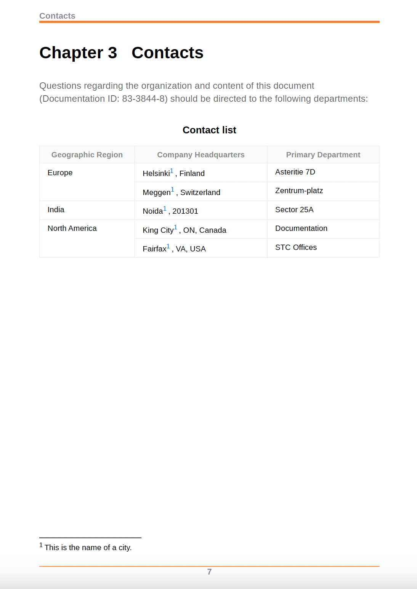

# 套用註腳樣式


註腳是放置在頁面底部的註記，註解或引用指定文字部分的參照。

每個註腳在頁面底部都會有一個註腳標籤，通常是數字或星號等符號。 在主要內容內，相同的註腳標籤會顯示為註腳呼叫，並以與上標相同的數字或符號表示。


## 變更註腳呼叫和標籤的樣式

您可以變更註腳呼叫和標籤的樣式，並管理它們在PDF輸出中的外觀。 這些樣式可協助您快速識別檔案中的註腳。


**範例1**：

使用給定的範例，在註腳呼叫和標籤之前和之後新增括弧：

* 使用以下專案中的內容屬性，新增前置詞「（」及後置詞「）」： `footnote-call` 樣式，這會在主題內容的註腳數字兩側加上括弧。
* 使用以下專案中的內容屬性，新增前置詞「（」及後置詞「）」： `footnote-marker` 樣式，這會在頁面底部的註腳數字周圍加上括弧。

```css
...
.fn::footnote-call { 
content: "(" counter(footnote, decimal) ")"; 
} 

.fn::footnote-marker { 
content: "(" counter(footnote, decimal) ")"; 
} 

...
```


*在註腳呼叫和註腳標籤周圍新增括弧。*

**範例2**：

您也可以以星號或小希臘字元（而非數字）標示註腳註呼叫和標籤。


```css
.fn::footnote-call {
 content: counter(footnote, asterisks);
}
.fn::footnote-marker {
 content: counter(footnote, asterisks) " ";
}
```

在輸出中，您可以檢視類似以下的內容：


*在註腳呼叫和標籤中新增星號。*

## 隱藏註腳呼叫

您也可以將樣式套用至具有特定屬性的註腳呼叫。 例如，使用下列樣式來隱藏具有ID的註腳：註腳呼叫會隱藏在主要內容中，但註腳標籤會出現在頁面底部。

```css
.fn[id]::footnote-call {
		display: none;
                        }
```

## 格式化註腳區域

註腳區域是放置所有註腳的位置，通常位於頁面底部。 您可以使用頁面配置或CSS樣式來格式化註腳區域。


### 頁面配置

您可以使用頁面配置圖中的頁面屬性，來設定PDF檔案中不同區段的註腳區域樣式。 例如，您可以指定章節中註腳區域的邊界和邊框間距屬性。 您也可以變更邊框側、樣式、顏色、寬度和半徑。

瞭解如何 [使用頁面配置的頁面屬性](./design-page-layout.md#page-props-page-layout).

### CSS樣式

您可以在PDF檔案中套用樣式並設定註腳區域格式。 例如，您可以變更邊框長度、樣式、顏色和寬度。

```css
	@page {
	  @footnote {
   		border-top-style: solid;
   		border-top-color: #FF0000;
   		border-top-width: 3px;
 		        }
	      }
```

## 重新開始註腳的編號

依預設，註腳會在檔案中連續編號。 不過，您可以使用版面配置或CSS樣式來重新開始註腳的編號。


### 頁面配置

您可以在版面配置中指定一個數字，以重新啟動PDF檔案中不同區段的註腳編號。 例如，從 **重新開始編號** 「頁面屬性」面板中的欄位，以重新啟動每個章節的註腳編號。

### CSS樣式

使用下列樣式重設PDF輸出每一頁的註腳編號：

```css
@page
{
counter-reset: footnote
}
```

因此，每個頁面的註腳都會從1重新開始。

## 顯示內嵌註腳

通常，每個註腳都會顯示為區塊或開始於新行。 但您也可以將它們放置線上上或彼此旁邊。

```css
.fn{
  	display: inline;
              }
```

## 套用樣式至註腳互動參照

您也可以互動參照註腳，並在PDF輸出中多次參照相同的註腳。 這有助於您在檔案中多次參照同一引文或詳細附註，而不會再次建立註腳。

例如，下列熒幕擷圖顯示相同註腳在PDF輸出中如何互動參照至所有城市。


*插入註腳的互動參照。*


您也可以使用CSS樣式來格式化註腳的互動參照。 例如，您可以變更互動參照的背景顏色。

```css
    .xref-fn{
	background-color: red;
	}
```


