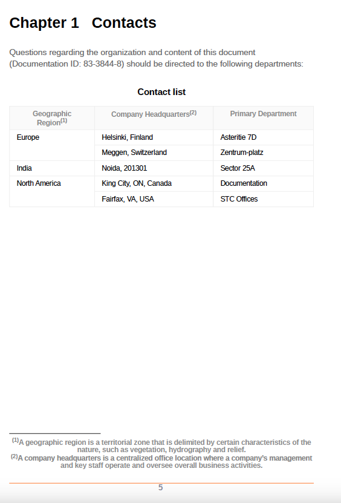

# 在註腳中使用自訂樣式

註腳是放置在頁面底部的註記，會在指定文字部分的參照上加上註解或引號。

您可以設定主題內容中出現的註腳呼叫中的數字樣式，以及頁面底部的註腳標籤。 例如，您可以在數字周圍加上括弧，或變更其顏色。 這些樣式可協助您輕鬆識別檔案中的註腳。

```css
...
.footnote::footnote-call { 
content: "(" counter(footnote, decimal) ")"; 
} 

.footnote::footnote-marker { 
content: "(" counter(footnote, decimal) ")"; 
} 

...
```

在指定的範例中，在註腳呼叫和標籤之前和之後新增括弧：

* 在「 」中使用content屬性新增前置詞「（」和後置詞「）」。 `footnote-call` 樣式，在主題內容的註腳數字兩側加上括弧。
* 在「 」中使用content屬性新增前置詞「（」和後置詞「）」。 `footnote-marker` 樣式會在頁面底部的註腳數字兩側加上括弧。


