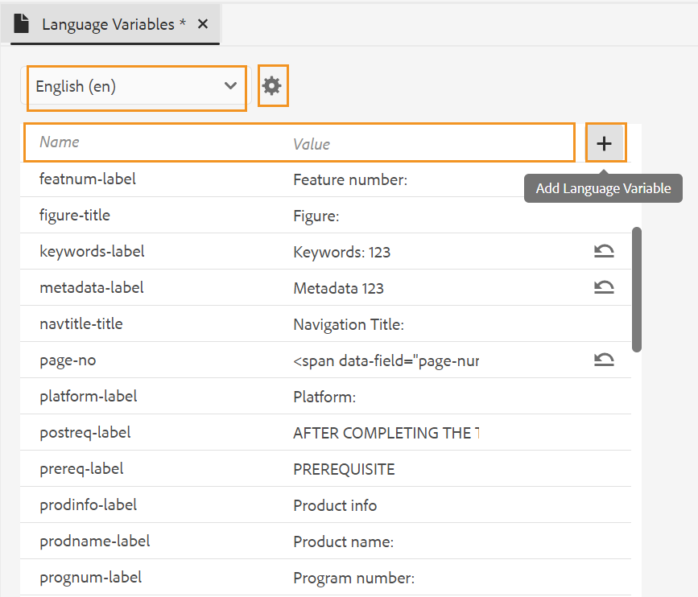

# 支援語言變數

AEM Guides提供使用語言變數的功能。 您可以使用語言變數來定義PDF輸出中的當地語系化字串，或將輸出範本中的任何靜態文字當地語系化。 您可以使用CSS樣式將來自CSS的字串當地語系化。

## 在PDF輸出中使用語言變數

您可以使用語言變數來定義PDF輸出中現成可用標籤（例如「注意」、「警告」和「警告」或靜態文字）的本地化版本。 所有語言的變數名稱都相同，但各種語言的值可能不同。 您可以更新一或多種語言中這些變數的值，然後本地化值會自動在PDF輸出中選取。

例如，您可以使用下列方法來呈現標籤 `Note` 在PDF輸出中：

- 英文：備註

- 法文：雷馬克

- 德文：欣威文


*英文、法文和德文的範例附註。*

>[!NOTE]
>
> 如果任何變數的值未以特定語言定義，則AEM Guides會從UI （應用程式的使用者介面）的語言中挑選字串作為遞補機制。
>
> 如果您尚未以UI的語言定義值，則會尋找英文(`en_us`)，否則會挑選英文(`en`)值，並在PDF輸出中顯示相同的值。

## 語言變數的型別

AEM Guides支援兩種型別的變數：應用程式和使用者變數。

### 應用程式變數

AEM Guides提供一組預先定義或現成可用的應用程式變數。 您可以使用這些預先定義的變數來新增AEM Guides專屬檔案的相關資訊。 例如， `chapter-number` 變數，若包含在頁面中，會顯示頁面所屬的章節編號。 此 `author-label` 變數會顯示檔案作者的名稱。

>[!NOTE]
>
> 您可以覆寫應用程式變數的值。


### 使用者變數

您也可以建立新的語言變數。 例如，您可以為檔案的發行者標籤建立使用者變數Publisher。

>[!NOTE]
>
>  您應該要有管理許可權來建立使用者變數以及編輯應用程式變數。



*新增並檢視所選語言的語言變數。*

## 新增語言變數

1. 在Web編輯器中，移至「輸出」標籤。
1. 選取 **語言變數**  在左側面板中。
1. 選取 **編輯** 以開啟 **語言變數** 視窗。 以選取的語言呈現的應用程式和使用者變數會依字母順序列出。 值會根據選取的語言顯示。 例如，如果您選取法文，則「提示」會顯示為「Conseil」。
1. 從 **語言** 在下拉式清單中，選取您要編輯變數的語言。

   >[!NOTE]
   >
   > 如果您沒有檢視所需的語言，請從以下連結啟用所需的語言： **語言變數設定**. 選取設定   以開啟 **語言變數設定** 對話方塊。

1. 在中輸入變數名稱 **名稱** 欄及其值 **值** 欄。

   >[!NOTE]
   >
   >您可以使用任何HTML內容作為變數值，以特定格式顯示變數值。 例如，您可以新增 `<b>` 標籤至變數值，以粗體顯示Publisher。

1. 選取 **新增語言變數**  將新的語言變數新增至選取的語言。 將變數新增至一種語言會自動將其新增至所有語言。 您無法建立與現有變數同名的變數。 顯示錯誤。

>[!NOTE]
>
> 如果您未選取 **新增語言變數**，不會建立變數並將其新增至清單

## 匯出和匯入語言變數

Experience Manager指南支援匯出和匯入以所選語言呈現的語言變數。 您可以輕鬆匯出所有語言變數以及定義的值。 這包括應用程式和使用者變數。 使用匯出的檔案在值中進行所需的變更，或將其當地語系化成其他語言。

您也可以匯入包含語言變數的XML檔案。 Experience Manager指南只會匯入已定義的語言變數，包括應用程式和使用者變數。 它不會匯入任何尚未定義的變數。

### 匯出語言變數

若要匯出某個語言的語言變數，請從下拉式選單中選取該語言，然後選取「 」 **匯出** .
它會以格式建立XML檔案 `language_variable_<ln>` 位置 `<ln>` 是選取語言的程式碼。 例如， `language_variable_en.xml` 英文版和 `language_variable_fr.xml` 法文版。

>[!NOTE]
> 
>如果語言變數中有任何未儲存的變更，您就無法匯出。 儲存變更以檢視已啟用的 **匯出**  圖示.

### 匯入語言變數

若要匯入語言變數：

1. 從下拉式清單中選取語言，然後選取 **匯入** 。
2. 瀏覽並選取包含語言變數的XML。 例如，language_variable_en.xml。
您可以匯入下列格式的XML檔案：

```
<?xml version="1.0" encoding="UTF-8"?>
<variables>    
<variable id="note-important">Important: </variable>    
<variable id="note-caution">Avertir: </variable>    
<variable id="image-with-text">Text and image &lt;img src=&quot;/content/dam/assets/images/image_with_text.png&quot; /&gt; </variable> 
</variables> 
```

匯入檔案後，系統就會匯入具有相同ID的變數。 所選取語言中的變數值會以XML檔案中的變數值更新。  畫面上會顯示已更新變數數目的相關訊息。

>[!NOTE]
> 
><ul><li>如果檔案不是XML檔案，或如果檔案包含不正確的格式，且未與語言變數對應，您會檢視錯誤，指出XML檔案有問題。 
&gt;<li>如果檔案未包含具有相同ID的變數，您會檢視警告，指出匯入的檔案中找不到相符的語言變數。

### 語言變數的選項

將滑鼠指標暫留在變數上以檢視 **選項** 功能表。


*使用&#x200B;**選項**功能表以刪除、預覽或複製語言變數。*

您可以預覽應用程式和使用者變數。 若要檢視變數值在輸出中的顯示方式，請選取 **預覽** 從 **選項** 選單中所選變數。
您也可以選擇 **刪除** 或 **複製** 使用者變數。 從一種語言刪除變數會自動從所有語言刪除它。

### 編輯或還原應用程式變數

您也可以編輯應用程式變數的值。 稍後，您可以將應用程式變數回覆成原始值。 **還原變數**   會針對值已變更的應用程式變數顯示。

## 在輸出範本中使用語言變數

您應在當地語系化檔案中新增語言變數。 您可以在出現於本地化檔案中不同頁面的版面配置中插入這些語言變數。 例如，您可以為新增語言變數 `author-name` 會顯示在頁面配置的頁首區域（或任何其他部分，如頁尾或內文）中。


*在針對法文產生的PDF輸出中本地化的作者和品牌名稱。*

若要插入語言變數，例如 `copyright-label` 在標題區域中，執行下列步驟：

1. 開啟編輯所需的版面配置。

   >[!NOTE]
   >
   > 檢視 [自訂頁面配置](../native-pdf/components-pdf-template.md#customize-a-page-layout-customize-page-layout) 區段，用於開啟頁面版面以進行自訂或編輯。

1. 選取標頭，將其設為使用中以插入變數。
1. 選取 **插入變數**   （在工具列中）。
1. 在 **插入變數** 快顯視窗，選取要插入的語言變數名稱，然後按一下 **插入** 以將其插入頁首區域。

   >[!NOTE]
   >
   > 您也可以在文字方塊中輸入搜尋字串。 包含指定字串的變數名稱會經過篩選，並顯示在清單中。
   > 選取的語言變數會插入頁首區域中。


*此 `copyright-label` 在標題區域中新增。*

### 將內容樣式套用至語言變數

除了您指派給語言變數的值之外，您也可以使用HTML標籤，以特定格式顯示變數值。 例如，您可以顯示 `publisher-label` 粗體。

- 您也可以使用下列專案來格式化值的樣式 <span> 標籤之間。 例如，使用page-number語言變數，您可以用英文以羅馬數字格式顯示頁碼，並指定其他語言的格式。

  英文的值：
  `<span data-field="page-number" data-format="upper-roman">1</span>`

  泰米爾文的值：
  `<span data-field="page-number" data-format="tamil">1</span>`

同樣地，您可以新增語言變數，並格式化列在頁面配置圖插入欄位功能中的其他欄位。 如需新增欄位的詳細資訊，請檢視 [新增欄位和中繼資料](../native-pdf/design-page-layout.md#add-fields-metadata).

- 您也可以在值中新增本地化的影像。 例如，您可以使用章節編號語言新增影像圖示，並在PDF輸出中取得圖示的本地化影像。

  如果是英文，影像的變數值可能如下 ``，而且對於德文中的相同變數，它可以 ``. 因此，它會根據語言挑選影像。

## 使用CSS樣式本地化字串

使用CSS樣式，您也可以本地化Autonumber中使用的字串，例如Chapter、Section、Figure和Table。 由於這些字串來自CSS檔案，因此您無法使用語言變數將其當地語系化。 若要將這些字串當地語系化，您可以針對您想要當地語系化的每種語言建立CSS樣式。
例如，您可以使用以下CSS以各種語言顯示章節首碼和對應的數字格式。
例如，您可以使用以下CSS將章節以德文顯示為Hoofdstuk，將章節編號以小數格式顯示。 如果是日文，您可以使用日文數字格式，在目錄中顯示章節編號。

```
// for English
h1:before {
  counter-increment: h11;
  content: "Chapter " counter(h11, decimal)".";
}

// for German
:root:lang(de) h1:before {
  content: "Hoofdstuk " counter(h11, decimal)".";
}

// for Japanese
:root:lang(ja) h1:before {
  content: "章 " counter(h11, japanese-formal)".";
}
```

下列熒幕擷取畫面顯示德文和日文PDF輸出的當地語系化字串。


### 格式化字首

使用CSS樣式，您也可以格式化字首。 例如，您可以將標籤格式化 `Note` 以紅色顯示在各種語言的PDF輸出中。

```
.note .prefix-content 
{
color: red;
} 
```


