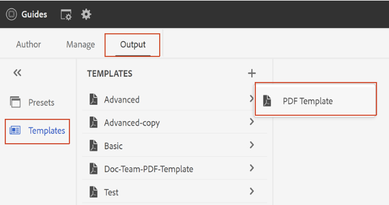
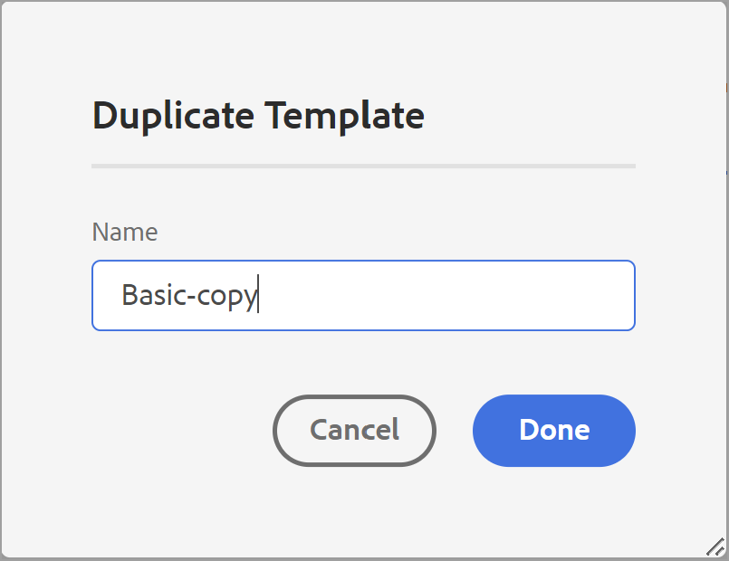

# PDF範本 {#PDF-template}

使用範本可確保內容版面配置與結構的一致性。 由於範本是預先定義的，您可以避免重新處理每個新專案或更新中出現的格式問題。 範本可讓您設計頁面配置、樣式內容，以及套用各種設定來自訂PDF。

## 工廠和自訂PDF範本

有些工廠範本是現成可用的範例，開發人員可將其當作基礎範本，根據組織需求建立自訂範本。

## 建立新的PDF範本 {#create-pdf-template}

您可以使用樣式表來建立具有特定頁面配置的自訂PDF範本，並定義頁面配置元件（例如TOC、索引、字彙表）或DITA元件（例如標題、段落、清單）的格式。

若要建立新的PDF範本，請執行下列步驟：
1. 在網頁編輯器中，前往 **輸出** 標籤。
1. 選取 **範本**  在左側面板中。

1.在**樣版**視窗中，選取**樣版**旁的**+**圖示，然後選擇**PDF樣版**。
1.在**新增PDF樣版**對話方塊中，選取要作為建立自訂樣版基礎的工廠樣版。 您也可以使用搜尋方塊來搜尋範本。
1.指定樣版的標題。

>[!NOTE]
>
>  您也可以在建立和複製範本時預覽範本的縮圖。 編輯或刪除縮圖，使用 [**屬性**](#properties-option) 在 **選項** 選單。

1. 按一下&#x200B;**建立**。

   新範本隨即建立並新增至 **範本** 面板。

## 複製PDF範本 {#duplicate-pdf-template}

如果要建立與現有範本具有相同頁面配置及格式的新範本，您可以建立副本。 複製範本後，您可以視需要進一步自訂其元件。

若要複製現有PDF範本，請遵循下列步驟：
1. 在網頁編輯器中，前往 **輸出** 標籤。
1. 選取 **範本**  在左側面板中。 如此將可開啟 **範本** 視窗。
1. 將游標停留在您要複製的範本上，然後選取 **...** *選項* 圖示並選擇 **複製** 從內容功能表。

   如此將可開啟 **複製PDF範本** 對話方塊。

   

   *選取要複製的範本、預覽縮圖，並更新中的標題&#x200B;**複製PDF範本**對話方塊。*

1. 指定範本的標題。

   此 **標題** 欄位會預先填入為與來源範本相同標題的副本。 如果具有相同標題的範本存在，您將會檢視錯誤訊息。

1. 若要指定偏好的標題，請移除預先填入的標題並指定標題。
1. 按一下 **複製**.

   系統隨即會建立重複範本，並新增至 **範本**.

## 範本上的其他作業

您也可以對範本執行下列操作 **選項** 功能表：

### 刪除

選取「刪除」選項，刪除選取的範本。 然後，在確認提示中選取「是」。
預設集會從 **範本**.

### 屬性{#properties-option}

選取此選項可檢視和編輯範本的屬性。 您可以預覽範本的現有縮圖。 您也可以編輯或刪除縮圖。 您也可以變更範本的標題和說明。

### 在資產UI中檢視

選取此選項，即可在「資產」UI中檢視範本。 開啟範本的根位置時，您可以檢視範本的所有資源。

建立自訂範本後，您可以從PDF輸出預設集的「頁面配置」中選擇它。
瞭解如何 [發佈PDF輸出](https://experienceleague.adobe.com/docs/experience-manager-guides-learn/tutorials/user-guide/output-gen/web-editor/native-pdf-web-editor.html?lang=en).

>[!NOTE]
>
>如果您的資料夾上設定了「資料夾設定檔」，則您將只會檢視在「資料夾設定檔」上設定的PDF範本。

根據您的設定，您的管理員可以設定範本：

 雲端服務 

如需設定全域和檔案夾層級設定檔的詳細資訊，請檢視 [設定範本](../cs-install-guide/conf-folder-level.md#id1889D0IL0Y4) 一節(適用於Cloud Service的安裝與設定指南)。

    

  內部部署軟體 

如需設定全域和檔案夾層級設定檔的詳細資訊，請檢視 [設定編寫範本](../install-guide/conf-folder-level.md#create-custom-authoring-template-id1917d0eg0hj) On-premise安裝和設定指南中的區段。

## 自訂PDF範本 {#customize-pdf-template}

您可以調整範本元件並使用樣式表套用樣式格式來自訂範本。

若要自訂PDF範本，請執行下列步驟：
1. 在網頁編輯器中，前往 **輸出** 標籤。
1. 展開左側邊欄並選取 **範本**.

   如此將可開啟 **範本** 面板。
1. 若要檢視範本的元件，請執行下列任一項作業：

   * 選取範本旁的>圖示，或按兩下範本名稱。
   * 將滑鼠指標暫留在任何範本上，並選取…… (**選項** 圖示)並選擇 **編輯** 從內容功能表。

     依預設，這會開啟 **設定** 範本編輯器中的面板。
   

   >[!NOTE]
   >
   >  您的管理員可以從以下路徑下載最新的範本並取代現有的範本：
   >
   > `/libs/fmdita/pdf`

   您可以自訂的各種範本元件分為以下幾節：
   * 頁面配置：典型的PDF包含不同的頁面，例如封面或標題頁面、目錄、章節、索引、引文等。 「頁面配置」區段可讓您設計構成PDF之不同頁面的外觀。 如需詳細資訊，請檢視 [頁面配置](../native-pdf/components-pdf-template.md#page-layouts).

     除了外觀之外，您還可以定義頁面元素（例如頁首、頁尾和頁面上的內容區域）的排列。 若要進一步瞭解自訂頁面的版面，請參閱 [建立和自訂頁面配置](components-pdf-template.md#create-customize-page-layout).

   * 樣式表：「樣式表」區段中的設定可讓您自訂頁面配置元件如目錄、索引、字彙表、引文等的外觀和風格。 此外，您也可以自訂DITA內容的樣式，例如標題、段落、清單等。 若要進一步瞭解如何使用樣式表，請參閱 [使用樣式表來自訂PDF](components-pdf-template.md#stylesheet-customization).
   * 資源：儲存自訂或設計PDF範本所需的資產檔案。 標誌、自訂字型、背景影像等資產會儲存在「資源」中。
您也可以使用存在於存放庫中任何其他位置的資源。 您不需要為每個範本建立重複資源，您可以將它們儲存在共用資料夾中，並在所有原生PDF範本中使用它們。

     若要進一步瞭解如何利用資源，請參閱 [使用資源](components-pdf-template.md#work-with-resources).
   * 設定：設定輸出設定，以使用範本產生PDF。 本節可讓您為PDF中的各種頁面、章節開始頁面、列印標籤、引文等定義範本對應。
您也可以排列它們在最終PDF輸出中的顯示順序。
如需套用設定的詳細資訊，請參閱 [進階PDF設定](components-pdf-template.md#advanced-pdf-settings).

1. 若要自訂範本元件，請連按兩下範本元件或選取其前的>圖示。

   例如，按兩下 *頁面配置* 或選取 *>* 之前圖示 *頁面配置* 以檢視可用的頁面配置。

   >[!NOTE]
   >
   >您也可以使用更新範本的縮圖和說明 [**屬性**](#properties-option) 在 **選項** 功能表。

1. 完成所需的變更後，選取 *全部儲存* (或 `Ctrl+S`)。
