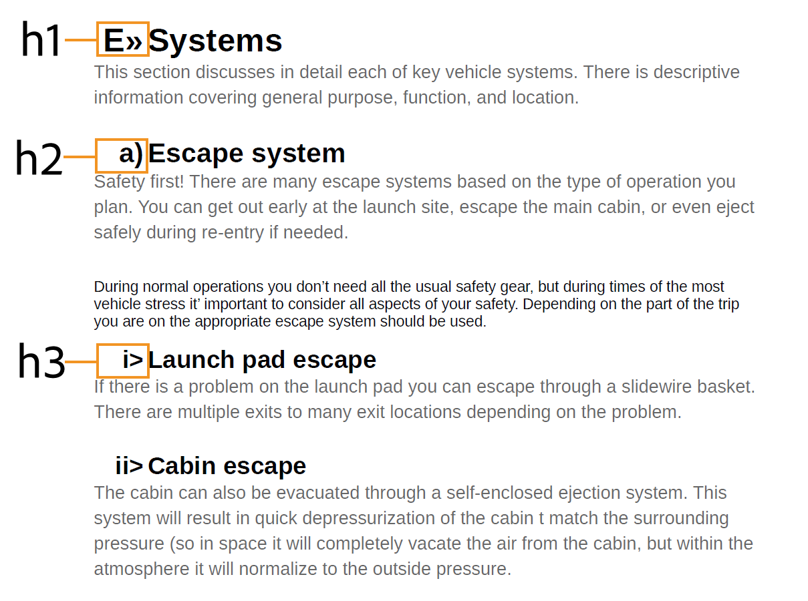
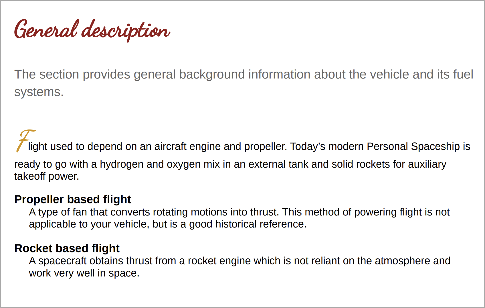
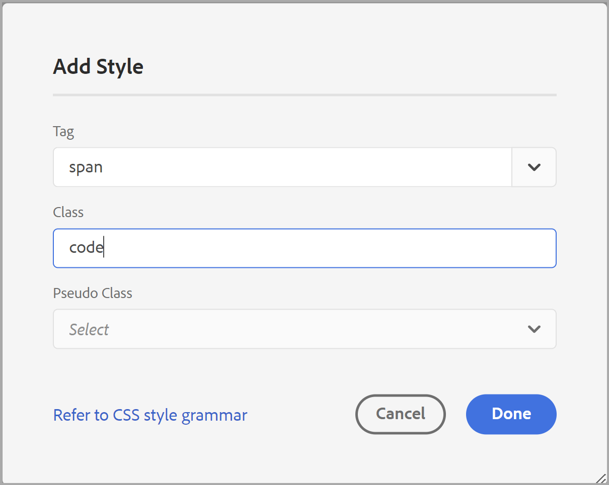
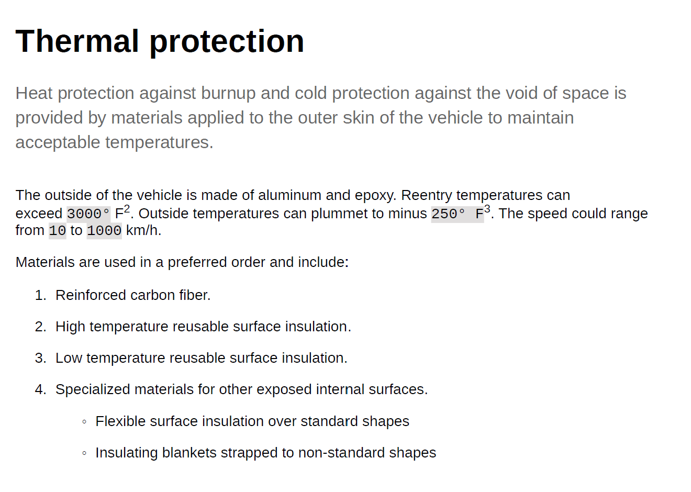

# 使用常見的內容樣式 {#work-with-common-styles}

樣式表包含PDF輸出中所用元素的樣式定義。 您可以選擇使用樣式表或建立新樣式表。 在大多數情況下，建立OOTB樣例樣式表的副本將幫助您快速開始。

樣式編輯器是WYSIWYG編輯器，會在使用者介面後面隱藏CSS程式碼的所有複雜項目。 使用樣式編輯器，您可以輕鬆且快速地自訂所選元素的樣式。 樣式會分類在下列標題下：

* 標題樣式
* 段落樣式
* 字元樣式
* 超連結樣式
* 影像樣式
* 清單樣式
* 表格樣式
* Div樣式
* 頁面樣式
* 其他樣式

使用結構化DITA內容時，預設樣式表中已就緒大部分DITA元素的樣式對應。 如果您使用標準DITA元素，則可以直接在樣式定義中進行變更，以變更其外觀和風格。 這些樣式定義可在「其他樣式」類別下使用。 如需詳細資訊，請參閱 [使用其他樣式](#other-styles) 更新。

以下各節將以示例形式介紹最常用的樣式設定。

>[!NOTE]
>
>在以下示例中，假定您正在使用產品附帶的示例樣式表。

## 使用標題樣式 {#heading-styles}

標題樣式會封裝內容中使用標題的所有基本樣式。 OOTB將提供主題/章節和附錄標題標題的6個基本標題樣式和標題樣式。 在結構化文檔中，H1表示主題或章節的標題，H2到H6用於主題/章節中的子主題或章節。 每當找到對應的標題時，標題的階層就會自動套用至您的內容。

>[!NOTE]
>
>您可以建立自己的自訂標題樣式，並可使用輸出類別在您的內容中使用這些樣式。 如需更多詳細資訊，請參閱 [使用頁面方向和檢視旋轉](design-page-layout.md#page-orientation-rotation) 範例。

### 建立自訂章節層級標題 {#create-chapter-level-heading}

在書（或書籤圖）中，您使用章節。 基本標題樣式的設計方式，可將其套用至章節層級標題，而不需自訂。 不過，如果您想要為內容建立專用標題，則必須建立這些標題。 例如，預設 `h1.chapter` 標題。 如果您希望章節標題以不同樣式顯示，則需要自訂 `h1.chapter` 樣式。 同樣地，您也可以在章節中建立子標題的自訂樣式。 例如，如果您想要為全部2建立自訂樣式nd 和3rd 在章節中建立級別標題，然後需要建立新樣式 `h2.chatper` 和 `h3.chatper`.

由於「原生PDF發佈」功能包含最常見樣式的基礎樣式定義，即使您不小心刪除了樣式，預設樣式也會套用在內容上。 例如，如果樣式表中沒有h2樣式的樣式定義，則「本機PDF發佈」功能將對h2內容應用一些基本樣式。

在此範例中，我們將建立第2層章節標題樣式：

1. 開啟所需的樣式表以進行編輯。
   >[!NOTE]
   >
   >請參閱 [自訂預先定義或新樣式](components-pdf-template.md#customize-style) 用於開啟樣式表以進行自定義或編輯的部分。

1. 在 **樣式** 清單，展開 **標題樣式**.
1. 按一下右鍵 **標題樣式** 樣式和選擇 **新樣式**.
1. 在 *添加樣式* 對話框，保留 **標籤** 名稱為 `h2` 輸入 `chapter` 在 **類別** 名稱欄位。
1. 按一下 **完成**.

新標題樣式已命名 `h2.chapter` 會建立，並新增至標題樣式清單下。

建立樣式後，可以使用樣式編輯器自定義樣式的必需屬性。

### 建立自動編號標題 {#auto-number-heading}

最常用的輸出樣式之一是自動編號標題。 這些標題代表章節編號、主題和子主題編號。 自動編號標題與為主題內的項目清單分配自動編號的清單樣式不同。

在此範例中，我們將自訂從第1層到第3層的標題，以使用不同格式的自動數字。

1. 開啟所需的樣式表以進行編輯。

   >[!NOTE]
   >
   >請參閱 [自訂預先定義或新樣式](components-pdf-template.md#customize-style) 用於開啟樣式表以進行自定義或編輯的部分。

1. 在 **樣式** 清單，展開 **標題樣式**.

1. 選取 **h1** 樣式。
h1樣式的屬性連同其預覽一起顯示在「屬性」面板中。

   >[!NOTE]
   >
   >「預覽」面板可讓您即時檢視套用至任何元素的任何樣式更新。

1. 選取 **自動編號** 屬性。

   自動編號清單上可應用的樣式顯示在Autonumber屬性下。

1. 設定下列屬性：
   * **樣式**:從範圍廣泛的特定於區域設定的或通用編號樣式中選擇。 您可以選擇阿拉伯文 — 印地語、梵文、喬治亞文、小數、下字母等樣式。 對於當前示例，請選擇 `upper-alpha`.

   * **格式**:預設格式設為 `<x>`，其中 `x` 值將替換為您在「樣式」屬性中選擇的編號樣式。 例如，若您已選取 `decimal` (1)樣式，則 `x` 每個例項的自動遞增 `h1` 樣式和2、3等。 您也可以在欄位中新增自訂文字，以格式化標題樣式。 例如，如果您想要所有h1標題的首碼為 `Chapter`，則您需要將此欄位設為 `Chapter <x>`.

   * **插入字元**:如果要在「格式」中添加任何特殊字元，請按一下「插入字元」() 圖示. 選擇要以樣式格式添加的字元，然後按一下「插入」。 從「選擇類別」下拉清單中選擇不同類型的特殊字元。 例如，從標點符號類別中選取右指雙角引號。

      

   * **起始編號**:如果希望編號從特定編號開始，請提供該值。 例如，請保留預設值1。

   * **縮進**:如果要縮進標題，則需要設定「縮進」值。 在我們的範例中，將其設為0 px。

      >[!NOTE]
      >
      >您可以輸入px（像素）、pt（點）、rem、em、%（百分比）或（英吋）單位的值。

   * **前置詞寬度**:這是自動編號格式佔據的區域。 它會自動設定為可輕鬆容納所選樣式格式的大小。 如果要增加大小，則可替換預設值。

      手動設定此值時，請嘗試變更會影響寬度的其他屬性。 例如，變更字型大小、字型為首碼（章節）或尾碼(:)的格式，請在 *起始編號* 屬性，以及各種字型屬性，以得到最佳大小。

      例如，請保留預設值。

   * **間距**:指定水準和垂直間距。 例如，請保留預設值。

      有了上述自訂項目，樣式便可自訂，如下所示：

      

   * **將格式套用至**:自動編號類別下的屬性將幫助您定義編號樣式。 要對標題格式的編號樣式或內容應用更多自定義，可在此欄位中選擇「編號」或「段落」。 如果選擇「編號」，則對「字型」、「邊框」、「佈局」和其他類別所做的任何更改將僅應用於標題中的編號樣式。 但是，如果選擇「段落」，則更改將應用於標題內容，而不是編號樣式。

   使用以下設定生成如下螢幕截圖中所示的輸出：

   |**標題樣式**|**屬性**|**值**|**其他注釋**| | :- | :- | :- | :- | |h1|樣式|小數|這些屬性位於「自動編號」類別下 | ||格式|`Capter <x>:`|| ||前置詞寬度|160 px|| ||「字型」>「文本對齊」|「左」|確保將「應用格式」設定為「編號」| |h2|樣式|小數|這些屬性位於「自動編號」類別下 | ||格式|`Section <x>:`|| ||前置詞寬度|125 px|| ||「字型」>「文本對齊」|「左」|確保將「應用格式」設定為「編號」| |h3|樣式|小數|這些屬性位於「自動編號」類別下 | ||插入級別|2|| ||格式|`Section <2>.<x>:`|| ||前置詞寬度|125 px|| ||「字型」>「文本對齊」|「左」|確保將「應用格式」設定為「編號」| ||

   

## 使用段落樣式 {#paragraph-style}

可以建立段落樣式，以對整個段落應用特殊格式。 但是，使用偽類，可以只將樣式應用到文本的特定部分。 在以下示例中，我們將建立段落樣式以使用下拉帽樣式。

### 建立下拉帽樣式 {#drop-cap-style}

在雜誌和文學檔案中使用下拉蓋（或掉下的資本）樣式，其中段落或部分的第一字元被賦予一些特殊的樣式。 使用「原生PDF發佈」功能，可達到相同效果。

在以下範例中，我們將建立下拉式大寫樣式：

1. 開啟所需的樣式表以進行編輯。

   >[!NOTE]
   請參閱 [自訂預先定義或新樣式](components-pdf-template.md#customize-style) 用於開啟樣式表以進行自定義或編輯的部分。

1. 在 **樣式** 清單，展開 **段落樣式**.

1. 以滑鼠右鍵按一下 **段落樣式** 選擇 **新樣式**.

1. 在 *添加樣式* 對話框，保留 **標籤** 名稱為p，在 **偽** **類別** 欄位，選擇 `::first-letter`.

1. 按一下 **完成**.

   新段落樣式已命名 `::first-letter`  是在 **段落樣式** 清單。

1. 選擇 `::first-letter` 在p樣式下，並設定下列屬性：

   * **字型**:為段落中的第一個字母設定所要的字型。 例如，將「字型系列」設定為粗體，將字型寬度設定為500，將字型大小設定為30品脫，然後選擇字型顏色。

   * **版面**:設定下拉帽樣式周圍文本的垂直對齊方式。 例如，我們將「垂直對齊」(Vertical Alignment)設定為「底部」(Bottom)。

作為 `p` 標籤已與 `
` 元素，您不需要使用outputclass屬性明確新增此樣式。 內容中的任何位置a `
` 元素時，會自動套用下拉式大頭樣式。 在以下螢幕擷取中，章節標題、簡短說明和定義清單元素尚未使用下拉式字元樣式格式化。 只有段落樣式採用下拉式樣式：

## 使用字元樣式 {#char-style}

使用字元樣式，您可以建立內容中字元或字詞格式的樣式。 例如，您可以為內嵌代碼或檔案名建立字元樣式，也可以為所選內容建立使用多種樣式格式的樣式。

### 建立內嵌字元樣式 {#inline-char-style}

在段落中設定內嵌字元或單詞的格式是非常常見的樣式。 建立內嵌樣式的過程涉及兩個任務：首先，在樣式表中建立新樣式，然後使用 `outputclass` 屬性。

在以下範例中，我們將建立內嵌字元樣式：

1. 開啟所需的樣式表以進行編輯。

   >[!NOTE]
   請參閱 [自訂預先定義或新樣式](components-pdf-template.md#customize-style) 用於開啟樣式表以進行自定義或編輯的部分。

1. 在 **樣式** 清單，展開 **字元樣式**.

1. 以滑鼠右鍵按一下 **字元樣式** 選擇 **新樣式**.

1. 在「新增樣式」對話方塊中，保留 **標籤** 名稱為span ，請輸入 `BoldItalic` 在 **類別** 名稱欄位。

   

1. 按一下 **完成**.

   將建立名為代碼的新字元樣式，並在「字元樣式」清單下添加。

1. 選擇 `span.BoldItalic` 從 **字元樣式** ，並設定下列屬性：

   * **字型**:可從本區段自訂所有字型相關屬性。 依預設，產品中會包含一些字型。 您可以為字元樣式選擇所需的字型。 例如，將字型系列設定為 *襯線，* 選取 *粗體* 和 *斜體* 在「字型樣式」屬性中。 您也可以自訂其他字型屬性，例如字型粗細（如粗體、淺色）、文字裝飾（如底線、上線）、字型大小、字型顏色、文字對齊方式等。

      >[!NOTE]
      您也可以將字型新增至範本，這些字型會儲存在範本的「資源」區段中。 如需新增字型和使用資源的詳細資訊，請參閱 [使用資源](components-pdf-template.md#work-with-resources).

   * **版面**:您可以設定與版面相關的屬性，例如「高度和寬度」、「邊距」、「邊框間距」、「對齊方式」等。

   * **背景**:「背景」屬性可讓您設定特定樣式的背景顏色的格式。 您可以定義任何樣式的背景顏色或影像。

建立內嵌字元樣式後，您需要在內容中套用該樣式。 要應用內嵌代碼樣式，請轉至源視圖並添加 `outputclass` 屬性中的任何值：

`outputclass="BoldItalic"`

下列範例顯示在執行中文字的不同位置套用的粗體斜體格式：

## 自訂清單樣式 {#custom-list-style}

清單樣式包含有序和無序清單的預設樣式設定。 您可以輕鬆自訂這些清單樣式，以符合檔案需求。

在以下範例中，我們將自訂編號或排序的清單樣式：

1. 開啟所需的樣式表以進行編輯。

   >[!NOTE]
   請參閱 [自訂預先定義或新樣式](components-pdf-template.md#customize-style) 用於開啟樣式表以進行自定義或編輯的部分。

1. 在 **樣式** 清單，展開 **清單樣式**.

1. 選取 **ol** 樣式。

   顏色樣式的屬性連同其預覽一起顯示在「屬性」面板中。

   

1. 選取 **進階格式** 選項。

   將顯示確認消息。

1. 按一下 **是** 在 *確認* 要開啟的訊息 **進階格式** 屬性。

   預設可使用下列屬性：

   * **層級**:依預設，有6個層級的編號清單。 您在此下拉式清單中選取的層級，控制所選層級和所有後續層級的樣式變更。 例如，如果選擇第4級，則您應用的所有樣式更改都設定在第4、5和6級。

   * **清單樣式類型**:您可以選擇多種清單編號樣式。 該清單包含用於建立編號清單的特定於語言環境的通用編號樣式。 清單樣式的某些類型是阿拉伯文、柬埔寨文、天成文、衣索匹亞文、朝鮮文、希伯來文、日文、韓文、簡單中文、烏爾都文等。

   此外，您還可以使用下列進階格式屬性：

   * **數字格式**:預設格式設為 `<x>`，其中 `x` 值將替換為您在「清單樣式類型」屬性中選擇的編號樣式。 例如，若您已選取 `decimal` (1)樣式，則 `x` 清單元素的每個例項自動遞增，如2、3等。 您也可以在欄位中新增自訂文字，以格式化清單樣式。 例如，如果您希望所有第一層清單樣式都有尾碼「`)`&quot;，則需要將第一級清單樣式的此欄位設定為&quot;`<x>)`」。

   * **插入字元**:如果要在數字格式中添加任何特殊字元，請按一下插入字元() 圖示. 選擇要以樣式格式添加的字元，然後按一下「插入」。 從「選擇類別」下拉清單中選擇不同類型的特殊字元。

   * **插入級別**:您可以使用數字格式加入任何先前層級的數字。 例如，如果要將第5級的數字格式納入第6級數字格式，則在「插入級別」下拉清單中選擇5。 請注意，「插入層級」下拉式清單只會顯示先前層級的數量，而不會顯示下列層級的數量。 例如，當您處於第3級時，「插入級別」清單將只顯示第1級和第2級。

      

      您也可以變更「數字格式」以視需要呈現清單值。 例如，當您對第3層使用嵌套的編號樣式時，可以將其格式化為「`<2>.<x>))`」。 這會顯示清單編號2，後跟句號，後跟清單編號3，然後兩個括弧，如 `2.3))`.

   * **縮進**:如果要縮進清單，則需要設定「縮進」值。 可在「預覽」面板中查看並調整縮進中的任何更改。

      >[!NOTE]
      您可以輸入px（像素）、pt（點）、rem、em、%（百分比）或（英吋）單位的值。

   * **前置詞寬度**:這是數字格式佔據的區域。 會自動設定為可輕鬆容納所選格式的大小。 如果要增加大小，則可替換預設值。

      手動設定此值時，請嘗試變更會影響寬度的其他屬性。 例如，更改字型大小、帶前置詞或尾碼的格式以及各種字型屬性，以得到最佳大小。

   * **間距**:在清單編號格式和內容之間指定水準間距。 垂直間距控制兩個清單項目之間的間隙。

      以下螢幕截圖顯示每個級別的自定義順序清單：

      

## 使用表格樣式 {#table-styles}

使用樣式表，您可以設計 *n* 表樣式數。 使用表格樣式，您可以設計整個表格、特定列或欄的方式。 透過儲存格層級樣式的控制項，您可以建立非常顯示的表格樣式。

在以下示例中，我們將了解如何建立表樣式以及您可以自定義的各種表樣式選項：

1. 開啟所需的樣式表以進行編輯。

   >[!NOTE]
   請參閱 [自訂預先定義或新樣式](components-pdf-template.md#customize-style) 用於開啟樣式表以進行自定義或編輯的部分。

1. 在 **樣式** 清單，按一下右鍵 **表格樣式** 選擇 **新樣式**.

1. 在 *添加樣式* 對話框，保留 **標籤** 名稱為 `table` 輸入 `double-border` 在 **類別** 名稱欄位。

1. 按一下 **完成**.

   名為的新表樣式 `table.double-border` 會建立，並新增至表格樣式清單下。

1. 選擇 `table.double-border` 從 **表格樣式** ，並設定下列屬性：

   * **將格式套用至**:您可以選擇將樣式格式應用到整個表、奇數/偶數行或列，或第一/最後一行或列。

      >[!NOTE]
      下列設定可在 **一般** 區段 **將格式套用至** 設為 **整表**.

   * **文字繞排**:選取如何繞排表格文字。 當表格位於另一個區塊層級元素內，且表格必須與區塊元素中的其他內容一併呈現時，這個功能會很實用。 包裝選項為 *lef* 或 *右* 對齊，或 *無*.

   * **邊框折疊**:選擇表邊框的外觀。 如果選擇折疊，則在表單元格之間只繪製一條邊框線。 不過，對於個別樣式，邊框會在每個儲存格周圍顯示，並附加邊框間距。

      

   * **邊框間距**:此設定僅在「邊框折疊」設定為「分隔」時可用。 使用此設定，可以在單元格邊界之間指定垂直和水準間距。

      

      >[!NOTE]
      下列設定可在 **儲存格** 區段 **將格式套用至** 設為 **整表**.

   * **邊框間距**:在表格儲存格之間指定邊框間距。 您可以為上、下、左、右邊指定不同的邊框間距值。

   * **垂直對齊**:指定儲存格內容的垂直對齊方式。 可用選項包括：上、中、下。

   * **邊框側、樣式、顏色、寬度、半徑：** 指定與邊框相關的屬性。 您可以選擇只在特定邊（如「左」或「右」）上有邊界。 「邊框樣式」(Border Style)列出可用的邊框樣式，如實線、虛線、雙線等。 使用調色盤指定邊框顏色。 您可以以px、pt、rem、em、%和單位指定邊框寬度。 「半徑」(Radius)定義曲線以製作圓角。

   在本主題的其他範例中，會說明字型、邊框、版面、分頁和背景下的其他屬性。 視您在 **將格式套用至** 屬性中，您可以將這些值套用至整個表格或選取的列或欄。

   以下是以不同方式格式化的不同行的示例表格預覽：

   

## 使用其他樣式 {#other-styles}

如果您使用結構化(DITA)內容，則您會注意到幾乎所有DITA元素在預設樣式表中都有樣式對應。 例如， `<shortdesc>` 元素的樣式定義於 **其他樣式** > **.shortdesc** 樣式定義。 您可以輕鬆自訂其中的任何樣式，這些樣式會自動套用至從結構化內容產生的PDF輸出。 這表示與其他自訂樣式不同，您不需要新增 `outputclass` 屬性。

如果要為預設不可用的任何元素建立樣式定義，或者您有自定義元素，則可以在樣式表中輕鬆建立它。 您必須考慮的唯一一點是建立與結構元素名稱同名的樣式。

在以下範例中，我們將建立新視窗的標題(`wintitle`)樣式：

1. 開啟所需的樣式表以進行編輯。

   >[!NOTE]
   請參閱 [自訂預先定義或新樣式](components-pdf-template.md#customize-style) 用於開啟樣式表以進行自定義或編輯的部分。

1. 在 **樣式** 清單，展開 **其他樣式**.

1. 以滑鼠右鍵按一下 **其他樣式** 選擇 **新樣式**.

1. 在 *添加樣式* 對話框，保留 **標籤** 名稱為 *空白* 輸入 `wintitle` 在 **類別** 名稱欄位。

   As `wintitle` 是已識別的DITA元素名稱，其樣式定義會自動對應至 `<wintitle>` 元素。

1. 按一下 **完成**.

   新樣式已命名 `.wintitle` 是在 **其他樣式** 清單。

1. 從 **其他樣式** ，並視需要設定屬性。

以下螢幕截圖顯示要應用到「Primary Control」文本的wintitle樣式。

