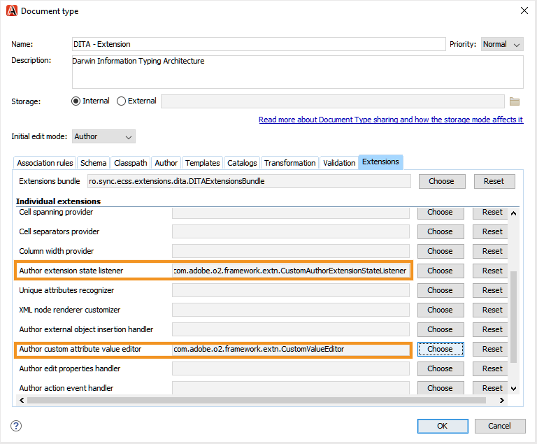

# Adobe Experience Manager指南的Oxon Plugin {#id1645H6010Q5}

Adobe Experience Manager指南的Oxon Plugin(後來又稱為指南中的Oxon Plugin for AEM指南)可讓您將Oxon XML作者與Adobe Experience Manager \(AEM\)存放庫連結，以製作和管理內容。 您可以使用外掛程式來瀏覽、搜尋和開啟檔案；簽入檔案；上傳資料夾和檔案至AEM存放庫。 案頭應用程式中的「AEM參考線」面板可讓您將所需的資料夾\(從AEM存放庫\)標示至最喜愛的資料夾清單，以便快速存取。 此外，您可以在AEM Web介面中安裝套件，並直接從AEM Web介面開啟Oxon XML Author中的DITA檔案。

## 下載並安裝 {#id1826M0L0PUI}

AEM指南的Oxon外掛程式可透過您的Adobe軟體發佈入口網站取得。 在「Experience Manager」標籤中搜尋「氧氣」，然後從您的 [Adobe軟體發佈入口網站](https://experience.adobe.com/#/downloads/content/software-distribution/en/general.html).

**注意：** 查看《Adobe Experience Manager指南》的發行說明中的Oxon Connector版本相容性。

安裝程式完成後，請在安裝Oxon XML Author的本地電腦上安裝。 在開始安裝過程之前，您必須確保系統符合技術要求，才能安裝「AEM適用的Oxon插件指南」。

### 技術要求{ .section}

- Oxon XML作者版本24.1

- Adobe Experience Manager指南3.4版或更新版本

- Adobe Experience Manager 6.5版（含Service Pack 10、11、12和13）

- 受Oxon XML Author 24.1版支援的作業系統

- Java開發套件
   - OracleSE 8 JRE 1.8

### 在Windows { .section}上安裝插件

**重要:**

如果您的系統上已安裝舊版外掛程式，請務必先解除安裝，再開始安裝程式。 請參閱 **卸載軟體包** 區段 [如何使用套件](https://helpx.adobe.com/tw/experience-manager/6-4/sites/administering/using/package-manager.html) 卸載說明文章。

在安裝Oxon XML Author的系統上執行以下步驟：

1. 啟動安裝程式的 `.exe` 檔案。

   出現安裝嚮導的歡迎螢幕。

2. 按一下 **下一個** 並瀏覽到Oxon XML Author的.exe檔案可用的位置。

3. 選取檔案，然後按一下 **開啟**.

   選定檔案的位置將添加到安裝嚮導中。

4. 按一下&#x200B;**下一步**。

5. 按一下 **安裝**.

6. 按一下 **完成** 關閉安裝嚮導。
7. 啟動Oxo XML作者。

   「AEM參考線」面板顯示在「Oxon XML作者」中。

   

   **注意:**

   如果您沒有看到「AEM指南」面板，請參閱疑難排解一節中的解決方法 — [缺少AEM參考線面板](#id192BH200ZAX).


### 在Mac { .section}上安裝外掛程式

**重要:**

如果您的系統上已安裝舊版外掛程式，請務必先解除安裝，再開始安裝程式。 請參閱 **卸載軟體包** 區段 [如何使用套件](https://helpx.adobe.com/tw/experience-manager/6-4/sites/administering/using/package-manager.html) 文章解除安裝說明。

在安裝Oxon XML Author的系統上執行以下步驟：

1. 在您的系統上找到外掛程式的.dmg檔案。

2. 連按兩下.dmg檔案以開啟檔案內容。

   .dmg檔案包含aem-connector-x.x資料夾和aem-connector-x.x-setup檔案。

   **注意:**

   檔案名稱中的x.x是外掛程式的版本號。

3. 將aem-connector-x.x資料夾複製到Oxon XML Author的外掛程式資料夾中。
4. 連按兩下aem-connector-x.x-setup檔案以啟動安裝程式。

5. 啟動Oxo XML作者。

   「AEM參考線」面板顯示在「Oxon XML作者」中。

   

   **注意:**

   如果您沒有看到「AEM指南」面板，請參閱疑難排解一節中的解決方法 — [缺少AEM參考線面板](#id192BH200ZAX).


### 安裝套件，以從AEM網頁介面啟用檔案編輯功能 {#id182CE0Q0TY4 .section}

作為作者，您可以直接從AEM Web介面開啟和編輯Oxion XML作者中的DITA地圖或主題。 若要在AEM網頁介面中啟用此功能，您的AEM管理員需要在AEM製作執行個體中安裝套件。

身為AEM管理員，請執行下列步驟以安裝套件：

1. 從您的IT團隊取得套件的.zip檔案。
2. 登入您的AEM例項 *\（管理員）* 並導覽至CRX封裝管理器。 存取套件管理器的預設URL為

   ```
   http://<server name>:<port>/crx/packmgr/index.jsp
   ```

   套件管理器會管理您本機AEM安裝上的套件。 有關使用包管理器的詳細資訊，請參閱 [如何使用套件](https://docs.adobe.com/docs/en/aem/6-3/administer/content/package-manager.html) 在AEM檔案中。

   

3. 要上傳氧包，請按一下 **上傳套件**.
4. 在「Upload Package（上載包）」對話框中，導航到您在步驟1中下載的Ox包檔案，然後按一下「OK（確定）」。

   套件會上傳至您的AEM執行個體。

5. 要啟動安裝過程，請按一下 **安裝**.

   

6. 在「安裝套件」對話方塊中，按一下 **安裝**.
7. 安裝完成後，按一下CRX封裝管理器左上角的「首頁」按鈕。
8. 在資產資料夾中選取DITA檔案。

   **在氧氣中編輯** 選項。 如需使用此選項的詳細資訊，請參閱 [從AEM Web介面在Ox XML作者中開啟DITA主題](#id182CE0I905Z).

   **注意:**

   此 **在氧氣中編輯** 選取一個DITA主題時，選項會顯示。 如果您選取多個主題，則不會顯示選項。


## 配置AEM指南的Oxon插件 {#id1826KF00AHS}

下載並安裝外掛程式後，您需要設定下列以搭配外掛程式使用：

- **Web驗證設定**:AEM指南的外掛程式中的SSO驗證設定。
- **一般設定**:外掛程式的連線設定，例如AEM伺服器URL、登入詳細資料等。
- **設定檔屬性自訂的偏好設定**:文檔集的配置檔案屬性配置需要此配置。

### Web身份驗證設定{ .section}

JxBrowser用於Oxon連接器外掛程式的SSO驗證。 是以Chromium為基礎的瀏覽器。 對於java 9+，必須存取非公用API，且您必須明確授予JxBrowser的此存取權。 如需詳細資訊，請參閱 [JxBrowser疑難排解](https://jxbrowser-support.teamdev.com/docs/guides/troubleshooting/issues.html).

更新指定檔案，以在AEM指南的Oxon Plugin中配置Web身份驗證設定：

**注意：** 更新檔案之前備份該檔案。

**Mac和氧氣24.1**

在env.sh中新增下列行

```
--illegal-access=permit\--add-opens=java.desktop/javax.swing.plaf.basic=ALL-UNNAMED\--add-exports=javafx.controls/com.sun.javafx.scene.control=ALL-UNNAMED\--add-exports=javafx.graphics/com.sun.javafx.stage=ALL-UNNAMED\--add-exports=javafx.graphics/com.sun.javafx.scene=ALL-UNNAMED\--add-exports=javafx.graphics/com.sun.javafx.scene.traversal=ALL-UNNAMED\--add-exports=javafx.graphics/com.sun.javafx.tk=ALL-UNNAMED\--add-exports=javafx.graphics/com.sun.glass.ui=ALL-UNNAMED\--add-opens=javafx.graphics/com.sun.glass.ui=ALL-UNNAMED\--add-opens=javafx.graphics/javafx.stage=ALL-UNNAMED\--add-opens=javafx.graphics/com.sun.javafx.tk.quantum=ALL-UNNAMED\--add-exports=java.desktop/sun.awt=ALL-UNNAMED\--add-opens javafx.swing/javafx.embed.swing=ALL-UNNAMED
```

在oxonAuthor.sh中新增下列行

```
-Djdk.module.illegalAccess=permit\-Djava.ipc.external=true\
```

**Windows和Ox24.1版**

在env.bat中新增下列行

```
--illegal-access=permit --add-opens=java.desktop/javax.swing.plaf.basic=ALL-UNNAMED --add-exports=javafx.controls/com.sun.javafx.scene.control=ALL-UNNAMED --add-exports=javafx.graphics/com.sun.javafx.stage=ALL-UNNAMED --add-exports=javafx.graphics/com.sun.javafx.scene=ALL-UNNAMED --add-exports=javafx.graphics/com.sun.javafx.scene.traversal=ALL-UNNAMED --add-exports=javafx.graphics/com.sun.javafx.tk=ALL-UNNAMED --add-exports=javafx.graphics/com.sun.glass.ui=ALL-UNNAMED --add-opens=javafx.graphics/com.sun.glass.ui=ALL-UNNAMED --add-opens=javafx.graphics/javafx.stage=ALL-UNNAMED --add-opens=javafx.graphics/com.sun.javafx.tk.quantum=ALL-UNNAMED --add-exports=java.desktop/sun.awt=ALL-UNNAMED --add-opens javafx.swing/javafx.embed.swing=ALL-UNNAMED
```

在oxonAuthor.bat中新增下列行

```
-Djdk.module.illegalAccess=permit -Djava.ipc.external=true
```

**注意:**

您需要以管理員身分，從Mac適用的oxonAuthor.sh和OxonAuthor.bat for Windows中執行氧氣。

### 一般設定{ .section}

執行下列步驟以在「Adobe Experience Manager指南的氧氣外掛程式」中配置連接設定：

1. 在「AEM參考線」面板中，按一下設定圖示，然後選取 **設定**.

   

2. 指定下列詳細資訊：
   - **伺服器URL**:AEM伺服器的URL，例如：

      ```
      http[s]://<host>:<port>
      ```

      在上述URL中，指定部署AEM伺服器之伺服器的主機名稱和埠。

      **重要:**

      如果您的AEM伺服器部署在連接埠80或443上，則無需在URL中指定。

   - **驗證：** 選擇 **基本\（用戶名/密碼\）** 或 **Web驗證**. 若您選取 **基本** 需要輸入的驗證 **使用者名稱** 和 **密碼** 在「首選項」對話框中。

      如果您選取「Web驗證」，則會顯示「AEM登入」畫面。 輸入您的登入憑證，然後按一下 **登入** 按鈕。 成功登入時，AEM登入畫面會關閉，AEM參考線面板會顯示AEM伺服器的檔案清單。

   - **連線逾時**:指定用戶端等待AEM伺服器回應的時間（秒）。 如果在指定時間內未收到來自伺服器的響應，則終止請求。 預設值為20秒。

   - **本機資料夾**:在本機電腦上的位置，在結帳後儲存AEM存放庫的檔案。 如果指定驅動器上不存在的位置，則插件將建立該位置。
   - **簽出時開啟檔案**:如果選中，則在簽出時開啟檔案。
   - **簽入時關閉檔案**:如果選中，則在簽入時關閉檔案。 在關閉檔案之前，會顯示快顯視窗，您可在其中指定版本註解。
   - **關閉檔案時顯示簽入對話框**:如果選取，關閉檔案時會顯示快顯視窗。 從彈出式視窗中，您可以選擇簽入檔案或關閉檔案而不簽入。
   - **開啟時自動結帳檔案**:如果選中，按兩下某個檔案會自動將其檢出並開啟以進行編輯。 如果檔案已簽出，則只需開啟以進行編輯。 如果未選擇此選項，則開啟您沒有鎖定的檔案會以只讀模式開啟它。
3. 按一下&#x200B;**「確定」**。

### 設定檔屬性自訂的偏好設定 {#id1827K0D0OHT .section}

您需要在Oxo XML作者中配置首選項，以使用與AEM儲存庫中的DITA主題關聯的效能分析屬性。

執行下列步驟來配置效能分析屬性：

1. 在Oxon XML作者中，按一下 **選項** \> **偏好設定**.
2. 在 **文檔類型關聯** 索引標籤，選取 **DITA**，然後按一下 **擴充**.

   

3. 在 **類路徑** 索引標籤中，選取「com.adobe.o2.connector」 **從具有ID的外掛程式使用父類載入器** 下拉式清單。

   

4. 在 **擴充功能** 頁簽，請進行下列更改：
5. 
   - 按一下 **選擇** 旁邊 **製作擴充功能狀態監聽器** 在 **個別擴充功能** 並在 **類別** 清單。 按一下&#x200B;**「確定」**。
- 按一下 **選擇** 旁邊 **製作自訂屬性值編輯器** 在 **個別擴充功能** 並在 **類別** 清單。 按一下&#x200B;**「確定」**。以下螢幕截圖顯示已配置 **擴充功能** DITA主題的索引標籤：

   

6. 按一下 **確定** ，保存更改。

### 配置DITA映射副檔名{ .section}

需要DITA映射擴展配置，才能直接從AEM Web介面開啟Oxon XML Author中的映射檔案。 這些配置與前述過程中完成的配置分析屬性配置類似。

執行下列步驟來設定DITA映射擴充功能：

1. 在Oxon XML作者中，按一下&#x200B;**選項** \> **偏好設定**.
2. 在 **文檔類型關聯** 索引標籤，選取 **DITA映射**，然後按一下 **擴充**.
3. 在 **類路徑** 索引標籤中，選取「com.adobe.o2.connector」 **從具有ID的外掛程式使用父類載入器** 下拉式清單。
4. 在 **擴充功能** 頁簽，請進行下列更改：
5. 
   - 按一下 **選擇** 旁邊 **製作擴充功能狀態監聽器** 在 **個別擴充功能** 並在 **類別** 清單。 按一下&#x200B;**「確定」**。
- 按一下 **選擇** 旁邊 **製作自訂屬性值編輯器** 在 **個別擴充功能** 並在 **類別** 清單。 按一下&#x200B;**「確定」**。
- *\（可選\）* 如果在開啟映射檔案時不想解析引用，則需要執行以下附加配置：

   按一下 **選擇** 旁邊 **參考解析器**&#x200B;在 **個別擴充功能** 並在 **類別** 清單。 按一下&#x200B;**「確定」**。

   以下螢幕截圖顯示已配置 **擴充功能** 標籤：

   

6. 按一下 **確定** ，保存更改。

## 使用AEM指南的Oxon Plugin {#id1826JG00WY4}

### AEM參考線面板{ .section}

下列畫面顯示「AEM參考線」面板。


**A**\)顯示搜尋列。

**B**\)顯示收藏夾資料夾。 預設為空。 您可以從AEM存放庫新增資料夾作為我的最愛，最喜愛的資料夾便會顯示在此處。

**C**\)DAM資料夾會顯示AEM存放庫。 您可以展開和折疊資料夾檢視。

**D**\)設定\（齒輪\）圖示，包含下列選項：

- **Connect**:選取此選項以連線至AEM伺服器。 當Oxon XML Author連接到AEM Server時，將禁用該選項。
- **重新整理**:選取此選項，即可從AEM存放庫取得檔案和資料夾的最新狀態。

   **注意：** 重新整理檔案之前，請確定您已儲存檔案。 選取 **重新整理** 選項，您會在重新整理檔案之前收到儲存檔案的警告。 如果您尚未儲存檔案，可以按一下 **取消** 並拯救他們。

- **設定**:您可以使用此選項開啟外掛程式的一般偏好設定對話方塊。
- **登出**:選擇此選項以關閉AEM伺服器連線。 只有在使用Web身份驗證模式時，此選項才可用。

### 上下文菜單函式{ .section}

以滑鼠右鍵按一下AEM存放庫中的資料夾或檔案，即可使用AEM指南專用的Oxo Plugin功能。 資料夾可用的功能與檔案不同。 以下是「AEM參考線」上下文菜單的Oxo Plugin功能的完整清單：

- **開啟**:開啟所選檔案或展開所選資料夾。
- **開啟於**:您可以選擇在AEM參考線的Web編輯器、地圖控制面板或地圖編輯器中開啟選取的檔案。 如需這些選項的詳細資訊，請參閱 [在AEM參考線編輯器中開啟檔案](#id195GH0V30KX).
- **結帳**:從AEM存放庫簽出檔案。 如需詳細資訊，請參閱 [簽出檔案](#id195HC020TS4).
- **帶家屬的簽出**:檢出包含其直接參照的檔案。 如需詳細資訊，請參閱 [簽出檔案](#id195HC020TS4).
- **具有只讀依存項的簽出**:檢出所選檔案及其從屬項。 不能在從屬檔案中進行任何更改。 如需詳細資訊，請參閱 [簽出檔案](#id195HC020TS4).
- **取消結帳**:取消簽出檔案，從編輯器關閉檔案，並將更改還原為伺服器上保存的檔案的最後版本。
- **重新整理**:若是檔案，會從AEM存放庫擷取檔案的最新副本。 對於資料夾，它會擷取資料夾結構和檔案的狀態。 這表示會新增檔案，然後會顯示在AEM參考線檢視中。 此外，如果AEM伺服器上已簽出檔案，則在Oxo Author中執行「刷新」將顯示已簽出的檔案。 不過，這不會更新 *AEM指南中籤出的檔案* 檢視。
- **刷新簽出的檔案**:刷新 *AEM指南中籤出的檔案* 檢視。 如果AEM伺服器上已簽出檔案，則執行「刷新」將更新 *AEM指南中籤出的檔案* 檢視。 但是，如果已添加新檔案或檔案的狀態已更改，則它不會在AEM參考線樹視圖中更新它。 若要更新AEM上檔案的狀態，您必須重新整理。
- **簽入**:簽入您已簽出的檔案。 如需詳細資訊，請參閱 [簽入檔案](#id182CF0J0FHS).
- **帶家屬的簽入**:如果已簽出包含從屬項的檔案，則此選項將檢入主檔案及其從屬項。 如需詳細資訊，請參閱 [簽入檔案](#id182CF0J0FHS).
- **建立資料夾**:在AEM存放庫中建立資料夾。 此選項僅在資料夾級別可用。
- **上傳檔案**:上傳單一或多個檔案。 如需詳細資訊，請參閱 [上傳檔案和資料夾](#id195HC03F03J).
- **具有相依項的上傳**:上載DITA檔案（XML、DITA、書簿映射或DITA映射）及其依存項。 如需詳細資訊，請參閱 [上傳檔案和資料夾](#id195HC03F03J).
- **上傳資料夾**:上傳AEM存放庫上的資料夾。 如需詳細資訊，請參閱 [上傳檔案和資料夾](#id195HC03F03J).
- **添加到收藏夾**:將資料夾新增至 *我的最愛* 檔案夾(位於「AEM參考線」面板中)。 建議您在此處新增工作資料夾，以便從AEM同步檔案和檔案狀態。
- **從收藏夾中刪除**:從 *我的最愛*. 如需詳細資訊，請參閱 [添加或刪除收藏夾](#id195HC04405P).
- **檢視中繼資料**:顯示元資料，如DITA類、文檔的標題、類型、UUID以及與檔案關聯的其他資訊。 如需詳細資訊，請參閱 [檢視檔案的中繼資料](#id195GHN0H05C).
- **檢視版本**:顯示檔案的版本歷史記錄。 如需詳細資訊，請參閱 [檢視檔案的版本記錄](#id195GI000D5Q).

### 在Oxon XML作者中開啟檔案 {#id195GHJ0A0UB .section}

連接到AEM儲存庫後，可以在「Oxon XML作者」中開啟要編輯的檔案。 執行以下步驟以開啟檔案以在「Oxon XML作者」中進行編輯：

1. 在要開啟以進行編輯的AEM參考線面板中，以滑鼠右鍵按一下檔案。

2. 選擇 **開啟** 從上下文菜單。

   檔案在Oxon XML作者編輯器中開啟。

   

   將滑鼠指標暫留在檔案的索引標籤上時，會顯示伺服器路徑及其UUID。 在上述螢幕擷取中，會強調顯示檔案的UUID。


如果您已選取 **開啟時自動結帳檔案** 選項\（在「首選項」對話框\中），然後開啟檔案時，該檔案將自動簽出，並可供編輯。 要開啟檔案，可以按兩下檔案名，或按一下右鍵檔案名並選擇 **開啟** 從上下文菜單。 如果未選取此選項，則會以唯讀模式開啟檔案。

**注意:**

您也可以連按兩下檔案以開啟它。

### 在AEM參考線編輯器中開啟檔案 {#id195GH0V30KX .section}

如果您想使用AEM指南中可用的編輯器，可以從內容功能表選取必要選項，完成此操作。 執行以下步驟以使用AEM參考線編輯器取代Oxon XML作者的編輯器：

1. 在要開啟以進行編輯的AEM參考線面板中，以滑鼠右鍵按一下檔案。

2. 選擇 **開啟於** 從上下文菜單中，從以下選項中選擇：

- **Web主題編輯器**:如果要開啟的檔案是.xml或.dita檔案，則可以在Web編輯器中開啟它進行編輯。 選擇 **Web主題編輯器** 選項，以在Web編輯器中開啟要編輯的選定檔案。

- **對應控制面板**:您可以選擇在地圖控制面板中編輯.ditamap檔案，在其中可以對地圖檔案執行各種操作。 這些操作取決於您所屬的角色/組。

- **Web DITA映射編輯器**:如果要開啟.ditamap檔案以在「地圖編輯器」中進行編輯，請選擇此選項。 使用DITA映射編輯器選項，可以添加或刪除主題、添加關係表以及在映射上執行其他操作。


### 簽出檔案 {#id195HC020TS4 .section}

當您結帳檔案時，檔案會儲存在本機的系統上，並鎖定在AEM存放庫中進行編輯。 執行下列步驟以簽出檔案：

1. 在「AEM參考線」面板中，以滑鼠右鍵按一下檔案。
2. 選取下列其中一個選項：
   - **結帳：** 從AEM存放庫簽出檔案，並使其可供編輯。
   - **帶家屬的簽出**:檢出包含其直接參照的檔案。 您可以使用此選項在父頁面和子頁面中進行變更。 AEM指南的Oxon Plugin支援簽出一級相依項。 例如，映射引用主題A和主題A引用主題B。簽出映射A將簽出主題A，而不管其在目錄層次結構中的級別如何。 不過，它不會簽出主題B，因為它並非直接從對應A連結。
   - **具有只讀依存項的簽出**:簽出檔案並將其從屬項作為只讀副本下載到本地電腦。 不能在從屬檔案中進行任何更改。

如果您已選取 **在簽出時開啟檔案** 選項\（在「首選項」對話框\中），然後在簽出檔案時，將自動開啟檔案進行編輯。

如果您已選取 **開啟時自動結帳檔案** 選項\（在「首選項」對話框\中），然後開啟檔案時，檔案將自動簽出，並可供編輯。 要開啟檔案，可以按兩下檔案名，或按一下右鍵檔案名並選擇 **開啟** 從上下文菜單。

簽出檔案時，檔案的表徵圖將更改為顯示其鎖定狀態。


在上述螢幕擷取中，其他使用者簽出的檔案會顯示黑色鎖定圖示\(A\)。 當前用戶簽出的檔案顯示為綠色鎖定\(B\)。

**注意:**

如果簽出的檔案被刪除或移動到AEM中的任何其他資料夾，則在簽入檔案時將收到錯誤消息。 請確定未使用AEM Web介面移動或刪除簽出的檔案。

### 簽入檔案 {#id182CF0J0FHS .section}

簽入檔案時，系統的本地副本將儲存在AEM儲存庫中，並刪除檔案的鎖定。 執行下列步驟以檢入檔案：

1. 按一下 **檔案** \> **儲存**.

2. 按一下右鍵簽出檔案，然後從以下兩個選項中選擇：

   - **簽入**:將選取的檔案從本機系統簽入AEM存放庫。
   - **帶家屬簽入：** 如果已簽出一個檔案及其從屬項，則使用此選項在一個操作中籤入所有從屬檔案。 選擇此選項時，將顯示包含所有從屬檔案的檢入對話框。 按一下「確定」一次簽入所有檔案。

      如果您未簽出相依檔案，然後選擇此選項，則只有已\（單獨\）簽出的相依檔案才會簽入。 系統會顯示無法簽入的檔案清單：

      

      強烈建議不要移動已簽出的檔案。 但是，如果已簽出的檔案被移到其他位置，則必須取消該檔案的簽出。 如果要對該檔案進行更新，請再次簽出該檔案，進行更改，然後重新簽入。 如果您嘗試簽入已從原始位置移動的檔案，則會出現錯誤。

      如果在AEM中檢出從屬檔案，則帶從屬項的檢入將不在檢入對話框中顯示從屬檔案。 要獲取在AEM中籤出的從屬檔案的清單，必須執行資料夾刷新。

      同樣，如果您通過AEM簽入了相依檔案，則在執行資料夾「刷新並刷新簽出檔案」之前，檔案清單不會在Oxo Author中刷新。 如果執行「帶依存項的簽入」，並通過AEM簽入某些檔案，則將出現錯誤，列出無法簽入的檔案。

3. \（選用\）在「簽入」對話方塊中，在 **版本注釋** 框。

   **注意:**

   此注釋顯示在檔案的AEM版本歷史記錄中。

4. 按一下&#x200B;**「確定」**。

**注意:**

如果簽出的檔案被刪除或移動到AEM中的任何其他資料夾，則在簽入檔案時將收到錯誤消息。 請確定未使用AEM Web介面移動或刪除簽出的檔案。

### AEM參考線檢視{ .section}中已簽出的檔案

當您在多個資料夾中時，在一個視圖中要查找多少個檔案是不容易的。 AEM參考線提供AEM參考線檢視中的已簽出檔案，可提供目前已簽出檔案的完整快照。 使用此檢視，您可以使用AEM指南，輕鬆找出您在AEM存放庫中勾選的檔案。 執行下列步驟以存取和使用此檢視：

1. 按一下 **視窗** \> **顯示視圖** \> **AEM指南中籤出的檔案**.

   此時將顯示「AEM參考線」視圖中籤出的檔案。

   

2. 在此檢視中以滑鼠右鍵按一下檔案，即可取得下列選項：

   - [開啟](#id195GH0V30KX)
   - [開啟於](#id195GH0V30KX)
   - 取消結帳
   - [簽入](#id182CF0J0FHS)
   - [帶家屬簽入](#id182CF0J0FHS)
   - [檢視中繼資料](#id195GHN0H05C)
   - [檢視版本](#id195GI000D5Q)

**關於AEM參考線檢視中已簽出檔案的附註：**

- 此 *AEM指南中籤出的檔案* 「視圖」維護用戶的會話。 這表示目前使用者簽出的檔案會儲存在相同使用者工作階段\（或快取\）的檢視中並加以維護。

- 如果使用者變更登入憑證或AEM伺服器，則檢視中已簽出檔案的資料\（或快取\）會重設。 使用者必須手動執行 *刷新簽出的檔案* 命令，在檔案之前已檢出的每個資料夾中指定。 為簡化此程式，建議您將工作資料夾新增至 *我的最愛* 快速重新整理資料夾。

- 您可以根據檔案名、標題或路徑對檔案清單進行排序。 如果檢出了新檔案，則該檔案將按照視圖中的順序顯示。


### 上傳檔案和檔案夾 {#id195HC03F03J .section}

執行下列步驟以上傳檔案或資料夾：

1. 在「AEM參考線」面板中，以滑鼠右鍵按一下資料夾。
2. 選取下列其中一個選項：
   - **上傳檔案**:選擇此選項可將單個或多個檔案上傳至AEM存放庫中選取的資料夾。 在「選取要上傳的檔案\(s\)」對話方塊中，選取檔案並按一下 **開啟**.
   - **具有相依項的上傳**:選擇此選項可上載包含其依存項的DITA檔案。 在選取要上傳的檔案對話方塊中，選取檔案並按一下 **開啟**.
   - **上傳資料夾**:選取此選項可上傳AEM存放庫中的資料夾。 在「選擇」對話方塊中，選取資料夾並按一下 **選擇**.

**使用UUID型檔案的其他附註**:

將內容從本機系統移動或複製到AEM存放庫時，必須考量下列幾點：

- 上傳一或多個檔案時，會為沒有任何UUID的檔案產生新的UUID。 此UUID會新增至 `topic id` 的DITA檔案。

- 複製資料夾時，所有參考該資料夾中檔案的DITA映射中，對檔案的引用\（在資料夾內）會自動更新。

- 複製DITA映射檔案時，映射檔案內的UUID引用不會變更。

- 如果檔案或資料夾有衝突或重複，則為要複製或移動的新檔案生成唯一的檔案名。

- 沒有兩個檔案可以有相同的UUID。 所有新檔案都會獲派唯一的UUID。

- 如果兩個不同的使用者同時上傳檔案，則稍後處理的檔案會覆寫先前的檔案。 然而，應避免這種做法。

- 從AEM存放庫簽出內容並在本機系統上進行變更時，請確定上傳檔案時檔案名稱未變更。


### 添加或刪除收藏夾 {#id195HC04405P .section}

執行下列步驟將資料夾新增或移除至AEM參考線面板的我的最愛資料夾：

- 以滑鼠右鍵按一下資料夾並選取 **添加到收藏夾**. 如果資料夾不在收藏夾中，可將其添加到收藏夾。
- 您可以透過下列方式從我的最愛中移除資料夾：
   - 以滑鼠右鍵按一下 **我的最愛** 資料夾和選取 **從收藏夾中刪除**.
   - 以滑鼠右鍵按一下AEM存放庫下方的資料夾 **DAM** 已添加為收藏夾的資料夾並選擇 **從收藏夾中刪除**.

### 檢視檔案的版本記錄 {#id195GI000D5Q .section}

執行下列步驟來檢視檔案的版本記錄：

1. 在「AEM參考線」面板中，以滑鼠右鍵按一下檔案。

2. 選擇 **檢視版本** 從上下文菜單。

   檔案的版本歷史記錄顯示在「版本」對話框中。

   


### 檢視檔案的中繼資料 {#id195GHN0H05C .section}

執行下列步驟來檢視檔案的中繼資料：

1. 在「AEM參考線」面板中，以滑鼠右鍵按一下檔案。

2. 選擇 **檢視中繼資料** 從上下文菜單。

   檔案的元資料（如DITA類、文檔狀態、修改日期、大小、標題和UUID）顯示在元資料對話框中。

   


## 在AEM存放庫中搜尋主題 {#id1826J20405Z}

您可以使用「AEM指南」面板的「搜尋列」，在AEM存放庫中搜尋主題。 您可以在整個DAM資料夾中搜尋，或選取資料夾，然後搜尋該資料夾中的主題。 搜尋結果會顯示文字元合您的搜尋查詢的主題。

執行下列步驟來搜尋主題：

1. 在AEM存放庫中選取您要搜尋主題的資料夾。
2. 輸入搜索查詢\(例如， `introduction`\)，位於AEM指南的Oxo Plugin的搜尋列中。
3. 按一下搜索按鈕或按Enter鍵。

   結果在「搜索結果」頁簽中顯示為帶有檔案路徑的清單。 如果您的搜索查詢沒有匹配的結果，則在中未找到任何結果 &lt;path of=&quot;&quot; the=&quot;&quot; selected=&quot;&quot; folder=&quot;&quot;> 訊息。

   

4. \（可選）按兩下搜索結果中的檔案，以在「Oxon XML作者」中開啟該檔案。
5. 若要返回「AEM Repository（儲存庫）」視圖，請執行下列操作之一：
   - 若要檢視AEM存放庫檢視而不清除搜尋結果，請按一下 **瀏覽** 標籤。
   - 要清除搜索結果並查看AEM儲存庫，請按一下「刪除」搜索表徵圖。

## 從AEM Web介面在Ox XML作者中開啟DITA主題 {#id182CE0I905Z}

您可以從AEM Web介面在Oxon XML作者中開啟和編輯DITA主題。 您必須在AEM中安裝套件，才能啟用此選項。 有關軟體包安裝的詳細資訊，請參見 [安裝套件，以從AEM網頁介面啟用檔案編輯功能](#id182CE0Q0TY4).

**注意:**

此 **在氧氣中編輯** 選項可從AEM的各個位置存取：選取主題時、預覽主題時，或從DITA映射控制台的「主題和報表」索引標籤中選取主題。 如果您選取多個主題，則工具列中不會顯示選項。

**開啟DITA主題**

執行下列步驟以在Oxo XML作者中開啟DITA主題：

1. 選取資產中的主題，然後按一下 **在氧氣中編輯** 選項。

   **注意:**

   如果主題未簽出，則首先簽出該主題，然後在編輯模式下在「氧氣」中開啟。

2. 選擇Oxo XML作者 *&lt;version>* 在 **啟動應用程式** 框。 您可以選取 **記住我對AEM連結的選擇** 選項以保存您的首選項。

**編輯DITA主題**

執行下列步驟以編輯Oxion XML作者中的DITA主題：

1. 選取並簽出資產中的主題。
2. 按一下 **在氧氣中編輯** 選項。

   **注意:**

   如果主題未簽出，則首先簽出該主題，然後在編輯模式下在「氧氣」中開啟。

3. 選擇Oxo XML作者 *&lt;version>* 在 **啟動應用程式** 框。 您可以選取 **記住我對AEM連結的選擇** 選項以保存您的首選項。
4. 在Oxon XML作者中編輯主題。
5. 從Oxon Plugin for AEM指南簽入主題。

   有關使用AEM Plugin for Ox Guides簽入主題的詳細資訊，請參見 [簽入檔案](#id182CF0J0FHS).

   **注意:**

   確保您使用AEM Guides的Oxon Plugin簽入主題，如果從AEM Web介面簽入，則在Oxon XML Author中所做的更改不會保存在主題的簽入版本中。


## 使用屬性設定檔 {#id1827JA002YK}

AEM參考線可讓您使用相關DITA屬性輕鬆建立和關聯條件屬性。 您可以在全域層級或資料夾層級定義條件屬性。 全域定義的條件在所有專案中都可見，而資料夾層級條件只會顯示在指定資料夾內建立的專案中。 內容作者可以使用這些條件屬性來條件化其建立或使用的DITA主題或地圖中的內容。 若要進一步了解如何使用AEM指南在AEM中建立條件屬性，請參閱 *為全域或資料夾層級設定檔設定條件屬性* 一節。

**注意:**

請確定您已在AEM中新增條件屬性，並已設定 [設定檔屬性自訂的偏好設定](#id1827K0D0OHT) 將條件屬性新增至內容之前。

執行下列步驟，將條件屬性新增至Oxon XML Author中的內容：

1. 結帳並開啟 *AEM指南的Oxon Plugin*.
2. 選取要套用條件屬性的內容部分。
3. 在Oxon XML作者的「屬性」面板中，按兩下條件屬性。

   

4. 在 **可用** 在「編輯屬性」對話框的列中，選擇屬性，然後按一下 **新增**.

   下列畫面顯示 `audience` 屬性。

   

5. 按一下&#x200B;**「確定」**。

   屬性會新增至內容。


## 疑難排解常見問題 {#id188ABC00RY4}

本主題涵蓋使用外掛程式時可能會遇到的一些常見問題及其解決方案。

### 缺少AEM參考線面板 {#id192BH200ZAX .section}

問題：如果您在Oxon XML Author中未看到「AEM參考線」面板，請嘗試下列解決方案：

解決方案1::1.  在「Oxon XML作者」中，啟用插件。

    按一下**Options** \> **Preferences** \> **Plugins**，然後選取**Oxo Plugin for Adobe Experience Manager參考線。**

2. 重新啟動Oxon XML作者。


解決方案2::如果您仍未看見「AEM參考線」面板，請啟用「AEM參考線」視窗。

    在Oxon XML作者中，按一下**Window** \> **Show View** \> **AEM指南**。

解決方案3::解除安裝並重新安裝《Adobe Experience Manager指南》的Oxo Plugin。

     — 在Windows上，從**新增或移除程式**清單中解除安裝外掛程式。 接著，重新安裝外掛程式。
    
     — 在Mac上，存取Oxon XML Author的外掛程式資料夾中的aem-connector-x.x資料夾，並將其移至**Trash**。 然後，清空**Trash**資料夾。


### 配置DITA-OT轉換的埠{ .section}

問題：當您對外掛程式處理的檔案執行任何DITA-OT轉換時，轉換會失敗，並出現下列錯誤：

    

解決方案：此問題已借由在DITA-OT和外掛程式之間新增代理伺服器而修正。 此代理伺服器處理並共用DITA-OT請求的所有檔案以進行轉換。 已配置此伺服器的預設埠為： `5972`. 如果將此埠用於其他伺服器，則可以為代理伺服器指定其他埠。

    執行以下步驟更改代理伺服器的預設埠：
    
    1.  瀏覽至您的\（使用者\）首頁目錄。
    
    2.  建立名為aem\_connector\_proxy的檔案。
    
    3.  在任何文字編輯器中開啟檔案，並在檔案的第一行中新增可用的連接埠號。
    
    4.  儲存並關閉檔案。
    
    5.  重新啟動Oxo XML作者並執行DITA-OT轉換。


### AEM參考線面板未瀏覽至已開啟的檔案位置{ .section}

問題：當您選擇從AEM伺服器開啟Oxon XML Author中進行編輯的檔案時，將開啟該檔案以在Oxon XML Author中進行編輯。 不過，AEM參考線面板不會顯示檔案在導覽樹狀結構中的位置。

解決方案：在檔案路徑包含/content/dam兩次的情況下，已發現此問題。 依預設，AEM中的所有資產都會儲存在/content/dam資料夾下。 如果您上傳或建立同時包含/content/dam的資料夾結構，則會發現此問題。 您可以對此類檔案執行所有正常操作，但預設不顯示它們在導航樹中的位置。 要在導航樹中訪問此類檔案，必須手動瀏覽到檔案的位置。 請注意，在導覽樹狀結構中，重複的/content/dam路徑會取代為/content/assets。

### 配置日誌{ .section}

問題：依預設，AEM參考線的Oxon外掛程式不會產生任何記錄，因此很難對任何錯誤案例進行除錯。

解決方案：執行下列步驟以在外掛程式中啟用記錄產生功能：

    1.  瀏覽至Oxon XML作者的安裝位置。
    
    2.  在文字編輯器中開啟oxonAuthor19.1.vmoptions檔案。
    
    **注意：**
    
    檔案的版本號可能因系統上安裝的應用程式的版本號而異。
    
    3.  在檔案中附加下列行：
    
    &quot;
    -Djava.util.logging.config.file=./log.properties
    &quot;
    
    4.  儲存並關閉檔案。
    
    5.  在相同位置，建立名為log.properties的檔案，其中包含下列內容：
    
    &quot;
    處理程式=java.util.logging.FileHandler
    java.util.logging.FileHandler.level = DEBUG
    java.util.logging.FileHandler.limit = 1048576
    java.util.logging.FileHandler.count = 5
    java.util.logging.FileHandler.pattern = %h/aem-plugin%g.log
    java.util.logging.FileHandler.formatter = java.util.logging.SimpleFormatter
    java.util.logging.FileHandler.format=[%1$tF %1$tT] [%4$s] %5$s %n
    &quot;
    
    6.  儲存並關閉檔案。
    
    7.  啟動Oxo XML作者。
    
    
    此外掛程式現在會以檔案名aem-pluginX.log \（*其中X代表旋轉數*\），在使用者的首頁目錄中建立記錄檔。

