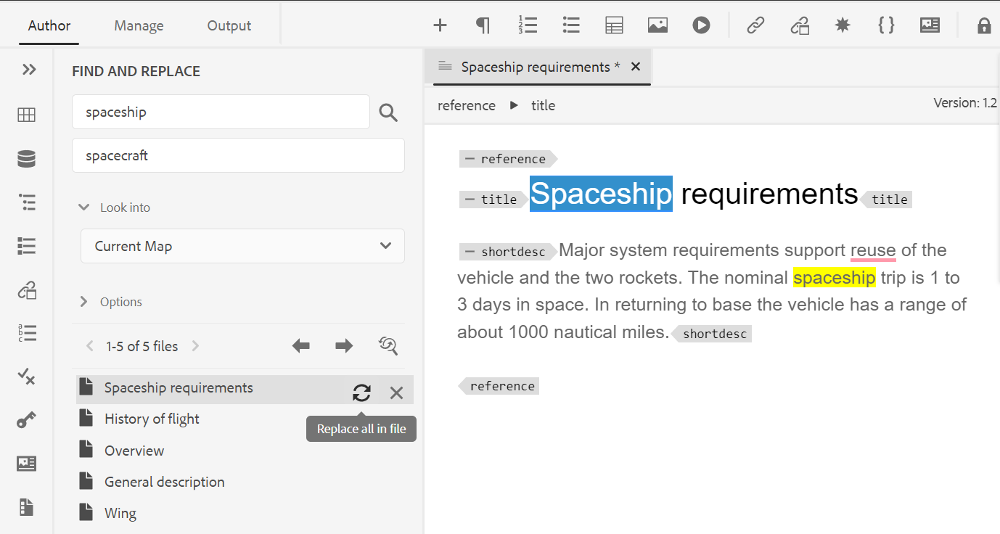

# Adobe Experience Manager Guides 4.2版的新增功能（2023年2月）

本文介紹Adobe Experience Manager Guides 4.2版的新增功能和增強功能(後稱為 *AEM指南*)。

如需有關升級指示、相容性矩陣，以及此版本中修正問題的詳細資訊，請參閱 [發行說明](release-notes-4.2.md) 文章。

## 從網頁編輯器產生報表

AEM Guides的網頁編輯器提供了一項功能，可讓您檢查技術檔案的整體完整性，並為其產生報告。
您可以檢視主題清單，並從以下位置管理目前地圖的所有參照的中繼資料：
**報表** 索引標籤進行編輯。

**產生主題清單檢視**

您可以產生「主題清單」，提供主題的相關詳細資訊，例如參照型別、檔案狀態和作者。 您也可以產生CSV來下載DITA map中主題的目前快照。

**管理中繼資料並變更檔案狀態**

您可以在個別主題上套用標籤，或使用大量標籤功能，在多個主題、DITA map或子對映上套用多個標籤。 您也可以將所有選取主題的檔案狀態變更為下一個可能的通用檔案狀態。

## 針對稽核功能改版的UX

現在AEM Guides提供改良的UX，可幫助您檢閱共用供檢閱的主題。 在最新的體驗中，稽核功能有下列增強功能：

* 重新整理的使用者介面
* 條件面板，可讓您根據主題中的可用條件反白顯示內容。
* 註解面板中的每個註解都會連結到目前主題中的對應文字。 它有助於您識別註解的文字。
* 註解會以檔案中註解文字的順序顯示。
* 稽核工作流程上會顯示稽核任務的名稱。
* 選取審閱工作的根目錄對映，用於解析審閱內容中使用的所有關鍵參考和字彙表術語。
* 上下文工具列可協助您快速反白或刪除文字。
* 「選項」選單可編輯或刪除您自己的註解。
* 對於過時的註解，您可以存取並排檢視，這有助於您將主題的前一版本與目前的稽核版本進行比較
* 使用篩選器時，右側面板上的註解會根據選取範圍進行篩選，而左側面板中的註解數量也會據此更新。

如需詳細資訊，請參閱 *檢閱主題或地圖* 使用Adobe Experience Manager指南中的區段。

## 翻譯增強功能

現在，翻譯儀表板中提供了更方便使用的增強功能，可幫助您從網頁編輯器輕鬆翻譯檔案。

**版本標籤欄已新增到翻譯儀表板**

在翻譯控制面板中，您也可以看到「版本標籤」欄。 這會顯示來源檔案之所選版本的標籤。 這可以協助您選取所有具有特定標籤的檔案，並一次翻譯它們。

**從翻譯儀表板檢視不同步檔案的版本差異**

現在您可以檢查所選版本與主題最後翻譯來源版本之間的差異。 您也可以選擇翻譯 **不同步** 根據兩個版本主題之間完成的變更的檔案。

**將版本標籤傳遞至目標版本**

AEM Guides可讓您將來源檔案的標籤傳遞至目標檔案。 這可協助您輕鬆識別翻譯檔案的來源版本。

例如，如果您有一些來源檔案套用了版本標籤1.0版，那麼您也可以將來源標籤（1.0版）傳遞給翻譯的檔案。

**強制同步處理不同步的資產**

如果您對部分資產進行變更，AEM Guides會將其標籤為不同步。 您可以重新翻譯修改的資產，或選擇關閉「不同步」狀態。 例如，如果您進行了一些確實不需要翻譯的次要變更，您可以將其狀態標示為「同步」。

**檢視主題或地圖的進行中翻譯專案**

翻譯控制面板上的某些參考可能正在進行中。 現在AEM Guides提供的功能可幫助您檢視包含所選參考的所有進行中翻譯專案的清單（以及目標語言）。

如需詳細資訊，請參閱 *從網頁編輯器翻譯檔案* 使用Adobe Experience Manager指南中的區段。

## 從網頁編輯器產生多種格式的輸出

現在您可以從網頁編輯器輕鬆產生主題或DITA map的輸出。 您可以設定各種輸出預設集，例如AEM Site、PDF、HTML5、JSON （Headless輸出格式）和自訂輸出。 使用這些來產生個別輸出。 您可以在DITA主題中定義屬性，然後使用條件預設集在發佈輸出時套用條件。 您也可以使用基準線發佈功能，選擇性地發佈DITA map或主題的特定版本。

**管理全域和資料夾設定檔輸出預設集**

AEM Guides提供您為全域和資料夾設定檔建立和管理輸出預設集的功能。 然後，您就可以輕鬆地使用這些輸出預設集來產生與該全域或資料夾設定檔相關的所有對應的輸出。

這些全域預設集會顯示在 **輸出** 標籤。 您可以使用它們來產生所有相關地圖的輸出。 您可以選取預設集作為預設PDF預設集，以產生PDF輸出。 您也可以 **編輯**， **重新命名**， **複製**，或 **刪除** 來自的現有輸出預設集 **選項** 功能表。

>[!NOTE]
>
>只有檔案夾層級的管理使用者才能建立全域和檔案夾設定檔預設集。

## 在地圖層級尋找和取代文字

您現在可以在地圖中搜尋包含特定文字的檔案。 搜尋的文字會在檔案中反白顯示。 您也可以將搜尋到的字詞或片語取代為檔案中的其他字詞或片語。 選取 **取代單一專案** 圖示取代目前的專案和 **取代檔案中的所有專案** 圖示取代所選檔案中的所有出現位置。 您可以選取 **全部取代** 圖示取代所有檔案中搜尋字詞的所有出現位置。

依預設，選項 **取代前簽出檔案** 和 **取代後建立新版本** 會選取，因此會在您取代文字之前出庫檔案，並在取代文字之後建立新版本。 您也可以搜尋DITA map內間接參照中的字串。 依預設，這會停用，所以只會在直接參照上執行搜尋。

## 地圖編輯器中的版面配置檢視

現在您可以在Map編輯器中檢視DITA map的完整版面。 當您開啟地圖進行編輯時，它會開啟「地圖編輯器」的「版面」檢視。 在此檢視中，您可以在樹狀檢視中檢視對應階層。 您也可以編輯和組織或建構地圖中的主題。

「版面」檢視包含一個單獨的工具列，可幫助您對映中顯示的主題執行許多工。
您可以在地圖中插入主題參照、主題群組、索引鍵定義。 您可以透過將主題上移、下移、左移或右移，重新組織地圖中顯示的主題。 您也可以拖放主題，在地圖中移動主題。 「地圖編輯器」也提供圖示，可鎖定或解鎖檔案、檢查版本歷史記錄和執行版本標籤管理。

「版面」檢視也提供 **檢視選項** 顯示或隱藏行號、顯示或隱藏核取方塊，或顯示地圖中主題的檔案名稱或標題。
您也可以根據套用到的條件篩選器來檢視主題。

除了在地圖檔案中組織主題外，您還可以使用 **選項** 「版面」檢視中元素可用的功能表。

右側面板會顯示「地圖編輯器」的「版面」檢視中的「內容屬性」和「地圖屬性」。 現在您也可以設定主題或地圖的中繼資料資訊。 您可以為選取的主題或地圖定義導覽標題、連結文字、簡短說明和關鍵字。

如需詳細資訊，請參閱 *版面檢視* 使用Adobe Experience Manager指南中的區段。

## 快速產生面板

現在AEM Guides提供「快速產生」面板，可幫助您快速產生和檢視針對DITA map建立的預設集輸出。

在 **快速產生** 面板中，您可以看到為DITA map建立的所有輸出預設集清單。 您也可以快速檢視針對預設集產生的輸出。 成功或失敗訊息會顯示在輸出產生完成時。 您也可以檢視錯誤記錄，其中包含產生程式中所發生錯誤的詳細資訊。

## 根據標籤建立動態基準線

現在AEM Guides提供您根據標籤建立動態基準的功能。 如果您產生基準線、下載基準線或使用基準線建立翻譯專案，系統會根據更新的標籤動態挑選檔案。 此功能很實用，因為更新標籤時不需要修改基準線。

## 從存放庫面板刪除和複製檔案

現在您可以輕鬆刪除檔案（一次刪除一個檔案），從 **選項** 儲存庫面板中選取檔案的功能表。 刪除檔案前會顯示確認提示。 如果檔案未從任何其他檔案參照，則會刪除檔案並顯示成功訊息。

您也可以建立所選檔案的副本或副本。 依預設，檔案會以尾碼（如filename_1.extension）建立。

## 其他Web Editor增強功能

* 在AEM Guides中，您可以使用快顯選單對影像和媒體檔案執行一些常見操作。 現在您也可以在存放庫中找出選取的影像或媒體，或在Assets UI中檢視檔案預覽。

* 目前資料夾描述檔的名稱會在主工具列中顯示為「使用者偏好設定」圖示的標籤。 這有助於您識別正在處理的資料夾設定檔。

* 在地圖檢視中開啟地圖時，目前地圖的標題會顯示在主工具列的中心。 這有助於讓使用者知道目前開啟的地圖。

## 清除檔案的所選版本

當您建立和維護內容時，可能會為存放庫中的DITA檔案建立許多版本。 AEM Guides可讓您從儲存庫清除舊版的DITA檔案，並釋放磁碟空間。

AEM Guides不會刪除檔案的第一個版本，或是包含在基準線中的版本，或是已套用標籤的版本。 清除作業甚至不會刪除翻譯或稽核工作流程中包含的檔案。 您可以選擇要保留的版本數量，也可以決定刪除早於定義天數的檔案。

在開始永久刪除作業之前，您可以預覽報表以檢視要永久刪除的版本。 然後，您可以決定啟動或取消整個清除作業。

永久刪除作業完成後，您可以檢查永久刪除報表，檢視已永久刪除的檔案。

## 在氧氣編輯器中檢視標題取代UUID

現在AEM Guides可讓您選擇 **在編輯器和地圖管理員中使用標題** 選項。 如果選取此選項，當在「編輯器」或「DITA地圖管理員」中開啟時，檔案的標題會顯示在檔案的標籤上。 如果您未選取此選項，則檔案的UUID會顯示在檔案的索引標籤上。

## PDF預設集可用的中繼資料UI

您可以從DITA map的輸出預設集設定中繼資料。 您可以設定標題、作者、主旨和關鍵字中繼資料。 此中繼資料會對應至輸出PDF之檔案屬性中的中繼資料。 此中繼資料會覆寫在書籍層級定義的中繼資料。 您可以具體定義每個輸出預設集中的中繼資料，並將其傳遞給輸出PDF。

## 原生PDF |含有顯示檔案版本之間差異之變更列的PDF

現在您可以使用變更列建立PDF，顯示兩個版本之間的內容差異。 您可以選擇將目前版本與先前版本的基準進行比較，或比較兩個選取的基準版本。

PDF中會出現變更列，指出已修改、插入或刪除的內容。 您也可以選擇執行下列動作：
* 以綠色和底線顯示插入的內容
* 以紅色顯示刪除的內容，並標示刪除線

## 原生PDF |輸出路徑和PDF檔案名稱的變數支援

現在您也可以使用下列現成可用的變數來定義輸出路徑和PDF檔案。 您可以使用單一變數或變陣列合來定義這些選項：
* `${map_filename}`
* `${map_title}`
* `${preset_name}`
* `${language_code}`
* `${map_parentpath}` （僅適用於輸出路徑）
* `${path_after_langfolder}` （僅適用於輸出路徑）

## 原生PDF |產生DITA map的目錄並重新排序頁面配置

現在您也可以使用範本的進階PDF設定在DITA map中產生TOC。 您可以選擇啟用或停用各種頁面配置圖的顯示，也可以重新排序其位置。

## 原生PDF |在PDF輸出中新增自訂書籤

現在，您可以在最終PDF輸出中的特定內容上新增自訂書籤，以便輕鬆導覽。 這將會新增到從DITA map中的主題或區段標題建立的目錄。

## 原生PDF |在目錄專案和主題內容上套用自訂樣式

AEM Guides提供在目錄專案或PDF輸出中的特定主題上套用自訂樣式的功能。 例如，您可以變更目錄中的文字顏色和主題標題。 您也可以在主題內的整個內容上套用樣式。
