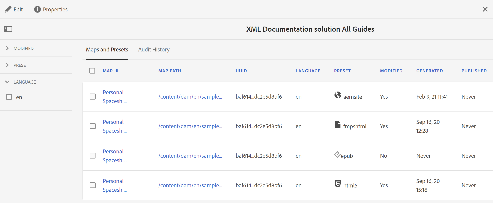

# 建立大量啟用地圖集合 {#id214GG0E90EV}

若要建立大量啟動對映集合，請執行以下步驟：

1. 選取 **指南** 工具清單中。

1. 按一下頂端的Adobe Experience Manager連結，然後選擇 **工具**.

1. 按一下 **大量發佈儀表板** 圖磚。

   第一次會顯示空白的集合頁面。 如果您先前已建立大量啟動集合，則會顯示在此頁面上。

1. 按一下&#x200B;**建立**。

1. 輸入大量啟用地圖集合的標題，然後按一下 **建立**.

   建立大量啟動地圖集合時會顯示成功訊息。

1. 按一下 **開啟** 成功訊息上。

1. 按一下 **編輯** 然後按一下 **新增地圖**.

1. 尋找並新增您要新增至大量啟動對映集合的DITA map。

   依預設，所有與地圖相關聯的預設集和區域設定都會自動新增。

1. 透過開啟或關閉滑動按鈕來選取所需的輸出。

   您可以跨可用地區設定選擇多個輸出預設集。

1. 按一下&#x200B;**「完成」**。

   DITA map檔案會新增至您的大量啟動對映集合中。

   {width="800" align="left"}

「地圖和預設集」標籤會顯示下列欄位中的資訊：

- **地圖**：顯示DITA map檔案的標題。
- **地圖路徑**：顯示DITA map檔案的完整路徑。

- **UUID**：顯示與檔案相關聯的唯一識別碼。

- **語言**：顯示DITA map的語言代碼。
- **預設集**：顯示地圖檔案上設定的輸出預設集標題。 也會根據輸出預設集的型別顯示圖示。

  >[!NOTE]
  >
  > 小型  圖示會指出資料夾設定檔層級預設集。
- **已修改**：指出DITA map是否於上次發佈後更新。 根據此資訊，您可以決定是否要啟動此DITA map的輸出。
- **已產生**：顯示上次產生輸出的日期和時間。
- **已發佈**：顯示上次發佈\（或已啟動\）輸出的日期和時間。 如果按一下連結，會顯示「啟用結果」頁面，其中包含啟用內容的根路徑相關資訊。

左側面板上有以下篩選選項：

- **已修改**：您可以選取「是」或「否」。 如果您選取「是」，則只會顯示修改過的DITA map。 修改後的對應是自上次發佈後產生的對應。
- **預設集**：選取您要濾除地圖檔案的預設集。 例如，如果您選擇 *AEM網站* 則只會顯示具有下列專案的對映： *AEM網站* 已設定輸出預設集。
- **語言**：您可以選取任何可用的語言代碼，並在「地圖和預設集」索引標籤中僅顯示選取的語言。

- **篩選：** 最後一個邊欄會顯示下列篩選器：
- **地圖和預設集** 表格：顯示的「地圖與預設集」表格包含下列欄：

**父級主題：**[&#x200B;大量啟用已發佈的內容](conf-bulk-activation.md)
