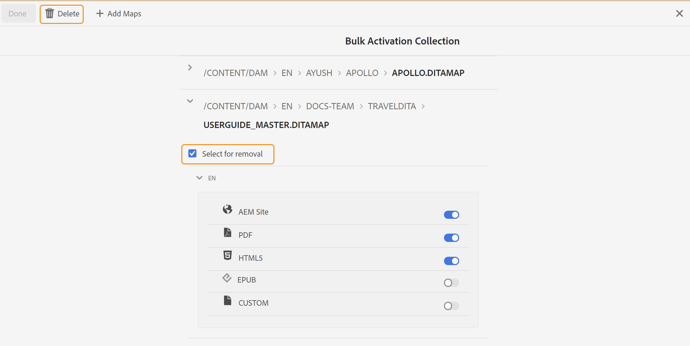

# 編輯批量激活映射集合 {#id214GI40B0XA}

可以通過添加或刪除集合中的映射檔案或預設來編輯批量激活映射集合。 要編輯批量激活映射集合，請執行以下步驟：

1. 選擇 **參考線** 的雙曲餘切值。

1. 按一下頂部的Adobe Experience Manager連結，然後選擇 **工具**。

1. 按一下 **批量發佈儀表板** 平鋪。

   顯示批量激活映射集合的清單。

1. 選擇要編輯的集合，然後按一下 **開啟**。

1. 按一下 **編輯**。

   此時將顯示批量激活映射收集頁，其中顯示了映射以及每個可用區域設定的預配置預設。

1. 使用滑塊開啟要激活或停用的所需輸出預設。

1. 如果要從集合中刪除映射，請展開該映射並選擇 **選擇以刪除** 的雙曲餘切值。

1. 按一下&#x200B;**刪除**。

   {width="800" align="left"}

   從批量激活映射集合中刪除所選映射。

1. 按一下 **完成**。

**父主題：**[&#x200B;已發佈內容的批量激活](conf-bulk-activation.md)
