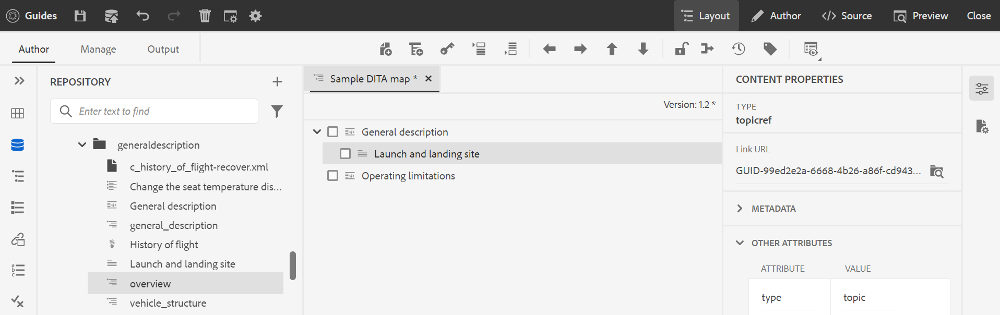

# 使用進階地圖編輯器 {#id1942D0S0IHS}

進階地圖編輯器提供直覺式使用者介面，與Web編輯器類似。 在Web編輯器中開啟映射檔案時，您將獲得一個選項，可以使用「高級映射編輯器」介面編輯映射檔案。 進階地圖編輯器可讓您新增主題參考、索引鍵參考、結構內容等。

除了直接從Web編輯器編輯地圖檔案之外，您還可以在地圖中開啟主題檔案以編輯Web編輯器。 本主題將逐步引導您了解高級映射編輯器中的功能，以及如何在Web編輯器中開啟和編輯DITA映射中的檔案。

## 將主題添加到映射檔案

執行下列步驟以使用進階地圖編輯器建立對應檔案：

1. 在資產UI中，導覽至您要編輯的對應檔案。

   >[!NOTE]
   >
   > 請確定您尚未啟用資產選取模式。

1. 要獲取映射檔案的獨佔鎖，請選擇映射檔案，然後按一下 **結帳**.

   >[!NOTE]
   >
   > 一旦您對地圖檔案擁有獨佔鎖定，其他使用者將無法編輯地圖。 不過，他們將能處理對映檔案中的主題。 如果您的管理員在編輯之前將Web編輯器配置為簽出檔案，則在簽出檔案之前，您將無法編輯該檔案。 同樣，如果配置了，系統將要求您在關閉檔案之前簽入任何簽出的檔案

1. 在選取映射檔案後，按一下 **編輯主題**.

   {width="800" align="left"}

   或者，您也可以選取 **編輯主題** 選項（位於映射檔案上的操作菜單中）:

   {width="800" align="left"}

   地圖檔案在Web編輯器中開啟以供編輯。

1. 按一下 **編輯** 表徵圖。

   {width="550" align="left"}

   地圖會在進階地圖編輯器介面中開啟。 如果您已開啟新的地圖檔案，則編輯器中只會顯示地圖的標題。

   {width="800" align="left"}

   - **A** - \(*主工具欄*\):這類似於Web編輯器的主工具欄。 請參閱 [主工具欄](web-editor-features.md#id2051EA0G05Z) ，以取得詳細資訊。

   - **B** - \(*輔助工具欄*\)這是次要工具列，可讓您使用對應檔案。 如需可透過次要工具列使用之功能的詳細資訊，請參閱 [「高級映射編輯器」工具欄中提供的功能](#id205DEC0005Z).

   - **C** - \(*地圖檢視*\):可讓您在「版面」、「作者」、「來源」和「預覽」之間切換「地圖編輯器」。 此 **版面**&#x200B;檢視可讓您在DITA映射中組織主題。 這可提供地圖的樹狀或階層檢視。 此 **作者** 檢視可讓您在地圖編輯器中編輯主題。 這也提供地圖檔案的WYSIWYG檢視。 此 **來源** 「視圖」(view)允許您使用映射檔案的基礎XML。 「預覽」可提供映射檔案中所有主題和子映射的統一視圖。 此 **關閉** 連結會關閉地圖檔案。

   - **D** - \(*左面板*\):提供對左面板的訪問，該面板允許您訪問收藏夾、儲存庫、映射、大綱和其他功能。 您可以按一下展開側欄圖示\(\)。 如需左側面板中可用功能的詳細資訊，請參閱 [左側面板](web-editor-features.md#id2051EA0M0HS) 的子母體。

   - **E** - \(*中間區域*\):映射內容編輯區域。

   - **F** - \(*右面板*\):提供「屬性」面板的存取權。 您可以看到所選主題或地圖的內容屬性和對應屬性。 如需此面板中可用功能的詳細資訊，請參閱 [右面板](web-editor-features.md#id2051EB003YK) 的子母體。

1. 在左側面板中，切換至 **儲存庫視圖**.

1. 在AEM存放庫中，導覽至包含您要新增之主題或子地圖的資料夾。

1. 在 **儲存庫視圖** 並將其拖放至「\(middle\)對應內容編輯」區域。

   主題會新增至地圖中。

   {width="800" align="left"}

1. 若要新增後續主題或子地圖，請拖放主題或子地圖至地圖中的必要位置。

   建立對應檔案時，請考量下列幾點：

   - 檔案會新增到地圖編輯區域中水準條出現的位置。 在以下螢幕擷取中， *概述* 主題會新增至 *一般說明* 和 *啟動和登陸網站* 主題。

      {width="350" align="left"}

   - 若要取代主題，請將主題置於要取代之主題的上方、左或右。 主題左側或右側的垂直條表示將替換為主題上放置的主題。

      {width="550" align="left"}

      不過，在取代主題之前，您會收到確認提示。 只有在您進行確認後，才會取代主題。

      {width="300" align="left"}

   - 如果將子映射添加到DITA映射，則子映射在DITA映射中顯示為連結。 若要檢視子地圖的所有主題，請按一下子地圖連結。 子地圖的內容會顯示在新索引標籤中。 同樣地，若要從DITA映射開啟主題，請按住Crtl鍵並按一下主題連結，並在新索引標籤中開啟。

   - 您可以使用快速鍵CTRL+Z和CTRL+Y或其各自在工具列中的圖示，來還原或重做地圖中的任何變更。

   - 若要變更主題的位置，請選取主題\（按一下主題圖示\），然後將其拖放至對應檔案中的所需位置。 請確定水準條顯示在您要放置主題的位置。 在以下螢幕截圖中， *啟動和登陸網站* 是在 *概述* 主題。

      {width="350" align="left"}

   - 要檢查映射檔案的屬性，請按一下右鍵映射編輯區域中的任意位置，然後選擇 **屬性** 從上下文菜單。 根據您的AEM版本，您可以看到中繼資料、排程\(de\)啟用、參考、檔案狀態等屬性。

1. 按一下「**儲存**」。

## 「高級映射編輯器」工具欄中提供的功能 {#id205DEC0005Z}

「高級映射編輯器」中的工具欄與主題Web編輯器類似。 切換左側面板、儲存地圖、建立新版本的地圖、還原/重做上次操作以及刪除所選元素等基本操作在這兩個編輯器中都很常見。 如需這些作業如何運作的詳細資訊，請參閱 [了解Web編輯器功能](web-editor-features.md#) 區段。

「版面」和「作者」檢視的工具列上也提供下列地圖專屬作業：

## 版面檢視 {#id205DEC0005Z_layout_view}

當您開啟用於編輯的映射時，將開啟映射編輯器的「佈局」視圖。「佈局」視圖以樹視圖顯示映射層次結構，並允許您在映射中組織主題。

>[!NOTE]
>
> 「配置」(Layout)視圖只顯示地圖中存在的參照。 如果有任何參照被破壞，則參照左側會顯示一個小交叉符號

您可以在「配置」檢視中執行下列工作：

**插入主題參考** - 

顯示主題搜索對話框。 導覽至您要插入的主題/對應檔案，然後按一下「選取」將其新增至對應。
{width="800" align="left"}

**插入主題組** - 

插入 `topicgroup` 元素。 如需分組主題的詳細資訊，請參閱 [topicgroup](https://docs.oasis-open.org/dita/v1.0/langspec/topicgroup.html) OASIS DITA語言規範中的檔案。

**插入鍵定義** - 

顯示「插入鍵定義」對話框。 使用此對話框定義要在映射中使用的任何鍵定義。

{width="300" align="left"}

**插入在前/插入在後** -  / 

顯示「插入元素」對話方塊。 選取您要插入地圖中的元素。 根據操作，新元素會插入到映射中的當前元素之前或之後。

**插入前置物** - 

當您開啟書籤圖以進行編輯時，此圖示會顯示。 您可以在書的開頭插入元件，如目錄、索引和表清單。

**插入回料** - 

當您開啟書籤圖以進行編輯時，此圖示會顯示。 您可以插入書尾的元件，如索引、字彙表和圖表清單。

**左/右移動所選項目** -  / 

按一下左箭頭，將主題在階層中向左移動。 這基本上將各主題提升到階層中的一個層級。 例如，在選取子主題時按左箭頭，可使其成為上方主題的同層級。 同樣地，如果按一下右箭頭，則主題會朝右推，使其成為上方主題的子項。

**上/下移動所選項目** - / 

按一下向上或向下箭頭圖示，在階層中向上或向下移動主題。

>[!NOTE]
>
> 您也可以拖放參照，以在地圖中移動參照。

**鎖定/解除鎖定** -  / 

獲取映射檔案的鎖定並釋放該鎖定。 如果您的地圖檔案中有未儲存的變更，則在釋放鎖定時，系統會提示您儲存地圖檔案。 更改將保存在當前版本的映射檔案中。

**合併** - 

如需從相同或不同檔案的不同版本合併內容的詳細資訊，請參閱 [合併](web-editor-features.md#id205DF04E0HS) 的子母體。

**版本記錄** - 

檢查您作用中主題的可用版本和標籤，並從編輯器本身回復至任何版本。

**版本標籤** - 

顯示版本標籤管理對話方塊。 從下拉式清單中選取版本。 選擇要應用到選定版本的標籤，然後按一下 **添加標籤** 來新增。

**檢視選項** - 

顯示一個下拉清單，該下拉清單提供「顯示行號」、「顯示」複選框和「顯示檔案名」選項。

- **顯示行號**

顯示或隱藏每個主題的行號。 系統會根據階層中的層級來顯示行號。

- **顯示複選框**

顯示或隱藏每個主題的核取方塊。 您可以使用核取方塊來選取主題，並使用選項功能表執行各種工作。 如需詳細資訊，請參閱 [選項](#id228ID8006H8) 功能表。

- **顯示檔案名**

顯示主題標題的檔案名。

>[!NOTE]
>
> 將指標暫留在主題標題上時，會顯示檔案路徑。

**根據條件篩選器檢視主題**&#x200B;如果您已對主題套用任何條件，則主題右側會顯示篩選圖示。 當您將指標暫留在篩選器圖示上時，會顯示套用的條件及其屬性值。

**「佈局」視圖中的「選項」菜單**

除了在映射檔案中組織主題外，您還可以使用「佈局」視圖中某元素可用的「選項」菜單來執行以下操作：

{width="650" align="left"}

- **新增**:您可以從地圖編輯器中選擇新增主題或空白參考：
   - **空白參考**:此選項可讓您在DITA映射中新增空白參照。 您稍後可以連按兩下插入的空引用，並添加主題詳細資訊。 如需詳細資訊，請參閱 [建立主題](web-editor-features.md#id228ICI0105U) 的子母體。
   - **新主題**:選擇從菜單建立新主題時，將顯示「建立新主題」對話框。 在「建立新主題」對話框中，提供所需的詳細資訊，然後按一下「建立」。 如需詳細資訊，請參閱 [建立主題](web-editor-features.md#id228ICI0105U) 的子母體。
- **移動**:您可以選擇在層次結構中上下/左移動主題。您也可以從儲存庫面板拖放主題或地圖至地圖編輯器中開啟的地圖。
- **還原**:撤消「佈局」視圖中的最後一個操作。
- **取消復原**:在「佈局」視圖中重做最後一個操作。
- **複製**:從映射檔案複製所選引用。

   >[!NOTE]
   >
   > 您可以顯示並選取核取方塊以複製多個參考。

- **貼上**:將複製的參考貼到階層中的目前位置。
- **刪除**:從映射檔案中刪除所選引用。

   >[!NOTE]
   >
   > 您可以顯示並選取核取方塊以刪除多個參考。

## 地圖編輯器中的右側面板

右側面板會在地圖編輯器的「版面」檢視中顯示「內容屬性」和「地圖屬性」。

**內容屬性**

「內容屬性」面板包含有關地圖中目前所選主題類型、其連結URL及其屬性的資訊。 如需詳細資訊，請參閱 [內容屬性](web-editor-features.md#id228IDB00HMM) 的子母體。

- **其他屬性** 如果您的管理員已建立屬性的設定檔，則您會取得這些屬性及其設定的值。 使用內容屬性面板，您可以選擇這些屬性並將它們指派給主題中的相關內容。 您也可以在 **顯示屬性** 標籤。 為元素定義的屬性顯示在「佈局」和「大綱」視圖中。 這可協助您快速查看地圖中定義特定屬性的所有主題。 例如，所有將平台屬性定義為「Android」的主題。

   {width="650" align="left"}

   如需詳細資訊，請參閱 *顯示屬性* 在 *編輯器設定* 功能說明，請參閱 [左面板](web-editor-features.md#id2051EA0M0HS) 區段。

- **中繼資料** 您可以使用中繼資料來設定中繼資料資訊。 您可以定義導覽標題、連結文字、簡短說明和關鍵字。

如需標準主題屬性和中繼資料的詳細資訊，請參閱 [topicref](https://docs.oasis-open.org/dita/v1.2/os/spec/langref/topicref.html) OASIS DITA語言規範中的檔案。

**映射屬性**

顯示「映射屬性」對話框，您可以在其中設定映射的屬性和元資料資訊。

## 作者檢視 {#id205DEC0005Z_author_view}

此 **作者** 檢視可讓您在Web編輯器中編輯DITA對應。 這會顯示地圖編輯器的WYSIWYG檢視，而「作者」檢視中顯示的某些圖示與「版面」檢視相同。 如需詳細資訊，請參閱 [版面檢視](#id205DEC0005Z_layout_view). 此外，您還可以從「作者」檢視中查看下列圖示並執行相關工作：

**插入在前/插入在後** -  / 

顯示「插入元素」對話方塊。 選取您要插入地圖中的元素。 根據操作，新元素會插入到映射中的當前元素之前或之後。

**插入元素** - 

顯示「插入元素」對話方塊。 選取要插入的元素。 您可以使用鍵盤捲動元素清單，然後按Enter鍵以插入所需元素。 或者，您也可以直接按一下元素，將其插入地圖中。

**插入關係表** - 

在映射中插入關係表。 由於使用關係表格的概念與「基本地圖編輯器」章節中的說明相同，請參閱 [在基本映射編輯器中使用關係表](map-editor-basic-map-editor.md#id1944B0I0COB) 以取得更多詳細資訊。

**插入可重複使用的內容** - 

顯示「重複使用內容」對話框。 使用此對話框插入要在映射中重複使用的內容。

**刷新導航標題屬性** - 

同步 `title` 映射中引用檔案的元素，其中指定的值在 `@navtitle` 屬性。 您可以在地圖中新增不同類型的參考檔案，例如主題、參考、任務、\(sub\)地圖等。 這些檔案大多支援 `@navtitle` 屬性。 如果檔案包含 `@navtitle` 屬性，然後 `@navtitle` 屬性。 若 `@navtitle` 屬性不存在，則 `@navtitle` 屬性已添加到該引用檔案及其 `title` 也會更新，以顯示 `@navtitle`.

>[!NOTE]
>
> 管理員可以配置自動添加 `@navtitle` 屬性至您新增至地圖的每個參考檔案。 如需設定自動新增的詳細資訊 `@navtitle` 屬性，請參閱 *預設包@navtitle屬性* (在安裝及設定Adobe Experience Manager指南中)as a Cloud Service。

按一下「刷新導航標題屬性」表徵圖以同步 `title` 元素和 `@navtitle` 屬性的值。

**切換標籤檢視** - 

顯示或隱藏XML標籤。 標籤用作指示元素界限的視覺提示。 在此模式中，如果您想要插入主題/地圖參考，則在標籤之前或之後，拖放所需的檔案。 水準條不會顯示在「標籤檢視」模式中。

**啟用/停用追蹤變更** - 

您可以啟用「追蹤變更」模式，以追蹤對映檔案中進行的所有更新。 啟用跟蹤更改後，文檔中將捕獲所有插入和刪除內容。 如需詳細資訊，請參閱 [啟用/停用追蹤變更](web-editor-features.md#id205DF0203Y4) 的子母體。

**建立審閱任務** - 

您可以直接從Web編輯器建立當前主題的審閱任務或映射檔案。 開啟要為其建立審閱任務的檔案，然後按一下「建立審閱任務」以啟動審閱建立過程。 遵循 [查看主題或地圖](review.md#) 以取得更多詳細資訊。

## 透過DITA映射編輯主題 {#id17ACJ0F0FHS}

編輯個別主題不會提供作者的完整內容。 作者沒有關於主題在DITA映射中的位置的資訊。 若沒有此內容資訊，作者就很難建立內容。

AEM參考線可讓作者在Web編輯器中開啟DITA對應，並查看對應中主題的放置位置。 這可協助作者確切了解主題在對映中的位置，並建立更相關的內容。 此外，如果有多個作者在專案中工作，他們就能知道地圖中有哪些主題可供使用，並可視需要重複使用內容。

要通過DITA映射編輯主題，請執行以下步驟：

1. 在資產UI中，導覽至包含您要編輯之主題的DITA對應。
1. 按一下DITA映射，在DITA映射控制台中開啟它。
1. 選取 **主題** 頁簽，查看DITA映射中可用的主題清單。

   >[!TIP]
   >
   > 「主題」(Topics)頁簽為您提供下載映射檔案及其依存項的選項。 如需詳細資訊，請參閱 [導出DITA映射檔案](authoring-download-assets.md#id218UBA00IXA).

1. 在主工具列中，按一下 **編輯主題**.

   DITA映射在Web編輯器中開啟。

   >[!NOTE]
   >
   > 您也可以在資產UI中選取DITA對應檔案，然後按一下 **編輯主題** （在主工具列中）以啟動網頁編輯器。

   {width="350" align="left"}

1. \(*可選*\)您也可以在編輯前，從對映中選取主題並結帳檔案。 要簽出檔案，請從左窗格中選擇一個或多個檔案，然後按一下 **結帳**. 您也可以選取已檢出的檔案，然後按一下 **取消簽出並解除鎖定** 圖示。

   >[!IMPORTANT]
   >
   > 如果管理員已設定 **禁用編輯而不簽出** 選項，則必須先簽出檔案才能編輯。 如果未簽出檔案，則文檔將在編輯器中以只讀模式開啟。

   以下螢幕擷取會反白顯示「結帳和鎖定」(\(A\)、「取消結帳和解除鎖定」(\(B\))、「另存為新版本並解除鎖定」(C\)、「編輯」(D\)、「預覽」(\(E\))、顯示不同DITA檔案類型(F\)的不同圖示，以及「簽出」(\(G\)的檔案」。

   {width="550" align="left"}

1. 按一下任何主題連結，在網頁編輯器中開啟它以進行編輯。

   您可以在編輯器中開啟多個主題，每個主題都會在編輯器的新索引標籤中開啟。 即使您的DITA映射包含子映射，子映射中的主題也會在新索引標籤中開啟以進行編輯。 如果您想在子地圖下檢視主題，可以按一下並展開子地圖。

   {width="800" align="left"}

   如果按一下映射檔案，則在Web瀏覽器的新頁簽中開啟該映射。

1. 編輯完主題後，您可以執行下列操作：

   - 您可以個別儲存。 如果您按一下 **關閉而不保存** 您的主題中會顯示對話方塊，提示您儲存未儲存的主題：

      {width="550" align="left"}

      您可以選擇保存所有選定的主題，或取消選擇不要保存的主題。

   - 您可以使用 **另存為新版本並解除鎖定** 按鈕。 保存主題的修訂時，將建立新修訂，並釋放鎖定。
   - 如果管理員啟用了關閉時簽入檔案的選項，則每當簽出的檔案關閉時，都會顯示保存檔案的提示。 啟用此選項後，當您關閉包含已更改檔案的編輯器時，將顯示需要保存的簽出檔案的清單。 簽出的檔案顯示為鎖定表徵圖：

      {width="550" align="left"}

      - 按一下 **關閉而不保存** 按鈕關閉檔案而不保存任何更改。

      - 按一下 **儲存** 按鈕會儲存變更，但不會簽入檔案。

      - 選取 **檢查檔案** ，然後按一下 **儲存** 按鈕會檢查檔案\（建立另一個版本\），並儲存檔案。

## 預覽地圖

除了能夠在地圖中查看每個主題檔案的位置之外，還希望以一個連續的流程查看地圖內容。 「預覽地圖」功能可讓您按一下即可查看地圖檔案的整個內容。 您不必產生對應檔案的輸出，即可查看發佈後整個地圖的外觀。 您只需存取地圖的預覽，所有主題和子地圖都會以書籍的形式呈現。

您可以從以下位置存取地圖的預覽：

- **Assets UI**:在「資產」UI中，導覽至對應位置，選取對應檔案，然後選擇 **預覽圖** 的子母體。 地圖的預覽會顯示在新索引標籤中。 您可以在預覽模式中檢視所有主題的內容。 在此視圖中，無法編輯任何主題。

   >[!NOTE]
   >
   > 若 *預覽圖* 選項未顯示在主工具列中，它可能已移至 **更多** 工具欄。

- **進階地圖編輯器**:在「進階地圖編輯器」中，按一下「預覽」圖示以查看目前地圖的預覽。

   {width="350" align="left"}

   您可以在預覽模式中執行下列其他工作：

   - 以滑鼠右鍵按一下主題，然後選取 **編輯** 以在新索引標籤中開啟要編輯的主題。

      >[!NOTE]
      >
      > 如果您沒有編輯權限，則主題將以唯讀模式開啟。

   - 按一下對應樹\（位於左面板\）中的主題標題，跳到所需的主題。

   - 地圖預覽中的目前主題也會在地圖樹中強調顯示。

**上層主題：**[&#x200B;使用地圖編輯器](map-editor.md)
